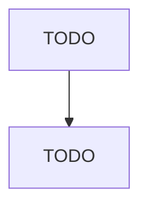

# Pottery, Ceramics, and Plumbing Fixture Manufacturing

> TODO: Business-as-Code definition

## Overview

This industry comprises establishments primarily engaged in shaping, molding, glazing, and firing pottery, ceramics, plumbing fixtures, and electrical supplies made entirely or partly of clay or other ceramic materials. Illustrative Examples: Bathroom accessories, vitreous china and earthenware, manufacturing Ceramic or ferrite permanent magnets manufacturing Chemical stoneware (i.e., pottery products) manufacturing Clay and ceramic statuary manufacturing Earthenware table and kitchen articles, 

## Actors

| Actor | Description |
|-------|-------------|
| TODO | TODO |

## Roles

| Role | Description |
|------|-------------|
| TODO | TODO |

## Entities

| Entity | Description |
|--------|-------------|
| TODO | TODO |

## Actions

| Action | Description |
|--------|-------------|
| TODO | TODO |

## Events

| Event | Description |
|-------|-------------|
| TODO | TODO |

## Searches

| Search | Description |
|--------|-------------|
| TODO | TODO |

## Workflow

## Actor Relationships

