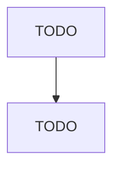

# Clay Building Material and Refractories Manufacturing

> TODO: Business-as-Code definition

## Overview

This industry comprises establishments primarily engaged in shaping, molding, baking, burning, or hardening clay refractories, nonclay refractories, ceramic tile, structural clay tile, brick, and other structural clay building materials. A refractory is a material that will retain its shape and chemical identity when subjected to high temperatures and is used in applications that require extreme resistance to heat, such as furnace linings. Cross-References. Establishments primarily engaged in--

## Actors

| Actor | Description |
|-------|-------------|
| TODO | TODO |

## Roles

| Role | Description |
|------|-------------|
| TODO | TODO |

## Entities

| Entity | Description |
|--------|-------------|
| TODO | TODO |

## Actions

| Action | Description |
|--------|-------------|
| TODO | TODO |

## Events

| Event | Description |
|-------|-------------|
| TODO | TODO |

## Searches

| Search | Description |
|--------|-------------|
| TODO | TODO |

## Workflow

## Actor Relationships

