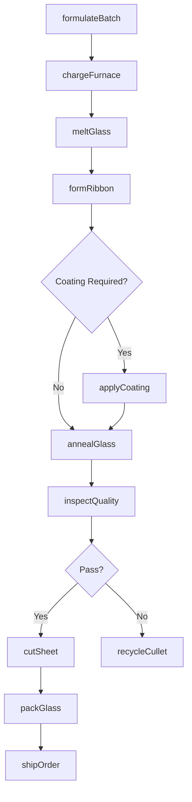
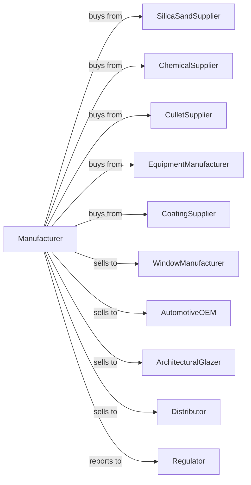

# Flat Glass Manufacturing

> Business-as-Code definition for flat glass manufacturing operations. Models the complete production lifecycle from raw material melting through finished sheet glass production.

## Overview

Flat glass manufacturing involves melting silica sand, soda ash, limestone, and cullet to produce sheet glass using the float process or rolled glass methods. Products include window glass, architectural glass, automotive glass, and specialty coated glass. This definition exposes actions for each phase of glass production, events for workflow automation, and searches for data retrieval.

## Actors

| Actor | Description |
|-------|-------------|
| SilicaSandSupplier | Provides high-purity silica sand for glass batch |
| ChemicalSupplier | Supplies soda ash, limestone, dolomite, and other batch chemicals |
| CulletSupplier | Provides recycled glass for batch composition |
| EquipmentManufacturer | Sells furnaces, float baths, and annealing equipment |
| CoatingSupplier | Provides materials for low-E and other specialty coatings |
| WindowManufacturer | Purchases flat glass for window fabrication |
| AutomotiveOEM | Uses flat glass for vehicle windshields and windows |
| ArchitecturalGlazer | Installs flat glass in commercial buildings |
| Distributor | Stocks and distributes flat glass to regional markets |
| Regulator | Oversees environmental emissions and product safety standards |

## Roles

| Role | Description |
|------|-------------|
| PlantManager | Directs overall manufacturing operations and strategy |
| BatchEngineer | Formulates and controls raw material composition |
| FurnaceOperator | Manages melting furnace temperature and flow |
| FloatLineOperator | Controls the float bath and ribbon forming process |
| CoatingTechnician | Operates online coating systems for specialty glass |
| QualityEngineer | Inspects glass for optical clarity, flatness, and defects |
| MaintenanceEngineer | Maintains furnaces, float bath, and annealing lehr |

## Entities

| Entity | Description |
|--------|-------------|
| Batch | Formulated mixture of raw materials for melting |
| Furnace | High-temperature melting tank for glass production |
| FloatBath | Molten tin bath where glass ribbon is formed |
| AnnealingLehr | Controlled cooling tunnel for stress relief |
| GlassRibbon | Continuous sheet of glass exiting the float line |
| Cullet | Recycled glass used in batch formulation |
| Coating | Thin film applied to glass for thermal or optical properties |
| Cut | Individual glass sheet cut from ribbon |
| QualitySpec | Optical and dimensional standards for glass products |
| ProductionRun | Scheduled manufacturing campaign with specifications |

## Actions

| Action | Description |
|--------|-------------|
| formulateBatch | Calculate and mix raw materials for target glass composition |
| chargeFurnace | Feed batch materials into the melting furnace |
| meltGlass | Heat batch to form molten glass at controlled temperature |
| formRibbon | Float molten glass on tin bath to form flat ribbon |
| applyCoating | Deposit thin films on glass surface for enhanced properties |
| annealGlass | Cool glass through lehr to relieve internal stresses |
| inspectQuality | Check glass for bubbles, inclusions, and optical distortion |
| cutSheet | Score and break glass ribbon into standard or custom sizes |
| packGlass | Prepare glass sheets for shipping with interleaving and crating |
| shipOrder | Deliver glass to customer facilities |
| recycleCullet | Process defective glass for reuse in batch |
| monitorEmissions | Track furnace emissions for environmental compliance |

## Events

| Event | Description |
|-------|-------------|
| batchCharged | Raw materials loaded into furnace |
| glassMelted | Batch fully melted and ready for forming |
| ribbonFormed | Glass ribbon exits float bath at target thickness |
| coatingApplied | Specialty coating deposited on glass surface |
| glassAnnealed | Ribbon cooled and stress-relieved |
| qualityApproved | Glass meets optical and dimensional specifications |
| qualityRejected | Glass fails inspection and routed to cullet |
| sheetCut | Individual sheets separated from ribbon |
| orderShipped | Glass delivered to customer |
| furnaceIssue | Temperature or flow anomaly detected |
| emissionsAlert | Environmental threshold exceeded |

## Searches

| Search | Description |
|--------|-------------|
| findProducts | List glass products by thickness, coating, and size |
| getInventory | Query stock levels by product specification and location |
| findOrders | Retrieve orders by customer, product, or delivery date |
| getProductionSchedule | View planned runs and furnace campaigns |
| checkQualityData | Access defect rates and optical test results |
| getMaterialInventory | Query raw material and cullet stock levels |
| getFurnaceStatus | Monitor furnace temperature, pull rate, and health |
| getEmissionsData | Retrieve environmental monitoring records |

## Workflow



## Actor Relationships



## Usage

### Calling Actions

```typescript
import { manufactureFlatGlass } from '@headlessly/manufacture-flat-glass'

const plant = manufactureFlatGlass()

// Formulate batch for low-iron architectural glass
const batch = await plant.formulateBatch({
  glassType: 'low-iron',
  composition: {
    silicaSand: 72.5,
    sodaAsh: 13,
    limestone: 8.5,
    dolomite: 4,
    cullet: 25
  },
  quantity: 500
})

// Form glass ribbon at target thickness
const ribbon = await plant.formRibbon({
  batchId: batch.id,
  thickness: 6,
  width: 3210,
  pullRate: 650
})

// Apply low-E coating for energy efficiency
await plant.applyCoating({
  ribbonId: ribbon.id,
  coatingType: 'low-E',
  layers: ['silver', 'tin-oxide'],
  position: 'surface-2'
})
```

### Event-Driven Automation

```typescript
// Auto-adjust on furnace anomaly
plant.furnaceIssue(async ({ furnaceId, parameter, reading, target }) => {
  await plant.adjustFurnace({
    furnaceId,
    parameter,
    adjustment: target - reading,
    notifyOperator: true
  })
})

// Auto-route rejected glass to cullet
plant.qualityRejected(async ({ sheetId, defectType, location }) => {
  await plant.recycleCullet({
    sheetId,
    reason: defectType,
    crushSize: 'standard'
  })
})
```
