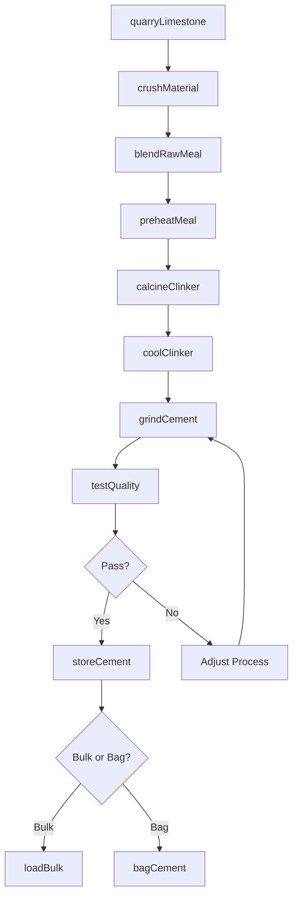
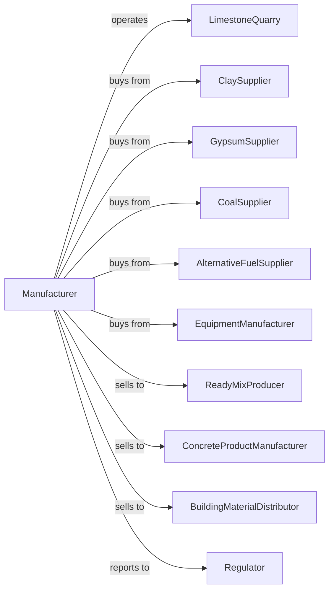

# Cement Manufacturing

> Business-as-Code definition for cement manufacturing operations. Models the complete production lifecycle from raw material extraction through finished cement distribution.

## Overview

Cement manufacturing involves mining or purchasing limestone and clay, crushing and blending raw materials, calcining in rotary kilns to produce clinker, and grinding clinker with gypsum to produce Portland cement and other hydraulic cements. This definition exposes actions for each phase of cement production, events for workflow automation, and searches for data retrieval.

## Actors

| Actor | Description |
|-------|-------------|
| LimestoneQuarry | Supplies limestone and other calcareous materials |
| ClaySupplier | Provides clay, shale, and silica sources |
| GypsumSupplier | Supplies gypsum for cement finish grinding |
| CoalSupplier | Provides fuel for kiln firing operations |
| AlternativeFuelSupplier | Supplies tire-derived fuel, biomass, and waste fuels |
| EquipmentManufacturer | Sells crushers, kilns, and grinding mills |
| ReadyMixProducer | Purchases cement for concrete production |
| ConcreteProductManufacturer | Uses cement in precast concrete products |
| BuildingMaterialDistributor | Distributes bagged cement to retail markets |
| Regulator | Oversees emissions, mining permits, and product standards |

## Roles

| Role | Description |
|------|-------------|
| PlantManager | Directs overall cement manufacturing operations |
| ProcessEngineer | Optimizes kiln operation and energy efficiency |
| QualityManager | Ensures cement meets strength and chemistry specifications |
| KilnOperator | Controls rotary kiln temperature and feed rate |
| MillOperator | Operates raw and finish grinding mills |
| EnvironmentalManager | Manages emissions monitoring and compliance |
| MineManager | Oversees quarry operations and raw material extraction |
| MaintenanceManager | Coordinates equipment upkeep and repairs |

## Entities

| Entity | Description |
|--------|-------------|
| Limestone | Primary raw material providing calcium carbite |
| Clay | Silica and alumina source for cement chemistry |
| RawMeal | Ground and blended raw materials for kiln feed |
| Kiln | Rotary furnace for calcining raw meal into clinker |
| Clinker | Intermediate product formed by sintering raw meal |
| Gypsum | Addite controlling cement setting time |
| Cement | Finished hydraulic binder product |
| Silo | Storage facility for raw materials or finished cement |
| Preheater | Tower recovering heat from kiln exhaust |
| BaggedCement | Packaged cement for retail distribution |

## Actions

| Action | Description |
|--------|-------------|
| quarryLimestone | Extract limestone from quarry deposits |
| crushMaterial | Reduce raw material size in primary and secondary crushers |
| blendRawMeal | Proportion and grind raw materials to target chemistry |
| preheatMeal | Heat raw meal using kiln exhaust gases |
| calcineCliinker | Fire raw meal in rotary kiln to form clinker |
| coolClinker | Reduce clinker temperature after kiln discharge |
| grindCement | Mill clinker with gypsum to produce finished cement |
| testQuality | Analyze cement for strength, fineness, and chemistry |
| storeCement | Transfer finished cement to silos |
| bagCement | Package cement in bags for retail sale |
| loadBulk | Fill trucks or railcars for bulk delivery |
| monitorEmissions | Track kiln and mill emissions for compliance |

## Events

| Event | Description |
|-------|-------------|
| limestoneQuarried | Raw material extracted from quarry |
| materialCrushed | Raw materials reduced to required size |
| rawMealBlended | Materials proportioned and ground to specification |
| clinkerProduced | Kiln firing completed and clinker cooled |
| cementGround | Finish grinding completed |
| qualityApproved | Cement meets specification requirements |
| qualityRejected | Cement fails tests and requires adjustment |
| cementStored | Product transferred to storage silo |
| orderShipped | Cement delivered to customer |
| kilnIssue | Temperature or feed anomaly detected |
| emissionsAlert | Environmental threshold exceeded |
| maintenanceScheduled | Equipment service planned |

## Searches

| Search | Description |
|--------|-------------|
| findProducts | List cement types by strength class and specification |
| getInventory | Query silo levels by cement type and location |
| findOrders | Retrieve orders by customer, product, or delivery date |
| getProductionData | View kiln output, energy use, and throughput |
| checkQualityData | Access strength tests, chemistry, and fineness data |
| getMaterialInventory | Query raw material and fuel stock levels |
| getEmissionsData | Retrieve environmental monitoring records |
| getEnergyMetrics | Analyze fuel consumption and alternative fuel usage |

## Workflow



## Actor Relationships



## Usage

### Calling Actions

```typescript
import { manufactureCement } from '@headlessly/manufacture-cement'

const plant = manufactureCement()

// Blend raw meal to target chemistry
const rawMeal = await plant.blendRawMeal({
  limestone: 85,
  clay: 12,
  ironOre: 2,
  sand: 1,
  targetLSF: 0.95,
  targetSilicaRatio: 2.5
})

// Produce clinker in rotary kiln
const clinker = await plant.calcineClinker({
  rawMealId: rawMeal.id,
  kilnTemp: 1450,
  feedRate: 350,
  rotationSpeed: 3.5
})

// Grind cement to specification
await plant.grindCement({
  clinkerId: clinker.id,
  gypsumPercent: 5,
  targetBlaine: 3500,
  cementType: 'Type-I'
})
```

### Event-Driven Automation

```typescript
// Auto-adjust kiln on temperature deviation
plant.kilnIssue(async ({ kilnId, parameter, reading, target }) => {
  await plant.adjustKiln({
    kilnId,
    parameter,
    adjustment: target - reading,
    notifyOperator: true
  })
})

// Auto-alert on emissions threshold
plant.emissionsAlert(async ({ source, pollutant, reading, limit }) => {
  await plant.reduceKilnFeed({
    source,
    reduction: 0.1,
    notifyEnvironmental: true
  })
})
```
