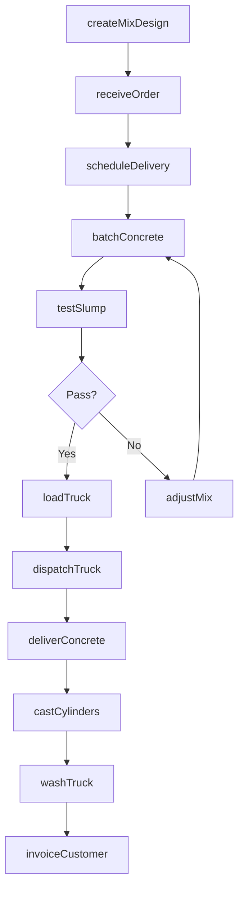
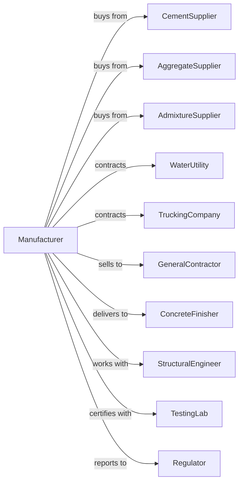

# Ready-Mix Concrete Manufacturing

> Business-as-Code definition for ready-mix concrete manufacturing operations. Models the complete production lifecycle from raw material batching through delivery to construction sites.

## Overview

Ready-mix concrete manufacturing involves batching cement, aggregates, water, and admixtures at central plants and delivering the mixed concrete to construction sites in a plastic, unhardened state. Operations require precise proportioning, quality control, and time-sensitive delivery to ensure concrete workability and strength. This definition exposes actions for each phase of production, events for workflow automation, and searches for data retrieval.

## Actors

| Actor | Description |
|-------|-------------|
| CementSupplier | Provides Portland cement and supplementary cite materials |
| AggregateSupplier | Supplies sand, gravel, and crushed stone |
| AdmixtureSupplier | Provides water reducers, accelerators, and specialty admixtures |
| WaterUtility | Supplies mixing water meeting quality specifications |
| TruckingCompany | Provides mixer trucks and drivers for delivery |
| GeneralContractor | Orders concrete for construction projects |
| ConcreteFinisher | Places and finishes delivered concrete |
| StructuralEngineer | Specifies concrete mix designs for projects |
| TestingLab | Provides quality testing and mix design services |
| Regulator | Oversees environmental permits and product standards |

## Roles

| Role | Description |
|------|-------------|
| PlantManager | Oversees batch plant operations and customer service |
| QualityManager | Develops mix designs and ensures product quality |
| BatchOperator | Controls automated batching and loading systems |
| Dispatcher | Schedules trucks and coordinates deliveries |
| TruckDriver | Operates mixer truck and delivers concrete |
| SalesRepresentative | Manages customer relationships and orders |
| LabTechnician | Tests aggregates, cement, and fresh concrete |
| MaintenanceTechnician | Maintains batch plant and mixer truck equipment |

## Entities

| Entity | Description |
|--------|-------------|
| MixDesign | Proportioned recipe for specific concrete properties |
| Batch | Single load of concrete mixed at plant |
| MixerTruck | Vehicle with rotating drum for transport and mixing |
| Cement | Hydraulic binder providing concrete strength |
| Aggregate | Sand and stone providing concrete volume and strength |
| Admixture | Chemical addite modifying concrete properties |
| Slump | Measure of concrete workability and consistency |
| Ticket | Delivery document with batch details and certifications |
| JobSite | Construction location receiving concrete delivery |
| Silo | Storage vessel for cement and supplementary materials |

## Actions

| Action | Description |
|--------|-------------|
| createMixDesign | Develop proportions for specific strength and workability |
| receiveOrder | Accept customer order with volume, mix, and delivery time |
| scheduleDelivery | Assign trucks and plan delivery sequence |
| batchConcrete | Proportion and mix materials according to design |
| loadTruck | Transfer batched concrete to mixer truck |
| dispatchTruck | Send truck to job site with delivery ticket |
| deliverConcrete | Transport and discharge concrete at job site |
| testSlump | Verify concrete workability at plant or site |
| castCylinders | Make test specimens for strength testing |
| washTruck | Clean mixer drum after delivery |
| adjustMix | Modify proportions based on test results or site conditions |
| invoiceCustomer | Bill customer for delivered concrete |

## Events

| Event | Description |
|-------|-------------|
| orderReceived | Customer order entered into dispatch system |
| truckScheduled | Delivery assigned to specific truck and time |
| batchCompleted | Concrete mixed and loaded into truck |
| truckDispatched | Mixer truck departed for job site |
| concreteDelivered | Concrete discharged at construction site |
| slumpApproved | Workability meets specification |
| slumpRejected | Concrete rejected for improper consistency |
| strengthTested | Cylinder break results available |
| truckReturned | Mixer truck back at plant for reload |
| plantDown | Equipment failure affecting production |
| weatherAlert | Conditions affecting concrete placement |

## Searches

| Search | Description |
|--------|-------------|
| findMixDesigns | List available mixes by strength, application, and exposure |
| getOrders | Retrieve orders by customer, date, or job site |
| getDispatchStatus | View truck locations and delivery progress |
| checkInventory | Query material levels in silos and stockpiles |
| getQualityData | Access slump tests, strength results, and certifications |
| findTrucks | List trucks by status, capacity, and availability |
| getCustomers | Retrieve customer accounts and pricing |
| getProduction | View daily batching volumes and efficiency metrics |

## Workflow



## Actor Relationships



## Usage

### Calling Actions

```typescript
import { manufactureReadyMixConcrete } from '@headlessly/manufacture-ready-mix-concrete'

const plant = manufactureReadyMixConcrete()

// Create mix design for structural application
const mix = await plant.createMixDesign({
  strength: 4000,
  slump: 4,
  maxAggSize: 0.75,
  cement: 564,
  flyAsh: 100,
  waterCementRatio: 0.45,
  airContent: 6
})

// Receive and schedule customer order
const order = await plant.receiveOrder({
  customerId: 'abc-construction',
  jobSite: '123-main-street',
  mixDesignId: mix.id,
  volume: 150,
  deliveryStart: '2024-03-15T07:00:00',
  pourRate: 30
})

// Batch and dispatch first truck
await plant.batchConcrete({
  orderId: order.id,
  truckId: 'truck-15',
  loadSize: 10
})
```

### Event-Driven Automation

```typescript
// Auto-adjust mix on slump rejection
plant.slumpRejected(async ({ batchId, actualSlump, targetSlump }) => {
  const adjustment = targetSlump - actualSlump
  await plant.adjustMix({
    batchId,
    addWater: adjustment > 0,
    gallons: Math.abs(adjustment) * 3
  })
})

// Auto-dispatch next truck when current delivered
plant.concreteDelivered(async ({ orderId, remainingVolume }) => {
  if (remainingVolume > 0) {
    await plant.scheduleDelivery({
      orderId,
      priority: 'next-available'
    })
  }
})
```
