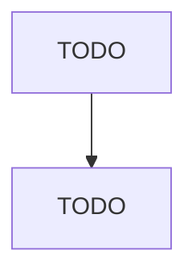

# Ready-Mix Concrete Manufacturing

> TODO: Business-as-Code definition

## Overview

This industry comprises establishments, such as batch plants or mix plants, primarily engaged in manufacturing concrete delivered to a purchaser in a plastic and unhardened state. Ready-mix concrete manufacturing establishments may mine, quarry, or purchase sand and gravel. Cross-References. Establishments primarily engaged in--

## Actors

| Actor | Description |
|-------|-------------|
| TODO | TODO |

## Roles

| Role | Description |
|------|-------------|
| TODO | TODO |

## Entities

| Entity | Description |
|--------|-------------|
| TODO | TODO |

## Actions

| Action | Description |
|--------|-------------|
| TODO | TODO |

## Events

| Event | Description |
|-------|-------------|
| TODO | TODO |

## Searches

| Search | Description |
|--------|-------------|
| TODO | TODO |

## Workflow

## Actor Relationships

