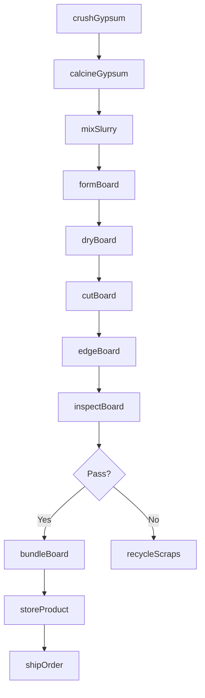
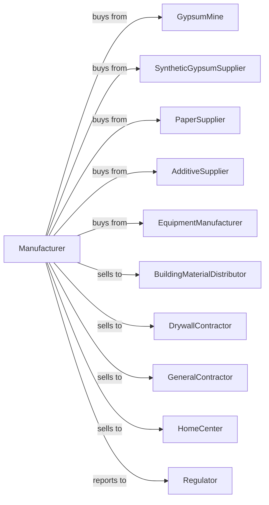

# Gypsum Product Manufacturing

> Business-as-Code definition for gypsum product manufacturing operations. Models the complete production lifecycle from raw gypsum processing through finished wallboard and plaster production.

## Overview

Gypsum product manufacturing involves calcining natural or synthetic gypsum to produce plaster of Paris and manufacturing wallboard, ceiling tiles, and specialty gypsum products. Wallboard production involves forming gypsum slurry between paper facers on continuous production lines. This definition exposes actions for each phase of production, events for workflow automation, and searches for data retrieval.

## Actors

| Actor | Description |
|-------|-------------|
| GypsumMine | Supplies natural gypsum rock from mining operations |
| SyntheticGypsumSupplier | Provides FGD gypsum from power plant scrubbers |
| PaperSupplier | Supplies facing paper and backing paper for wallboard |
| AdditiveSupplier | Provides foam, starch, and other wallboard additives |
| EquipmentManufacturer | Sells calciners, board lines, and finishing equipment |
| BuildingMaterialDistributor | Distributes wallboard to retail and contractor markets |
| DrywallContractor | Installs wallboard in residential and commercial construction |
| GeneralContractor | Purchases gypsum products for building projects |
| HomeCenter | Retails wallboard and joint compounds to consumers |
| Regulator | Oversees product standards and environmental compliance |

## Roles

| Role | Description |
|------|-------------|
| PlantManager | Directs gypsum product manufacturing operations |
| ProcessEngineer | Optimizes calcining and board line efficiency |
| QualityManager | Ensures products meet fire and strength ratings |
| CalcinerOperator | Controls gypsum calcination temperature and retention |
| BoardLineOperator | Runs wallboard forming and drying equipment |
| FinishingOperator | Manages cutting, edging, and bundling operations |
| WarehouseManager | Coordinates inventory and shipping logistics |
| MaintenanceManager | Oversees equipment upkeep and repairs |

## Entities

| Entity | Description |
|--------|-------------|
| NaturalGypsum | Mined gypsum rock for processing |
| SyntheticGypsum | Byproduct gypsum from industrial processes |
| StuccoPlaster | Calcined gypsum hemihydrate for board production |
| FacingPaper | Paper applied to wallboard surfaces |
| Wallboard | Gypsum panel with paper facers for construction |
| Slurry | Wet gypsum mixture before forming |
| BoardLine | Continuous production system for wallboard |
| Kiln | Calcining equipment for gypsum processing |
| Bundle | Packaged unit of wallboard sheets |
| QualitySpec | Fire rating, strength, and dimensional standards |

## Actions

| Action | Description |
|--------|-------------|
| crushGypsum | Reduce raw gypsum to processing size |
| calcineGypsum | Heat gypsum to remove water and produce stucco |
| mixSlurry | Combine stucco with water, foam, and additives |
| formBoard | Apply slurry between paper facers on board line |
| dryBoard | Remove moisture in multi-zone dryer |
| cutBoard | Trim boards to standard lengths |
| edgeBoard | Apply tapered or square edges |
| inspectBoard | Test for thickness, strength, and fire rating |
| bundleBoard | Stack and strap boards for shipping |
| storeProduct | Transfer bundles to warehouse |
| shipOrder | Deliver products to customer locations |
| recycleScraps | Process trim and rejected boards for reuse |

## Events

| Event | Description |
|-------|-------------|
| gypsumCrushed | Raw material reduced to processing size |
| gypsumCalcined | Stucco produced from calcining |
| slurryMixed | Wet mixture prepared for forming |
| boardFormed | Wallboard shaped on production line |
| boardDried | Moisture removed and board cured |
| boardCut | Product trimmed to final dimensions |
| inspectionPassed | Board meets quality specifications |
| inspectionFailed | Board rejected for defects |
| boardBundled | Product packaged for shipping |
| orderShipped | Wallboard delivered to customer |
| lineDown | Board line stoppage requiring intervention |
| inventoryLow | Stock below reorder threshold |

## Searches

| Search | Description |
|--------|-------------|
| findProducts | List wallboard by thickness, type, and fire rating |
| getInventory | Query stock levels by product and warehouse |
| findOrders | Retrieve orders by customer, product, or delivery date |
| getProductionSchedule | View board line schedules by product type |
| checkQualityData | Access strength tests, fire ratings, and dimensions |
| getLineEfficiency | Analyze board line uptime and throughput |
| getMaterialInventory | Query gypsum, paper, and additive stock |
| getScrapRate | Monitor waste and recycling metrics |

## Workflow



## Actor Relationships



## Usage

### Calling Actions

```typescript
import { manufactureGypsumProduct } from '@headlessly/manufacture-gypsum-product'

const plant = manufactureGypsumProduct()

// Calcine gypsum for board production
const stucco = await plant.calcineGypsum({
  source: 'synthetic-fgd',
  temperature: 150,
  residenceTime: 30,
  targetMoisture: 0.5
})

// Mix slurry for fire-rated board
const slurry = await plant.mixSlurry({
  stuccoId: stucco.id,
  waterRatio: 0.8,
  foamAgent: 2.5,
  glassfiber: 0.5,
  vermiculite: 3
})

// Form 5/8" Type X wallboard
await plant.formBoard({
  slurryId: slurry.id,
  thickness: 0.625,
  width: 48,
  paperType: 'fire-rated',
  lineSpeed: 500
})
```

### Event-Driven Automation

```typescript
// Auto-adjust on inspection failure
plant.inspectionFailed(async ({ boardId, defectType, severity }) => {
  await plant.recycleScraps({
    boardId,
    reason: defectType
  })
  if (severity === 'critical') {
    await plant.adjustBoardLine({
      parameter: defectType,
      notifyOperator: true
    })
  }
})

// Auto-reorder materials when inventory low
plant.inventoryLow(async ({ materialId, currentLevel, reorderPoint }) => {
  await plant.createPurchaseOrder({
    materialId,
    quantity: reorderPoint * 1.5,
    priority: 'standard'
  })
})
```
