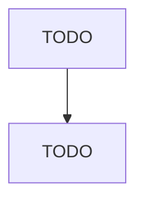

# Abrasive Product Manufacturing

> TODO: Business-as-Code definition

## Overview

This industry comprises establishments primarily engaged in manufacturing abrasive grinding wheels of natural or synthetic materials, abrasive-coated products, and other abrasive products. Illustrative Examples: Aluminum oxide (fused) abrasives manufacturing Buffing and polishing wheels, abrasive and nonabrasive, manufacturing Diamond dressing wheels manufacturing Sandpaper manufacturing Silicon carbide abrasives manufacturing Whetstones manufacturing Cross-References. Establishments primarily e

## Actors

| Actor | Description |
|-------|-------------|
| TODO | TODO |

## Roles

| Role | Description |
|------|-------------|
| TODO | TODO |

## Entities

| Entity | Description |
|--------|-------------|
| TODO | TODO |

## Actions

| Action | Description |
|--------|-------------|
| TODO | TODO |

## Events

| Event | Description |
|-------|-------------|
| TODO | TODO |

## Searches

| Search | Description |
|--------|-------------|
| TODO | TODO |

## Workflow

## Actor Relationships

