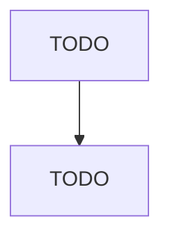

# All Other Miscellaneous Nonmetallic Mineral Product Manufacturing

> TODO: Business-as-Code definition

## Overview

This U.S. industry comprises establishments primarily engaged in manufacturing nonmetallic mineral products (except pottery, ceramics, and plumbing fixtures; clay building materials and refractories; glass and glass products; cement; ready-mix concrete; concrete products; lime; gypsum products; abrasive products; cut stone and stone products; ground and treated minerals and earth; and mineral wool). Illustrative Examples: Dry mix concrete manufacturing Mica products manufacturing Manmade and eng

## Actors

| Actor | Description |
|-------|-------------|
| TODO | TODO |

## Roles

| Role | Description |
|------|-------------|
| TODO | TODO |

## Entities

| Entity | Description |
|--------|-------------|
| TODO | TODO |

## Actions

| Action | Description |
|--------|-------------|
| TODO | TODO |

## Events

| Event | Description |
|-------|-------------|
| TODO | TODO |

## Searches

| Search | Description |
|--------|-------------|
| TODO | TODO |

## Workflow

## Actor Relationships

