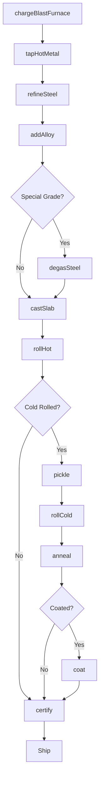
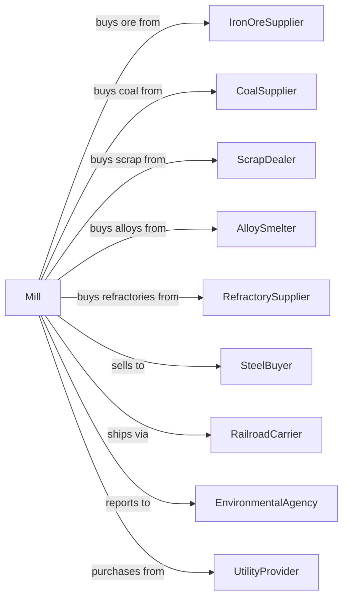

# Iron and Steel Mills and Ferroalloy Manufacturing

> Business-as-Code definition for integrated steel production operations. Models the complete steelmaking lifecycle from raw material procurement through finished steel products.

## Overview

This industry comprises establishments primarily engaged in one or more of the following: (1) direct reduction of iron ore; (2) manufacturing pig iron in molten or solid form; (3) converting pig iron into steel; (4) making steel; (5) making steel and manufacturing shapes (e.g., bar, plate, rod, sheet, strip, wire); (6) making steel and forming pipe and tube; and (7) manufacturing electrometallurgical ferroalloys. Ferroalloys add critical elements, such as silicon and manganese for carbon steel.

## Actors

| Actor | Description |
|-------|-------------|
| IronOreSupplier | Provides iron ore pellets and concentrate for smelting |
| CoalSupplier | Supplies metallurgical coal and coke for blast furnaces |
| ScrapDealer | Provides ferrous scrap for electric arc furnace operations |
| AlloySmelter | Supplies ferroalloys for steel chemistry adjustment |
| RefractorySupplier | Provides heat-resistant linings for furnaces and ladles |
| EquipmentVendor | Supplies and maintains rolling mills and furnace equipment |
| SteelBuyer | Purchases finished steel products for downstream use |
| RailroadCarrier | Transports bulk raw materials and finished products |
| EnvironmentalAgency | Regulates emissions and waste disposal compliance |
| UtilityProvider | Supplies electricity and natural gas for operations |

## Roles

| Role | Description |
|------|-------------|
| PlantManager | Oversees entire mill operations and production targets |
| MeltShopSupervisor | Manages blast furnace and steelmaking operations |
| MetallurgicalEngineer | Controls steel chemistry and quality specifications |
| FurnaceOperator | Operates blast furnaces and basic oxygen furnaces |
| RollingMillOperator | Controls hot and cold rolling equipment |
| QualityInspector | Tests steel samples and certifies product grades |
| MaintenanceTechnician | Maintains furnaces, mills, and process equipment |
| SafetyCoordinator | Ensures compliance with safety protocols |

## Entities

| Entity | Description |
|--------|-------------|
| Heat | A batch of molten steel from a single furnace charge |
| Coil | Rolled steel wound into cylindrical form |
| Slab | Flat semi-finished steel for rolling into sheet |
| Billet | Square semi-finished steel for rolling into bars |
| Bloom | Large semi-finished steel for structural shapes |
| Ladle | Vessel for transporting and treating molten steel |
| Mold | Form for casting steel into semi-finished shapes |
| Specification | Customer requirements for chemistry and properties |
| CertificateOfAnalysis | Document certifying steel chemistry and properties |
| FurnaceCampaign | Operating period between furnace relinings |

## Actions

| Action | Description |
|--------|-------------|
| chargeBlastFurnace | Load iron ore, coke, and flux into blast furnace |
| tapHotMetal | Draw molten iron from blast furnace into torpedo cars |
| refineSteel | Convert pig iron to steel in basic oxygen furnace |
| meltScrap | Process ferrous scrap in electric arc furnace |
| addAlloy | Adjust steel chemistry with ferroalloy additions |
| degasSteel | Remove dissolved gases in vacuum degassing unit |
| castSlab | Pour molten steel into continuous caster for slabs |
| rollHot | Reduce slab thickness in hot strip mill |
| rollCold | Further reduce thickness in cold rolling mill |
| anneal | Heat treat steel to restore ductility |
| pickle | Remove oxide scale in acid bath |
| coat | Apply zinc or other protective coatings |
| slit | Cut wide coils into narrower strips |
| certify | Issue mill test reports and certificates |

## Events

| Event | Description |
|-------|-------------|
| furnaceCharged | Blast furnace loaded and operating |
| hotMetalTapped | Molten iron collected from blast furnace |
| steelRefined | BOF or EAF heat completed |
| alloyAdjusted | Steel chemistry within specification |
| steelDegassed | Vacuum treatment completed |
| slabCast | Continuous casting produced solid slabs |
| hotRolled | Hot strip mill processing complete |
| coldRolled | Cold reduction completed |
| annealed | Heat treatment cycle finished |
| pickled | Scale removed from steel surface |
| coated | Protective coating applied |
| certified | Mill test certificate issued |
| shipped | Steel products dispatched to customer |

## Searches

| Search | Description |
|--------|-------------|
| findHeats | List heats by chemistry, grade, or production date |
| getInventory | Retrieve current stock by product type and grade |
| checkCapacity | Get available production capacity by process |
| findOrders | List customer orders by due date and specification |
| getQualityData | Retrieve test results and certifications |
| trackCoil | Locate specific coil through production process |
| getYieldMetrics | Retrieve yield and recovery statistics |
| findSuppliers | List qualified suppliers by material type |

## Workflow



## Actor Relationships



## Usage

### Calling Actions

```typescript
import { smeltIronSteel } from '@headlessly/smelt-iron-steel'

const mill = smeltIronSteel()

// Charge blast furnace with raw materials
await mill.chargeBlastFurnace({
  ironOre: { tons: 1800, grade: 'pellet-65' },
  coke: { tons: 600, quality: 'met-grade' },
  limestone: { tons: 200 }
})

// Tap hot metal when ready
const hotMetal = await mill.tapHotMetal({
  furnaceId: 'BF-3',
  targetTemperature: 1450,
  torpedoCars: ['TC-101', 'TC-102']
})

// Refine steel in BOF
const heat = await mill.refineSteel({
  hotMetalTons: 280,
  scrapTons: 30,
  targetGrade: 'SAE-1010',
  oxygenBlowMinutes: 18
})
```

### Event-Driven Automation

```typescript
// Auto-adjust alloy when chemistry off-spec
mill.steelRefined(async ({ heatId, chemistry }) => {
  const spec = await mill.getSpecification(heatId)

  if (chemistry.carbon < spec.carbonMin) {
    await mill.addAlloy({
      heatId,
      addition: 'carbon',
      quantity: calculateCarbonAddition(chemistry, spec)
    })
  }
})

// Auto-certify when quality tests pass
mill.coldRolled(async ({ coilId, thickness, tensile }) => {
  const order = await mill.getOrder(coilId)

  if (meetsSpecification(thickness, tensile, order.spec)) {
    await mill.certify({
      coilId,
      certificate: generateMTR(coilId, thickness, tensile)
    })
  }
})
```
