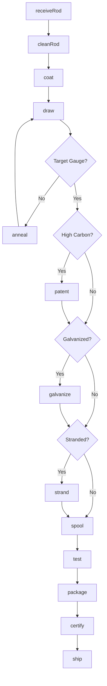
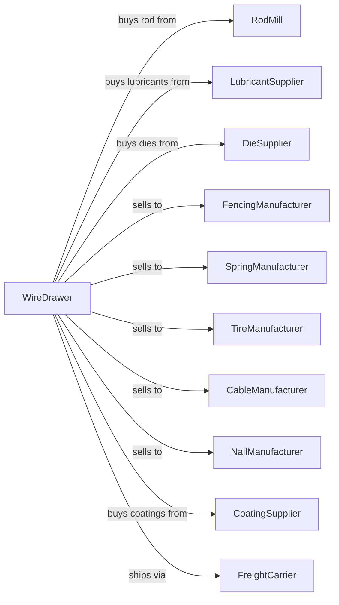

# Steel Wire Drawing

> Business-as-Code definition for steel wire drawing operations. Models the complete wire production process from rod procurement through finished wire coating and packaging.

## Overview

This U.S. industry comprises establishments primarily engaged in drawing wire from purchased steel.

## Actors

| Actor | Description |
|-------|-------------|
| RodMill | Supplies hot rolled wire rod for drawing |
| LubricantSupplier | Provides drawing lubricants and coatings |
| DieSupplier | Supplies tungsten carbide and diamond dies |
| FencingManufacturer | Purchases wire for fencing products |
| SpringManufacturer | Purchases high-tensile wire for springs |
| TireManufacturer | Purchases bead wire and tire cord |
| CableManufacturer | Purchases wire for wire rope and cable |
| NailManufacturer | Purchases wire for fastener production |
| CoatingSupplier | Provides zinc and other coating materials |
| FreightCarrier | Transports finished wire products |

## Roles

| Role | Description |
|------|-------------|
| PlantManager | Oversees wire drawing operations |
| DrawBenchOperator | Operates single and multi-die drawing machines |
| AnnealingOperator | Manages heat treatment furnaces |
| CoatingOperator | Operates galvanizing and coating lines |
| DieShopTechnician | Maintains and polishes drawing dies |
| QualityTechnician | Tests wire properties and dimensions |
| MaintenanceMechanic | Maintains drawing equipment and spoolers |
| ProductionPlanner | Schedules drawing campaigns by grade |

## Entities

| Entity | Description |
|--------|-------------|
| WireRod | Hot rolled input material for drawing |
| Wire | Drawn product in various gauges |
| Die | Hardened tool that reduces wire diameter |
| Coil | Wire wound on spool or carrier |
| Lubricant | Drawing compound reducing friction |
| Patenting | Heat treatment for high-carbon wire |
| Galvanizing | Zinc coating for corrosion protection |
| Gauge | Wire diameter measurement |
| TensileStrength | Mechanical property specification |
| Spool | Carrier for wound wire product |

## Actions

| Action | Description |
|--------|-------------|
| receiveRod | Accept and verify incoming wire rod coils |
| cleanRod | Remove scale through pickling or mechanical cleaning |
| coat | Apply drawing lubricant to rod surface |
| draw | Pull wire through dies to reduce diameter |
| anneal | Heat treat to restore ductility |
| patent | Special heat treatment for high-carbon wire |
| galvanize | Apply zinc coating by hot-dip or electro process |
| strand | Combine multiple wires into cable or rope |
| spool | Wind finished wire onto carriers |
| test | Verify tensile strength and dimensions |
| package | Prepare coils and spools for shipping |
| certify | Issue test reports and certifications |
| ship | Dispatch finished products to customers |

## Events

| Event | Description |
|-------|-------------|
| rodReceived | Wire rod verified and accepted |
| rodCleaned | Scale removed from rod surface |
| rodCoated | Lubricant applied for drawing |
| wireDrawn | Diameter reduction completed |
| wireAnnealed | Ductility restored by heat treatment |
| wirePatented | High-carbon heat treatment completed |
| wireGalvanized | Zinc coating applied |
| wireStranded | Multiple wires combined |
| wireSpooled | Product wound on carrier |
| wireTested | Properties verified |
| packaged | Product prepared for shipping |
| certified | Documentation issued |
| shipped | Product dispatched |

## Searches

| Search | Description |
|--------|-------------|
| findRodStock | List available wire rod by grade and size |
| getOrders | Retrieve open orders by gauge and finish |
| checkInventory | Get finished wire stock by specification |
| getDieStatus | Check die wear and replacement schedule |
| getDrawingSchedule | List planned production runs |
| findTestReports | Retrieve mechanical test data |
| trackCoil | Locate specific coil through production |
| getYieldMetrics | View drawing efficiency statistics |

## Workflow



## Actor Relationships



## Usage

### Calling Actions

```typescript
import { manufactureSteelWire } from '@headlessly/manufacture-steel-wire'

const drawer = manufactureSteelWire()

// Receive wire rod
const rod = await drawer.receiveRod({
  coilId: 'ROD-2024-7823',
  grade: 'SAE-1070',
  diameter: 5.5,
  weight: 2200,
  heatNumber: 'H-45231'
})

// Draw to target gauge
await drawer.draw({
  rodId: rod.id,
  targetGauge: 0.080,
  dieSequence: ['4.5mm', '3.5mm', '2.5mm', '2.0mm'],
  drawSpeed: 1200
})

// Galvanize for outdoor use
await drawer.galvanize({
  wireId: 'WIRE-2024-1234',
  process: 'hot-dip',
  coatingWeight: 0.80
})
```

### Event-Driven Automation

```typescript
// Auto-anneal after heavy reduction
drawer.wireDrawn(async ({ wireId, reductionPercent, gauge }) => {
  if (reductionPercent > 75) {
    await drawer.anneal({
      wireId,
      temperature: 1400,
      holdTime: 30,
      atmosphere: 'hydrogen'
    })
  }
})

// Auto-certify when tests pass
drawer.wireTested(async ({ wireId, tensile, elongation, coatingWeight }) => {
  const spec = await drawer.getSpecification(wireId)

  if (tensile >= spec.minTensile && elongation >= spec.minElong) {
    await drawer.certify({
      wireId,
      standard: spec.standard,
      tensileStrength: tensile,
      elongation
    })
  }
})
```
