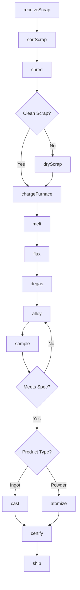
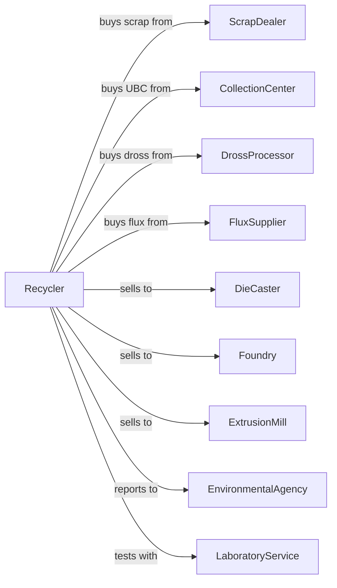

# Secondary Smelting and Alloying of Aluminum

> Business-as-Code definition for secondary aluminum smelting and alloying operations. Models the recycling process from scrap collection through alloy production and casting.

## Overview

This U.S. industry comprises establishments primarily engaged in (1) recovering aluminum and aluminum alloys from scrap and/or dross (i.e., secondary smelting) and making billet or ingot (except by rolling) and/or (2) manufacturing alloys, powder, paste, or flake from purchased aluminum.

## Actors

| Actor | Description |
|-------|-------------|
| ScrapDealer | Supplies aluminum scrap sorted by alloy type |
| CollectionCenter | Provides used beverage containers and consumer scrap |
| DrossProcessor | Supplies aluminum dross for recovery |
| FluxSupplier | Provides fluxing agents and degassers |
| DieCaster | Purchases secondary alloy ingots |
| Foundry | Purchases alloyed ingot for sand casting |
| ExtrusionMill | Purchases billet for extrusion |
| EnvironmentalAgency | Regulates emissions and waste disposal |
| EquipmentVendor | Supplies furnaces and processing equipment |
| LaboratoryService | Provides spectrographic analysis services |

## Roles

| Role | Description |
|------|-------------|
| PlantManager | Oversees recycling and smelting operations |
| MeltShopSupervisor | Manages furnace operations and chemistry |
| FurnaceOperator | Operates rotary and reverberatory furnaces |
| SortingTechnician | Classifies and prepares scrap for melting |
| AlloySpecialist | Adjusts chemistry to meet specifications |
| CastingOperator | Operates ingot and sow casting equipment |
| QualityAnalyst | Tests chemistry and certifies products |
| MaintenanceMechanic | Maintains furnaces and material handling |

## Entities

| Entity | Description |
|--------|-------------|
| Scrap | Recovered aluminum from various sources |
| Dross | Oxide-rich byproduct from melting operations |
| Alloy | Aluminum with controlled additions of other elements |
| Flux | Chemical agent for removing impurities |
| Ingot | Cast aluminum form for remelting |
| Sow | Large cast block for foundry use |
| Billet | Cylindrical form for extrusion |
| Powder | Fine aluminum particles for specialized uses |
| MasterAlloy | Concentrated alloying element for additions |
| Heat | A batch of molten aluminum from single charge |

## Actions

| Action | Description |
|--------|-------------|
| receiveScrap | Accept and weigh incoming aluminum scrap |
| sortScrap | Separate scrap by alloy type and cleanliness |
| shred | Size-reduce scrap for efficient melting |
| dryScrap | Remove moisture and oils from scrap |
| chargeFurnace | Load scrap into melting furnace |
| melt | Liquefy aluminum scrap in furnace |
| flux | Add chemicals to remove oxides and impurities |
| degas | Remove dissolved hydrogen from melt |
| alloy | Add elements to achieve target chemistry |
| sample | Take molten metal samples for analysis |
| cast | Pour molten aluminum into molds |
| atomize | Produce aluminum powder from molten metal |
| certify | Issue certificates of analysis |
| ship | Dispatch finished products to customers |

## Events

| Event | Description |
|-------|-------------|
| scrapReceived | Material weighed and accepted |
| scrapSorted | Material classified by alloy type |
| scrapShredded | Material size-reduced |
| scrapDried | Moisture and oils removed |
| furnaceCharged | Material loaded for melting |
| scrapMelted | Aluminum liquefied |
| meltFluxed | Impurities removed |
| meltDegassed | Hydrogen removed |
| alloyAdjusted | Chemistry within specification |
| meltSampled | Analysis results available |
| metalCast | Ingots or billets formed |
| powderAtomized | Powder produced |
| certified | Certificate issued |
| shipped | Product dispatched |

## Searches

| Search | Description |
|--------|-------------|
| findScrapInventory | List available scrap by type and grade |
| getOrderQueue | Retrieve pending orders by alloy |
| checkAlloyStock | Get ingot inventory by specification |
| getFurnaceStatus | Monitor furnace temperature and capacity |
| getYieldMetrics | View recovery efficiency statistics |
| findCertificates | Retrieve analysis certificates |
| trackHeat | Follow specific heat through production |
| getChemistryReports | Retrieve spectrographic analysis data |

## Workflow



## Actor Relationships



## Usage

### Calling Actions

```typescript
import { refineSecondarySmelting } from '@headlessly/refine-secondary-smelting'

const recycler = refineSecondarySmelting()

// Receive aluminum scrap
const scrap = await recycler.receiveScrap({
  loadId: 'SCR-2024-3421',
  type: 'used-beverage-containers',
  weight: 44000,
  estimatedYield: 0.92
})

// Melt and alloy
await recycler.melt({
  furnaceId: 'RV-2',
  scrapIds: [scrap.id],
  targetTemperature: 1350
})

// Adjust to target alloy
await recycler.alloy({
  heatId: 'HT-2024-0892',
  targetAlloy: 'A380',
  additions: [
    { element: 'silicon', pounds: 450 },
    { element: 'copper', pounds: 180 }
  ]
})
```

### Event-Driven Automation

```typescript
// Auto-degas after fluxing
recycler.meltFluxed(async ({ heatId, temperature }) => {
  await recycler.degas({
    heatId,
    method: 'rotary-impeller',
    gasType: 'argon',
    duration: 15
  })
})

// Auto-certify when chemistry verified
recycler.meltSampled(async ({ heatId, chemistry }) => {
  const spec = await recycler.getSpecification(heatId)

  if (meetsAlloySpec(chemistry, spec)) {
    await recycler.cast({
      heatId,
      form: spec.productForm,
      moldCount: spec.quantity
    })
  }
})
```
