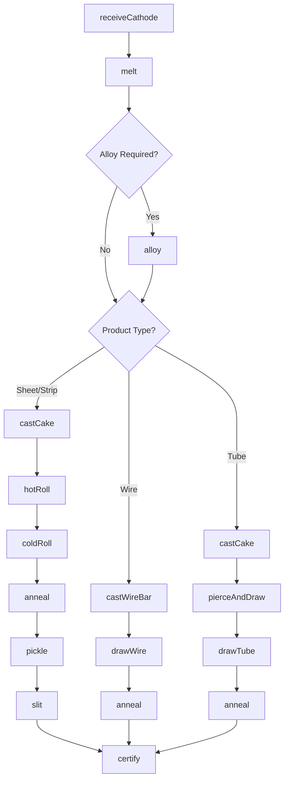
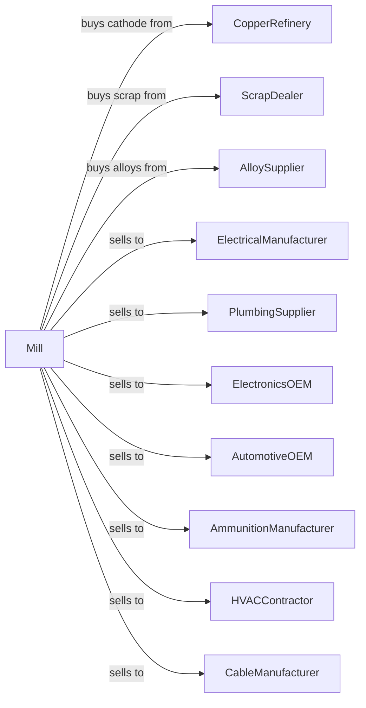

# Copper Rolling, Drawing, Extruding, and Alloying

> Business-as-Code definition for copper and brass mill operations. Models the production of sheet, strip, tube, rod, and wire from copper and copper alloys.

## Overview

This industry comprises establishments primarily engaged in one or more of the following: (1) recovering copper or copper alloys from scraps; (2) alloying purchased copper; (3) rolling, drawing, or extruding shapes from purchased copper; and (4) recovering copper from scrap and rolling, drawing, or extruding shapes in integrated mills.

## Actors

| Actor | Description |
|-------|-------------|
| CopperRefinery | Supplies copper cathodes and wire bar |
| ScrapDealer | Provides copper and brass scrap |
| AlloySupplier | Provides zinc, tin, and alloying elements |
| ElectricalManufacturer | Purchases wire and busbar |
| PlumbingSupplier | Purchases tube for plumbing applications |
| ElectronicsOEM | Purchases strip for connectors and leadframes |
| AutomotiveOEM | Purchases rod and strip for components |
| AmmunitionManufacturer | Purchases brass strip for cartridge cases |
| HVACContractor | Purchases tube for heat exchangers |
| CableManufacturer | Purchases rod for wire drawing |

## Roles

| Role | Description |
|------|-------------|
| PlantManager | Oversees mill operations |
| MeltShopOperator | Manages melting and casting operations |
| RollingMillOperator | Controls rolling equipment |
| DrawBenchOperator | Operates wire and tube drawing equipment |
| AlloySpecialist | Controls alloy chemistry and properties |
| AnnealingOperator | Manages heat treatment furnaces |
| QualityEngineer | Tests properties and certifies products |
| MaintenanceTechnician | Maintains mill equipment |

## Entities

| Entity | Description |
|--------|-------------|
| Cathode | Refined copper input material |
| WireBar | Cast copper bar for rod rolling |
| Cake | Cast copper slab for sheet rolling |
| Strip | Thin flat copper product |
| Sheet | Flat copper product |
| Tube | Hollow copper product |
| Rod | Round copper bar for wire drawing |
| Wire | Drawn copper product |
| BrassAlloy | Copper-zinc alloy |
| BronzeAlloy | Copper-tin alloy |

## Actions

| Action | Description |
|--------|-------------|
| receiveCathode | Accept and verify copper cathodes |
| melt | Liquefy copper in furnace |
| alloy | Add elements to create specific alloy |
| castCake | Pour molten copper into slab molds |
| castWireBar | Pour into continuous rod caster |
| hotRoll | Reduce thickness in hot rolling mill |
| coldRoll | Further reduce in cold rolling mill |
| drawWire | Pull rod through dies to make wire |
| drawTube | Reduce tube diameter through dies |
| anneal | Heat treat for desired properties |
| pickle | Remove oxide scale in acid |
| slit | Cut wide strip to narrower widths |
| cut | Shear sheets to specified sizes |
| certify | Issue mill test reports |

## Events

| Event | Description |
|-------|-------------|
| cathodeReceived | Material verified and accepted |
| copperMelted | Metal liquefied in furnace |
| alloyAdjusted | Chemistry within specification |
| cakeCast | Slab cast for rolling |
| wireBarCast | Rod cast for drawing |
| hotRolled | Hot reduction completed |
| coldRolled | Cold reduction completed |
| wireDrawn | Wire drawn to gauge |
| tubeDrawn | Tube drawn to size |
| annealed | Heat treatment completed |
| pickled | Scale removed |
| slit | Strip cut to width |
| cut | Sheets cut to size |
| certified | Test report issued |

## Searches

| Search | Description |
|--------|-------------|
| findCathodeStock | List available cathodes by grade |
| getAlloyInventory | Check alloy stock by composition |
| getOrders | Retrieve open orders by product |
| getMillSchedule | View planned production runs |
| findTestReports | Retrieve mechanical test data |
| trackCoil | Locate coil through production |
| getYieldMetrics | View rolling recovery statistics |
| getCapacity | Check available mill capacity |

## Workflow



## Actor Relationships



## Usage

### Calling Actions

```typescript
import { refineCopperRolling } from '@headlessly/refine-copper-rolling'

const mill = refineCopperRolling()

// Receive copper cathodes
const cathode = await mill.receiveCathode({
  lotId: 'CATH-2024-7892',
  grade: 'LME-A',
  weight: 25000,
  purity: 99.99
})

// Melt and alloy to brass
await mill.melt({
  furnaceId: 'INDUC-3',
  cathodeIds: [cathode.id],
  targetTemperature: 1150
})

await mill.alloy({
  heatId: 'HT-2024-0892',
  targetAlloy: 'C26000',
  additions: [
    { element: 'zinc', pounds: 7500 }
  ]
})

// Roll to finished strip
await mill.coldRoll({
  coilId: 'COIL-2024-4521',
  targetGauge: 0.010,
  targetWidth: 12,
  passes: 6
})
```

### Event-Driven Automation

```typescript
// Auto-anneal after cold rolling
mill.coldRolled(async ({ coilId, hardness, reductionPercent }) => {
  const order = await mill.getOrder(coilId)

  if (order.temper === 'soft' && hardness > order.maxHardness) {
    await mill.anneal({
      coilId,
      temperature: getAnnealTemp(order.alloy),
      atmosphere: 'reducing'
    })
  }
})

// Auto-certify when properties verified
mill.annealed(async ({ coilId, hardness, tensile, elongation }) => {
  const spec = await mill.getSpecification(coilId)

  if (meetsSpec(hardness, tensile, elongation, spec)) {
    await mill.certify({
      coilId,
      alloy: spec.alloy,
      temper: spec.temper,
      properties: { hardness, tensile, elongation }
    })
  }
})
```
