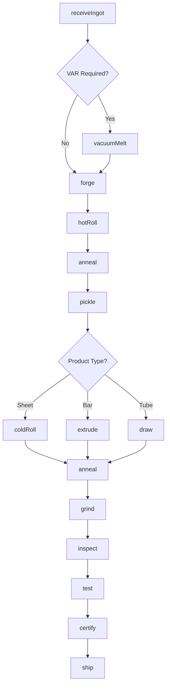
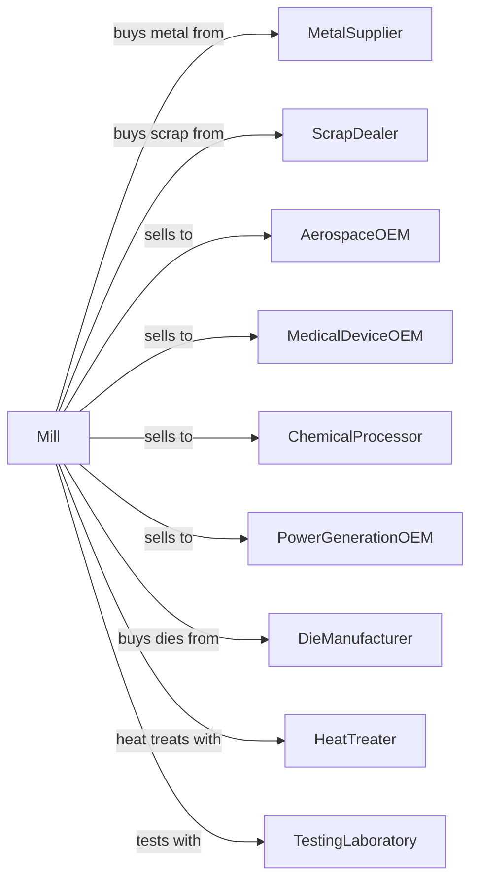

# Nonferrous Metal (except Copper and Aluminum) Rolling, Drawing, and Extruding

> Business-as-Code definition for specialty metal rolling and forming operations. Models the production of titanium, nickel, zinc, and other specialty metal shapes from purchased metals.

## Overview

This U.S. industry comprises establishments primarily engaged in (1) rolling, drawing, or extruding shapes (e.g., bar, plate, sheet, strip, tube) from purchased nonferrous metals and/or (2) recovering nonferrous metals from scrap and rolling, drawing, and/or extruding shapes in integrated mills.

## Actors

| Actor | Description |
|-------|-------------|
| MetalSupplier | Supplies primary titanium, nickel, and specialty metals |
| ScrapDealer | Provides specialty metal scrap for recycling |
| AerospaceOEM | Purchases titanium and nickel alloy products |
| MedicalDeviceOEM | Purchases biocompatible titanium products |
| ChemicalProcessor | Purchases corrosion-resistant alloy products |
| PowerGenerationOEM | Purchases high-temperature alloy products |
| DieManufacturer | Supplies extrusion and drawing dies |
| HeatTreater | Provides vacuum heat treatment services |
| TestingLaboratory | Provides metallurgical testing services |
| FreightCarrier | Transports finished specialty metals |

## Roles

| Role | Description |
|------|-------------|
| PlantManager | Oversees specialty metal processing operations |
| RollingMillOperator | Controls rolling equipment for specialty metals |
| ExtrusionOperator | Operates extrusion press equipment |
| DrawBenchOperator | Operates wire and tube drawing equipment |
| VacuumFurnaceOperator | Manages vacuum melting and heat treatment |
| MetallurgistEngineer | Controls alloy properties and processing |
| QualityEngineer | Tests and certifies products to aerospace specs |
| MaintenanceTechnician | Maintains specialized processing equipment |

## Entities

| Entity | Description |
|--------|-------------|
| Ingot | Cast primary metal input |
| Billet | Semi-finished form for extrusion |
| Sheet | Flat rolled specialty metal product |
| Plate | Thick flat rolled product |
| Strip | Thin flat rolled product |
| Bar | Round or shaped extruded product |
| Tube | Hollow drawn or extruded product |
| Wire | Fine drawn product |
| Specification | Aerospace or medical material standard |
| HeatLot | Traceability identifier for processing |

## Actions

| Action | Description |
|--------|-------------|
| receiveIngot | Accept and verify incoming specialty metal |
| vacuumMelt | Remelt in vacuum for purity |
| forge | Hot work ingot to intermediate shape |
| hotRoll | Reduce thickness at elevated temperature |
| coldRoll | Further reduce thickness at ambient temperature |
| anneal | Heat treat in vacuum or inert atmosphere |
| pickle | Remove oxide scale in acid solution |
| extrude | Push heated billet through die |
| draw | Pull through dies to reduce cross-section |
| grind | Remove surface defects |
| inspect | Verify dimensions and surface quality |
| test | Perform mechanical and chemical testing |
| certify | Issue compliance certifications |
| ship | Dispatch finished products |

## Events

| Event | Description |
|-------|-------------|
| ingotReceived | Material verified and accepted |
| metalRemelted | Vacuum remelting completed |
| metalForged | Hot working completed |
| hotRolled | Hot reduction completed |
| coldRolled | Cold reduction completed |
| annealed | Heat treatment completed |
| pickled | Scale removed |
| extruded | Extrusion completed |
| drawn | Drawing completed |
| ground | Surface conditioning completed |
| inspected | Quality verification completed |
| tested | Properties verified |
| certified | Compliance documentation issued |
| shipped | Product dispatched |

## Searches

| Search | Description |
|--------|-------------|
| findIngotStock | List available ingots by alloy and size |
| getOrders | Retrieve open orders by specification |
| checkInventory | Get finished stock by alloy and form |
| getProcessSchedule | View planned production runs |
| findTestReports | Retrieve test data by heat lot |
| trackMaterial | Locate material through processing |
| getCertifications | Retrieve compliance documents |
| getCapacity | Check available processing capacity |

## Workflow



## Actor Relationships



## Usage

### Calling Actions

```typescript
import { refineNonferrousMetal } from '@headlessly/refine-nonferrous-metal'

const mill = refineNonferrousMetal()

// Receive titanium ingot
const ingot = await mill.receiveIngot({
  ingotId: 'TI-2024-4521',
  alloy: 'Ti-6Al-4V',
  weight: 8000,
  meltId: 'VAR-2024-089'
})

// Hot roll to plate
await mill.hotRoll({
  billetId: ingot.billetId,
  targetThickness: 0.500,
  temperature: 1650,
  passes: 8
})

// Anneal in vacuum
await mill.anneal({
  plateId: 'PLT-2024-1234',
  temperature: 1300,
  holdTime: 120,
  atmosphere: 'vacuum'
})
```

### Event-Driven Automation

```typescript
// Auto-pickle after annealing
mill.annealed(async ({ productId, alloy }) => {
  if (requiresPickling(alloy)) {
    await mill.pickle({
      productId,
      solution: getPickleSolution(alloy),
      duration: getPickleTime(alloy)
    })
  }
})

// Auto-certify when tests pass
mill.tested(async ({ lotId, chemistry, tensile, yield: yieldStrength }) => {
  const spec = await mill.getSpecification(lotId)

  if (meetsAerospaceSpec(chemistry, tensile, yieldStrength, spec)) {
    await mill.certify({
      lotId,
      specification: spec.standard,
      conformanceLevel: 'full'
    })
  }
})
```
