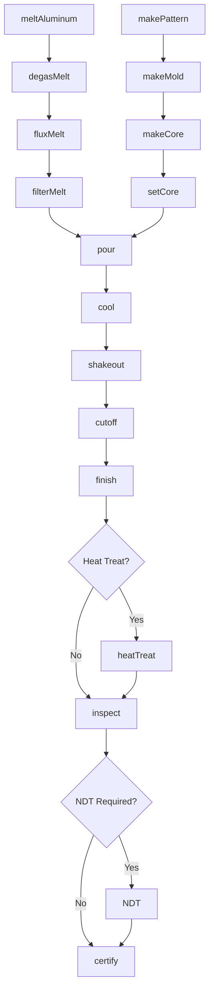
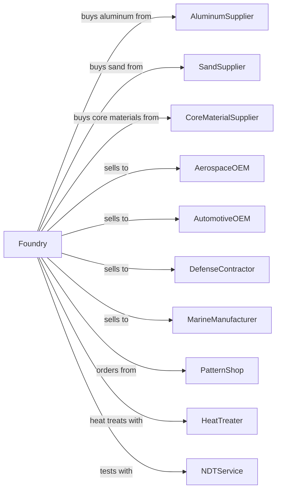

# Aluminum Foundries (except Die-Casting)

> Business-as-Code definition for aluminum sand and permanent mold casting operations. Models the production of complex aluminum castings for aerospace, automotive, and industrial applications.

## Overview

This U.S. industry comprises establishments primarily engaged in pouring molten aluminum into molds to manufacture aluminum castings (except nonferrous die-castings). Establishments in this industry purchase aluminum made in other establishments.

## Actors

| Actor | Description |
|-------|-------------|
| AluminumSupplier | Supplies aluminum alloy ingots |
| SandSupplier | Provides foundry sand and binders |
| CoreMaterialSupplier | Provides core sand and coatings |
| AerospaceOEM | Purchases structural and engine castings |
| AutomotiveOEM | Purchases engine blocks and heads |
| DefenseContractor | Purchases military vehicle components |
| MarineManufacturer | Purchases boat components |
| PatternShop | Fabricates patterns and core boxes |
| HeatTreater | Provides solution and aging treatment |
| NDTService | Provides radiographic and penetrant inspection |

## Roles

| Role | Description |
|------|-------------|
| FoundryManager | Oversees aluminum foundry operations |
| MeltSupervisor | Manages melting and metal treatment |
| MoldMaker | Creates sand and permanent molds |
| CoreMaker | Produces sand cores |
| PouringOperator | Controls metal pouring operations |
| ShakeoutOperator | Removes castings from molds |
| FinishingOperator | Cleans and finishes castings |
| QualityEngineer | Tests and inspects to aerospace standards |
| MetallurgistEngineer | Controls alloy chemistry and heat treatment |

## Entities

| Entity | Description |
|--------|-------------|
| Ingot | Aluminum alloy input material |
| Melt | Batch of molten aluminum |
| Pattern | Template for mold cavity |
| Mold | Sand or permanent mold for casting |
| Core | Sand insert for internal features |
| Casting | Solidified aluminum part |
| Riser | Reservoir feeding casting shrinkage |
| Degasser | Equipment for removing dissolved hydrogen |
| Filter | Ceramic device for removing inclusions |
| Specification | Aerospace or automotive material standard |

## Actions

| Action | Description |
|--------|-------------|
| meltAluminum | Liquefy aluminum alloy in furnace |
| degasMelt | Remove dissolved hydrogen |
| fluxMelt | Remove oxides and inclusions |
| filterMelt | Pass metal through ceramic filter |
| makePattern | Create or modify pattern |
| makeMold | Form sand or prepare permanent mold |
| makeCore | Produce sand cores |
| setCore | Position cores in mold |
| pour | Transfer molten aluminum into molds |
| cool | Allow castings to solidify |
| shakeout | Remove castings from sand molds |
| cutoff | Remove gates and risers |
| finish | Clean and prepare surfaces |
| heatTreat | Solution treat and age castings |
| inspect | Verify dimensions and defects |
| certify | Issue compliance certifications |

## Events

| Event | Description |
|-------|-------------|
| aluminumMelted | Metal liquefied |
| meltDegassed | Hydrogen removed |
| meltFluxed | Oxides removed |
| meltFiltered | Inclusions removed |
| patternCompleted | Pattern ready |
| moldMade | Mold completed |
| coresMade | Cores produced |
| coresSet | Cores positioned |
| metalPoured | Castings filled |
| castingsCooled | Solidification complete |
| castingsShaken | Castings extracted |
| gatesCut | Risers removed |
| castingsFinished | Cleaning completed |
| castingsHeatTreated | T6 or other temper achieved |
| castingsInspected | Quality verified |
| certified | Documentation issued |

## Searches

| Search | Description |
|--------|-------------|
| findAlloyStock | List available aluminum alloys |
| getOrders | Retrieve open orders by part |
| getMoldSchedule | View planned molding runs |
| getPatternLibrary | Browse available patterns |
| trackCasting | Locate castings through production |
| findTestReports | Retrieve mechanical test data |
| getCertifications | Retrieve compliance documents |
| getYieldMetrics | View casting yield statistics |

## Workflow



## Actor Relationships



## Usage

### Calling Actions

```typescript
import { castAluminumFoundries } from '@headlessly/cast-aluminum-foundries'

const foundry = castAluminumFoundries()

// Prepare aluminum melt
await foundry.meltAluminum({
  furnaceId: 'GAS-REVERB-2',
  alloy: 'A356',
  chargeWeight: 2000,
  targetTemperature: 1350
})

await foundry.degasMelt({
  furnaceId: 'GAS-REVERB-2',
  method: 'rotary-impeller',
  gas: 'argon',
  duration: 15
})

// Pour casting
await foundry.pour({
  meltId: 'MELT-2024-0892',
  moldId: 'M-ENGINE-BLOCK-001',
  pouringTemperature: 1300,
  filterSize: '20-ppi'
})
```

### Event-Driven Automation

```typescript
// Auto-filter before pouring
foundry.meltFluxed(async ({ meltId, cleanlinessLevel }) => {
  if (cleanlinessLevel >= 2) {
    await foundry.filterMelt({
      meltId,
      filterType: 'ceramic-foam',
      ppi: 30
    })
  }
})

// Auto-schedule heat treatment
foundry.castingsFinished(async ({ castingId, alloy, specification }) => {
  if (specification.temper === 'T6') {
    await foundry.heatTreat({
      castingId,
      solutionTemp: getSolutionTemp(alloy),
      solutionTime: getSolutionTime(alloy),
      agingTemp: getAgingTemp(alloy),
      agingTime: getAgingTime(alloy)
    })
  }
})
```
