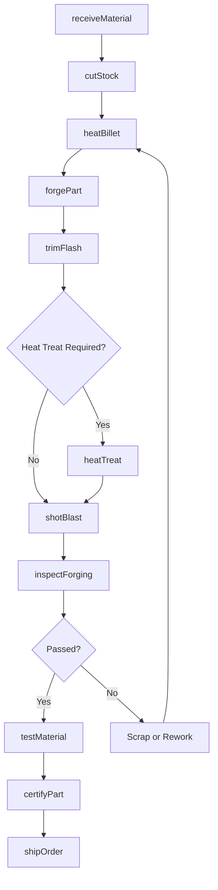
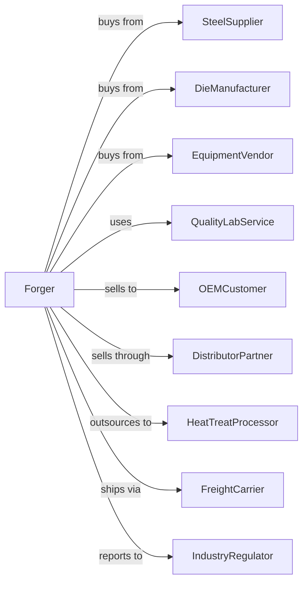

# Iron and Steel Forging

> Business-as-Code definition for iron and steel forging operations. Models the complete forging process from material procurement through finished part delivery.

## Overview

This U.S. industry comprises establishments primarily engaged in manufacturing iron and steel forgings from purchased iron and steel by hammering mill shapes. Establishments making iron and steel forgings and further manufacturing (e.g., machining, assembling) a specific manufactured product are classified in the industry of the finished product. Iron and steel forging establishments may perform surface finishing operations, such as cleaning and deburring, on the forgings they manufacture.

## Actors

| Actor | Description |
|-------|-------------|
| SteelSupplier | Provides raw steel billets, bars, and mill shapes for forging |
| DieManufacturer | Designs and produces forging dies and tooling |
| EquipmentVendor | Supplies forging presses, hammers, and furnaces |
| QualityLabService | Provides metallurgical testing and certification services |
| OEMCustomer | Purchases forgings for automotive, aerospace, and industrial applications |
| DistributorPartner | Stocks and distributes standard forging products |
| HeatTreatProcessor | Provides external heat treatment services |
| FreightCarrier | Transports raw materials and finished forgings |
| IndustryRegulator | Oversees safety, environmental, and quality compliance |

## Roles

| Role | Description |
|------|-------------|
| PlantManager | Oversees all forging operations and production schedules |
| ForgingOperator | Operates forging presses and hammers to shape heated metal |
| DieSetupTechnician | Installs, aligns, and maintains forging dies |
| FurnaceOperator | Controls heating furnaces to bring metal to forging temperature |
| QualityInspector | Inspects forgings for dimensional accuracy and defects |
| MetallurgicalEngineer | Develops forging processes and material specifications |
| MaintenanceTechnician | Maintains and repairs forging equipment |
| ProductionScheduler | Plans production runs and manages work orders |

## Entities

| Entity | Description |
|--------|-------------|
| Billet | Raw steel material prepared for forging |
| Die | Tooling that shapes the heated metal during forging |
| Forging | The finished or in-process shaped metal part |
| ForgingPress | Equipment that applies force to shape metal |
| Furnace | Equipment that heats metal to forging temperature |
| WorkOrder | Production order specifying forging requirements |
| HeatNumber | Tracking identifier for material traceability |
| Specification | Technical requirements for the forged part |
| QualityCertificate | Documentation certifying material and process compliance |
| ToolingInventory | Available dies and tooling for production |

## Actions

| Action | Description |
|--------|-------------|
| receiveMaterial | Receive and inspect incoming steel billets and bar stock |
| cutStock | Cut raw material to required billet lengths |
| heatBillet | Heat billet in furnace to proper forging temperature |
| forgePart | Shape heated metal using press or hammer |
| trimFlash | Remove excess material from forged part |
| heatTreat | Apply thermal treatment to achieve required properties |
| shotBlast | Clean forging surface using abrasive media |
| inspectForging | Verify dimensions and detect surface defects |
| testMaterial | Perform destructive and non-destructive testing |
| certifyPart | Generate quality certificates and traceability documents |
| shipOrder | Package and ship completed forgings to customer |
| maintainDie | Refurbish or replace worn forging dies |

## Events

| Event | Description |
|-------|-------------|
| materialReceived | Raw steel has arrived and passed incoming inspection |
| billetHeated | Billet has reached target forging temperature |
| partForged | Metal has been shaped in the forging press |
| flashTrimmed | Excess material has been removed from forging |
| heatTreatComplete | Thermal treatment cycle has finished |
| inspectionPassed | Forging has passed quality inspection |
| inspectionFailed | Forging has failed quality inspection requiring disposition |
| orderShipped | Completed forgings have been dispatched to customer |
| dieWornOut | Forging die has reached end of service life |
| equipmentDown | Forging press or furnace requires unplanned maintenance |

## Searches

| Search | Description |
|--------|-------------|
| findWorkOrders | List open work orders by customer, due date, or part number |
| getInventory | Retrieve raw material and finished goods inventory levels |
| checkDieStatus | Get die condition, hit count, and replacement schedule |
| getHeatHistory | Retrieve heat treatment records by heat number |
| findCertificates | Locate quality certificates by order or part number |
| getEquipmentStatus | Check availability and condition of forging equipment |
| trackShipments | Monitor outbound shipment status and delivery |
| getScrapRate | Calculate scrap and rework rates by part or process |

## Workflow

## Actor Relationships

