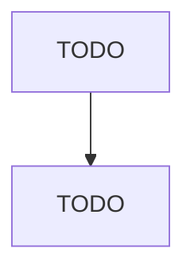

# Nonferrous Forging

> TODO: Business-as-Code definition

## Overview

This U.S. industry comprises establishments primarily engaged in manufacturing nonferrous forgings from purchased nonferrous metals by hammering mill shapes. Establishments making nonferrous forgings and further manufacturing (e.g., machining, assembling) a specific manufactured product are classified in the industry of the finished product. Nonferrous forging establishments may perform surface finishing operations, such as cleaning and deburring, on the forgings they manufacture. Cross-Referenc

## Actors

| Actor | Description |
|-------|-------------|
| TODO | TODO |

## Roles

| Role | Description |
|------|-------------|
| TODO | TODO |

## Entities

| Entity | Description |
|--------|-------------|
| TODO | TODO |

## Actions

| Action | Description |
|--------|-------------|
| TODO | TODO |

## Events

| Event | Description |
|-------|-------------|
| TODO | TODO |

## Searches

| Search | Description |
|--------|-------------|
| TODO | TODO |

## Workflow

## Actor Relationships

