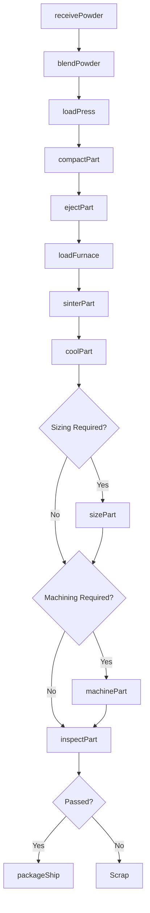
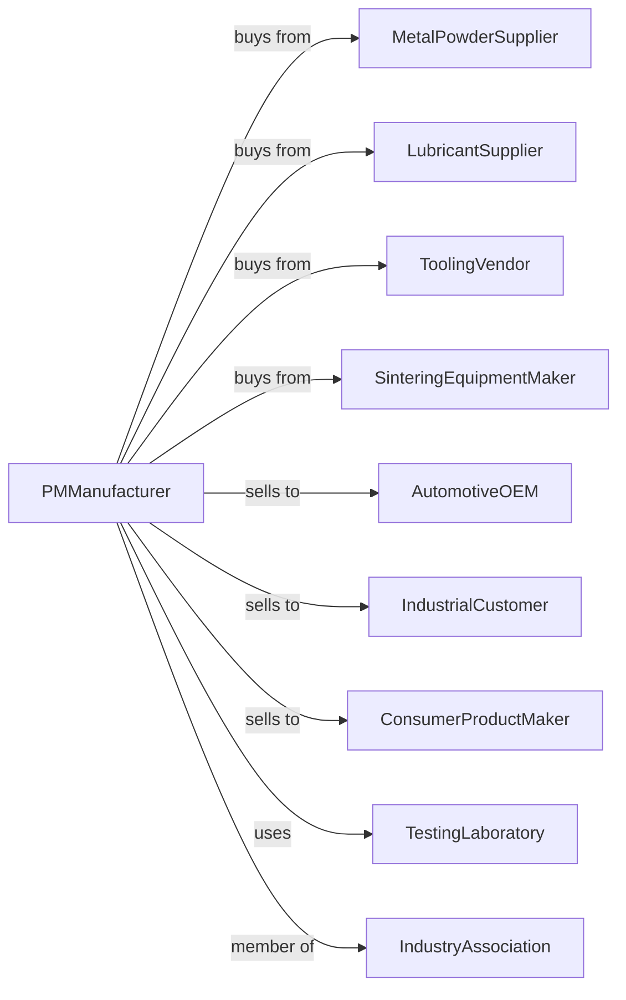

# Powder Metallurgy Part Manufacturing

> Business-as-Code definition for powder metallurgy part manufacturing. Models the complete process from metal powder blending through sintering to finished precision parts.

## Overview

This U.S. industry comprises establishments primarily engaged in manufacturing powder metallurgy products using any of the various powder metallurgy processing techniques, such as pressing and sintering or metal injection molding. Establishments in this industry generally make a wide range of parts on a job or order basis for automotive, industrial, and consumer applications.

## Actors

| Actor | Description |
|-------|-------------|
| MetalPowderSupplier | Provides iron, copper, stainless, and specialty metal powders |
| LubricantSupplier | Supplies die lubricants and binders for compaction |
| ToolingVendor | Manufactures compaction dies and punches |
| SinteringEquipmentMaker | Provides sintering furnaces and atmosphere systems |
| AutomotiveOEM | Purchases gears, bearings, and structural PM parts |
| IndustrialCustomer | Buys PM components for machinery and equipment |
| ConsumerProductMaker | Orders PM parts for appliances and power tools |
| TestingLaboratory | Provides density, hardness, and metallurgical testing |
| IndustryAssociation | Sets standards and promotes powder metallurgy technology |

## Roles

| Role | Description |
|------|-------------|
| PlantManager | Directs PM manufacturing operations and quality systems |
| ProcessEngineer | Develops compaction and sintering parameters for new parts |
| BlendOperator | Mixes metal powders with lubricants and additives |
| PressOperator | Operates compaction presses to form green parts |
| SinteringOperator | Runs sintering furnaces and controls atmospheres |
| ToolMaker | Designs and maintains compaction tooling |
| QualityInspector | Measures density, dimensions, and mechanical properties |
| SecondaryOperator | Performs sizing, machining, and finishing operations |

## Entities

| Entity | Description |
|--------|-------------|
| MetalPowder | Base material in powdered form for compaction |
| Lubricant | Additive that aids powder flow and die release |
| Blend | Mixed powder formulation ready for compaction |
| GreenPart | Compacted but unsintered powder metallurgy part |
| SinteredPart | Part that has undergone high-temperature sintering |
| CompactionDie | Tooling that shapes powder under pressure |
| SinteringFurnace | Equipment that heats parts to bond powder particles |
| Atmosphere | Controlled gas environment in the sintering furnace |
| DensitySpec | Target density specification for the finished part |
| SecondaryOperation | Post-sintering machining, sizing, or treatment |

## Actions

| Action | Description |
|--------|-------------|
| receivePowder | Receive and test incoming metal powders |
| blendPowder | Mix powders with lubricants to create blend |
| loadPress | Fill die cavity with blended powder |
| compactPart | Apply pressure to form green compact |
| ejectPart | Remove green part from compaction die |
| loadFurnace | Place green parts on sintering belt or trays |
| sinterPart | Heat parts to bond particles and develop strength |
| coolPart | Control cooling rate after sintering |
| sizePart | Repress sintered part to achieve final dimensions |
| machinePart | Perform secondary machining operations |
| inspectPart | Verify density, dimensions, and properties |
| packageShip | Package and dispatch finished parts |

## Events

| Event | Description |
|-------|-------------|
| powderReceived | Metal powder has passed incoming inspection |
| blendPrepared | Powder blend is ready for compaction |
| partCompacted | Green compact has been formed |
| sinteringComplete | Parts have exited the sintering furnace |
| densityVerified | Part density meets specification |
| dimensionsVerified | Part dimensions are within tolerance |
| orderShipped | Completed parts have been dispatched |
| dieWorn | Compaction tooling requires refurbishment |
| atmosphereAlarm | Sintering atmosphere out of specification |

## Searches

| Search | Description |
|--------|-------------|
| findBlendFormulas | List powder blend recipes by part family or material |
| getPowderInventory | Check stock levels of metal powders and lubricants |
| getToolingStatus | View die condition, usage count, and maintenance history |
| findWorkOrders | List production orders by customer or part number |
| getDensityRecords | Retrieve density test results by lot |
| getFurnaceSchedule | View sintering furnace loading schedule |
| calculateShrinkage | Compute expected shrinkage from green to sintered |
| trackYield | Monitor yield and scrap rates by part number |

## Workflow

## Actor Relationships

