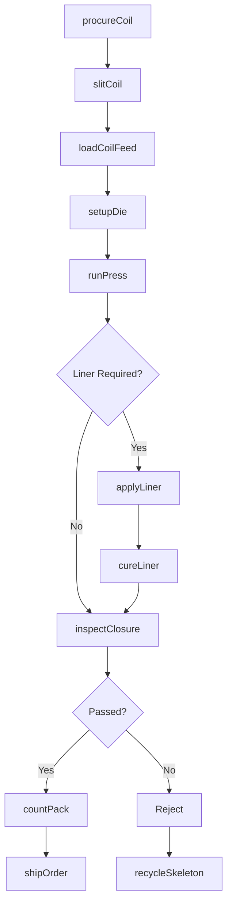
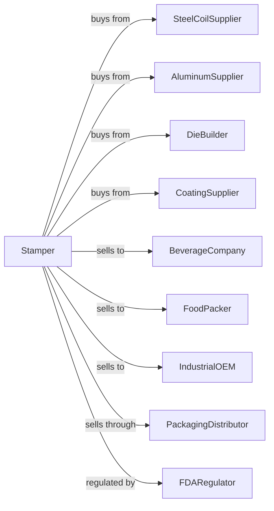

# Metal Crown, Closure, and Other Metal Stamping (except Automotive)

> Business-as-Code definition for metal stamping operations producing crowns, closures, and general stampings. Models the progressive die and transfer press operations for packaging and industrial components.

## Overview

This U.S. industry comprises establishments primarily engaged in (1) stamping metal crowns and closures, such as bottle caps and home canning lids and rings, and/or (2) manufacturing other unfinished metal stampings and spinning unfinished metal products (except automotive, cans, and coins). Establishments making metal stampings and metal spun products and further manufacturing a specific product are classified in the industry of the finished product.

## Actors

| Actor | Description |
|-------|-------------|
| SteelCoilSupplier | Provides tinplate and coated steel coil for closures |
| AluminumSupplier | Supplies aluminum sheet for lightweight closures |
| DieBuilder | Designs and manufactures progressive and transfer dies |
| BeverageCompany | Purchases bottle caps and crown closures |
| FoodPacker | Buys canning lids and jar closures |
| IndustrialOEM | Orders stamped components for appliances and equipment |
| CoatingSupplier | Provides lacquers and coatings for closure liners |
| PackagingDistributor | Stocks and distributes closure products |
| FDARegulator | Oversees food-contact material compliance |

## Roles

| Role | Description |
|------|-------------|
| PlantManager | Oversees stamping operations and quality systems |
| ToolEngineer | Designs progressive dies and optimizes stamping processes |
| PressOperator | Runs stamping presses and monitors production quality |
| DieSetterTechnician | Installs and adjusts dies in stamping presses |
| QualityTechnician | Inspects closures for dimensions and defects |
| CoilFeeder | Loads and feeds coil stock into press lines |
| PackagingOperator | Counts, boxes, and palletizes finished closures |
| MaintenanceMechanic | Maintains presses, feeders, and auxiliary equipment |

## Entities

| Entity | Description |
|--------|-------------|
| TinplateCoil | Tin-coated steel sheet for crown and closure stamping |
| ProgressiveDie | Multi-station die that performs sequential forming operations |
| Crown | Metal bottle cap with crimped edges |
| CanningLid | Closure for home canning jars |
| Stamping | General metal part produced by press forming |
| StampingPress | Machine that applies force through dies to form parts |
| CoilFeed | Equipment that advances coil stock into the press |
| LinerCompound | Sealing material applied inside closures |
| ScratchOff | Rejected parts with surface defects |
| ProductionLot | Batch of closures produced under same conditions |

## Actions

| Action | Description |
|--------|-------------|
| procureCoil | Order tinplate or aluminum coil to specification |
| slitCoil | Cut wide coil to required strip width |
| loadCoilFeed | Mount coil and thread through feeder |
| setupDie | Install progressive die and align in press |
| runPress | Operate stamping press to produce parts |
| applyLiner | Apply sealing compound to closure interior |
| cureLiner | Heat treat to set liner compound |
| inspectClosure | Check dimensions, liner coverage, and surface quality |
| countPack | Count closures and package for shipment |
| shipOrder | Dispatch packaged closures to customer |
| maintainDie | Sharpen, repair, or replace die components |
| recycleSkeleton | Reclaim scrap strip skeleton for recycling |

## Events

| Event | Description |
|-------|-------------|
| coilReceived | Raw material coil has arrived and passed inspection |
| dieSetupComplete | Die installed and trial parts approved |
| productionStarted | Press run has begun producing parts |
| linerApplied | Sealing compound has been applied and cured |
| qualityApproved | Lot has passed final inspection |
| orderShipped | Finished closures dispatched to customer |
| dieMaintenanceDue | Die has reached scheduled maintenance interval |
| pressJam | Press has stopped due to material feed or die issue |
| coilExhausted | Coil depleted, changeover required |

## Searches

| Search | Description |
|--------|-------------|
| findProducts | List closure types by size, material, or application |
| getCoilInventory | Check tinplate and aluminum coil stock levels |
| getDieLibrary | List dies by closure type and press compatibility |
| findOpenOrders | Retrieve orders by customer, product, or due date |
| getProductionSchedule | View press schedule and changeover timing |
| trackDefects | Analyze defect rates by product or press line |
| getShipmentStatus | Monitor outbound shipment delivery |
| calculateScrapRate | Compute skeleton and reject scrap percentages |

## Workflow

## Actor Relationships

