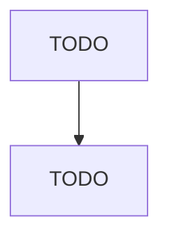

# Metal Crown, Closure, and Other Metal Stamping (except Automotive)

> TODO: Business-as-Code definition

## Overview

This U.S. industry comprises establishments primarily engaged in (1) stamping metal crowns and closures, such as bottle caps and home canning lids and rings, and/or (2) manufacturing other unfinished metal stampings and spinning unfinished metal products (except automotive, cans, and coins). Establishments making metal stampings and metal spun products and further manufacturing (e.g., machining, assembling) a specific product are classified in the industry of the finished product. Metal stamping

## Actors

| Actor | Description |
|-------|-------------|
| TODO | TODO |

## Roles

| Role | Description |
|------|-------------|
| TODO | TODO |

## Entities

| Entity | Description |
|--------|-------------|
| TODO | TODO |

## Actions

| Action | Description |
|--------|-------------|
| TODO | TODO |

## Events

| Event | Description |
|-------|-------------|
| TODO | TODO |

## Searches

| Search | Description |
|--------|-------------|
| TODO | TODO |

## Workflow

## Actor Relationships

