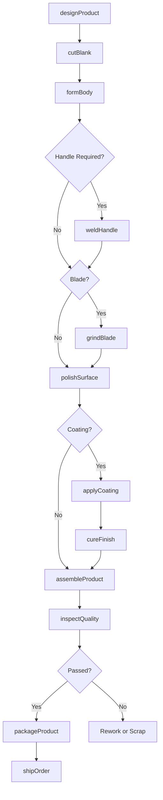
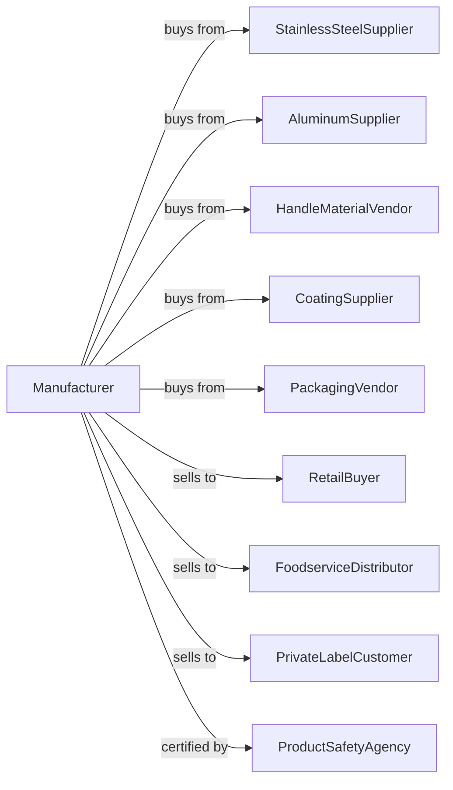

# Metal Kitchen Cookware, Utensil, Cutlery, and Flatware (except Precious) Manufacturing

> Business-as-Code definition for metal kitchenware manufacturing. Models the production of cookware, utensils, cutlery, and flatware from metal forming through finishing.

## Overview

This U.S. industry comprises establishments primarily engaged in manufacturing metal kitchen cookware (except by casting or stamped without further fabrication), utensils, and/or nonprecious and precious plated metal cutlery and flatware. Products include pots, pans, kitchen knives, forks, spoons, and serving utensils for residential and commercial food service applications.

## Actors

| Actor | Description |
|-------|-------------|
| StainlessSteelSupplier | Provides stainless steel sheet and coil for cookware |
| AluminumSupplier | Supplies aluminum for lightweight cookware and utensils |
| HandleMaterialVendor | Provides wood, plastic, and composite handle materials |
| RetailBuyer | Purchases kitchenware for department and specialty stores |
| FoodserviceDistributor | Buys commercial-grade cookware for restaurants |
| PrivateLabelCustomer | Orders kitchenware under house brands |
| CoatingSupplier | Provides nonstick coatings and anodizing services |
| PackagingVendor | Supplies retail packaging and display materials |
| ProductSafetyAgency | Certifies food-contact safety compliance |

## Roles

| Role | Description |
|------|-------------|
| PlantManager | Oversees all manufacturing operations and quality |
| ProductDesigner | Develops new cookware and cutlery designs |
| MetalFormingOperator | Operates presses, spinners, and forming equipment |
| GrindingTechnician | Sharpens knife blades and polishes surfaces |
| AssemblyWorker | Attaches handles and assembles multi-part items |
| QualityInspector | Tests products for performance and finish quality |
| FinishingOperator | Applies coatings, polishing, and surface treatments |
| PackagingWorker | Packages finished goods for retail or bulk shipment |

## Entities

| Entity | Description |
|--------|-------------|
| StainlessSheet | Flat stainless steel stock for forming cookware |
| Cookware | Pots, pans, and cooking vessels |
| Cutlery | Knives and cutting implements |
| Flatware | Forks, spoons, and serving utensils |
| Utensil | Kitchen tools like ladles, spatulas, and turners |
| Handle | Grip component attached to cookware or cutlery |
| Coating | Nonstick or protective surface treatment |
| DieCast | Metal formed by casting for handles or bodies |
| ProductLine | Collection of related kitchenware items |
| SKU | Individual stock keeping unit for inventory |

## Actions

| Action | Description |
|--------|-------------|
| designProduct | Create specifications and drawings for new items |
| cutBlank | Cut sheet metal to required blank size |
| formBody | Shape cookware body using spinning, pressing, or drawing |
| weldHandle | Attach handles by welding or riveting |
| grindBlade | Sharpen and profile knife blades |
| polishSurface | Buff and polish to achieve desired finish |
| applyCoating | Apply nonstick or protective coating |
| cureFinish | Heat treat to set coating or hardening |
| assembleProduct | Combine components into finished item |
| inspectQuality | Test for defects, performance, and safety |
| packageProduct | Package for retail display or bulk shipment |
| shipOrder | Dispatch finished goods to customers |

## Events

| Event | Description |
|-------|-------------|
| designApproved | New product design has been finalized |
| blankCut | Metal blanks are ready for forming |
| bodyFormed | Cookware body has been shaped |
| handleAttached | Handle has been welded or assembled |
| bladeSharpened | Knife blade has been ground to specification |
| coatingApplied | Surface treatment has been completed |
| inspectionPassed | Product has passed quality checks |
| orderPackaged | Order is ready for shipment |
| orderShipped | Products have been dispatched to customer |
| defectDetected | Quality issue requires rework or scrap |

## Searches

| Search | Description |
|--------|-------------|
| findProducts | List products by category, material, or product line |
| getMaterialInventory | Check stock levels of metal and handle materials |
| getProductionSchedule | View manufacturing schedule by product |
| findOpenOrders | Retrieve orders by customer or ship date |
| trackDefects | Analyze quality issues by product or process |
| getCoatingBatch | Retrieve coating batch records for traceability |
| getSalesHistory | View sales data by product, customer, or region |
| checkCertifications | Verify safety certifications by product |

## Workflow

## Actor Relationships

