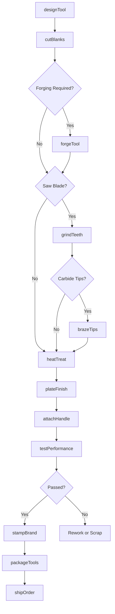
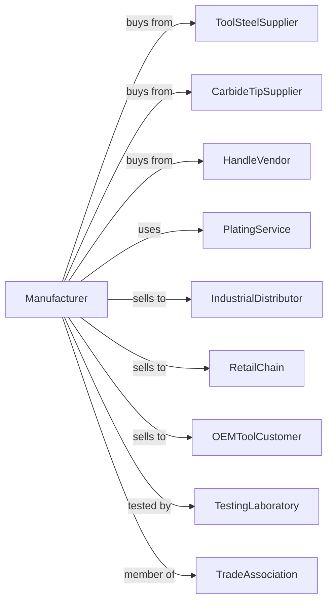

# Saw Blade and Handtool Manufacturing

> Business-as-Code definition for saw blade and handtool manufacturing. Models the production of cutting tools and nonpowered hand implements from raw material through finished product.

## Overview

This U.S. industry comprises establishments primarily engaged in (1) manufacturing saw blades, all types (including those for power sawing machines) and/or (2) manufacturing nonpowered handtools and edge tools. Products include circular saw blades, band saw blades, hand saws, wrenches, pliers, hammers, screwdrivers, and specialty hand implements for professional and consumer markets.

## Actors

| Actor | Description |
|-------|-------------|
| ToolSteelSupplier | Provides high-carbon and alloy tool steels |
| CarbideTipSupplier | Supplies tungsten carbide tips for saw blades |
| HandleVendor | Provides wood, fiberglass, and rubber grips |
| IndustrialDistributor | Purchases tools for professional trades |
| RetailChain | Buys handtools for hardware and home improvement stores |
| OEMToolCustomer | Orders private-label or specialty tools |
| PlatingService | Provides chrome and other protective plating |
| TestingLaboratory | Certifies tool performance and safety |
| TradeAssociation | Sets standards for hand and power tools |

## Roles

| Role | Description |
|------|-------------|
| PlantManager | Directs tool manufacturing operations |
| ToolEngineer | Designs tools and develops manufacturing processes |
| BladeGrinder | Sharpens and finishes saw blade teeth |
| ForgingOperator | Forges tool heads and bodies |
| HeatTreatOperator | Hardens and tempers tools for durability |
| AssemblyTechnician | Fits handles and assembles tool components |
| QualityTester | Tests tools for hardness, strength, and performance |
| ShippingCoordinator | Manages order fulfillment and logistics |

## Entities

| Entity | Description |
|--------|-------------|
| ToolSteel | High-carbon or alloy steel for tool bodies |
| SawBlade | Circular, band, or reciprocating cutting blade |
| CarbideTip | Tungsten carbide cutting insert brazed to blade |
| Handtool | Nonpowered implement like hammer, wrench, or plier |
| EdgeTool | Cutting tool like chisel, plane, or file |
| Handle | Grip component for handtools |
| Tooth | Individual cutting point on a saw blade |
| HeatTreatBatch | Group of tools processed together for hardening |
| PackageSet | Collection of tools sold as a kit |
| ProductCatalog | List of available tools and specifications |

## Actions

| Action | Description |
|--------|-------------|
| designTool | Engineer tool geometry and specifications |
| cutBlanks | Laser or punch cut blade and tool blanks |
| forgeTool | Form tool heads using drop forging |
| grindTeeth | Cut and sharpen teeth on saw blades |
| brazeTips | Attach carbide tips to saw blade teeth |
| heatTreat | Harden and temper tools for wear resistance |
| plateFinish | Apply protective chrome or other plating |
| attachHandle | Fit and secure handle to tool head |
| testPerformance | Verify hardness, torque, and cutting ability |
| stampBrand | Mark tools with brand and specifications |
| packageTools | Package individual tools or assemble kits |
| shipOrder | Dispatch tools to distribution or retail |

## Events

| Event | Description |
|-------|-------------|
| designCompleted | Tool design has been approved for production |
| blanksCut | Metal blanks are ready for processing |
| toolForged | Tool head has been forged to shape |
| teethGround | Saw blade teeth have been cut and sharpened |
| tipsBrazed | Carbide tips attached and inspected |
| heatTreatComplete | Batch has been hardened and tempered |
| finishApplied | Plating or coating has been completed |
| handleAttached | Tool assembly is complete |
| testPassed | Tool has met performance specifications |
| orderShipped | Tools dispatched to customer |

## Searches

| Search | Description |
|--------|-------------|
| findProducts | List tools by type, size, or application |
| getSteelInventory | Check tool steel and carbide stock levels |
| getBladeSpecs | Retrieve specifications for saw blade models |
| findOpenOrders | List orders by customer or ship date |
| getHeatTreatRecords | Trace heat treatment batch history |
| trackQualityData | Analyze test results and defect rates |
| getProductionSchedule | View manufacturing schedule by product line |
| checkCertifications | Verify tool meets industry standards |

## Workflow

## Actor Relationships

