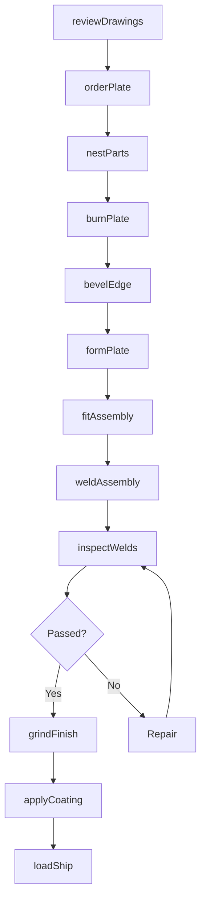
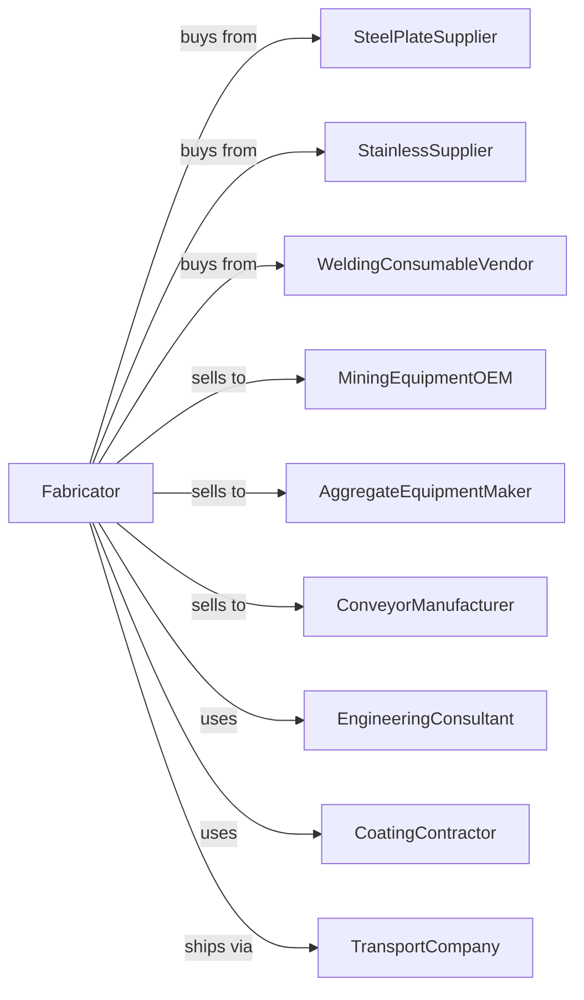

# Plate Work Manufacturing

> Business-as-Code definition for plate work manufacturing. Models the fabrication of heavy metal plate products through cutting, forming, and welding operations.

## Overview

This U.S. industry comprises establishments primarily engaged in manufacturing fabricated metal plate work by cutting, punching, bending, shaping, and welding purchased metal plate. Products include weldments, hoppers, chutes, conveyor sections, and custom plate fabrications for industrial and heavy equipment applications.

## Actors

| Actor | Description |
|-------|-------------|
| SteelPlateSupplier | Provides carbon and alloy steel plate |
| StainlessSupplier | Supplies stainless steel plate for corrosion resistance |
| WeldingConsumableVendor | Provides welding wire, flux, and gases |
| MiningEquipmentOEM | Purchases weldments for mining machinery |
| AggregateEquipmentMaker | Orders hoppers and chutes for crushing plants |
| ConveyorManufacturer | Buys plate components for material handling systems |
| EngineeringConsultant | Provides design and stress analysis services |
| CoatingContractor | Applies protective paint and linings |
| TransportCompany | Handles oversized and heavy haul shipments |

## Roles

| Role | Description |
|------|-------------|
| ShopManager | Directs plate shop operations and scheduling |
| WeldingEngineer | Develops welding procedures and quality standards |
| CNCBurningOperator | Operates plasma and laser plate cutting systems |
| PlateFitter | Fits and tacks plate assemblies for welding |
| Welder | Joins plate using specified welding processes |
| BrakePressOperator | Forms plate using hydraulic press brakes |
| WeldInspector | Inspects welds using visual and NDT methods |
| FinishingTechnician | Prepares surfaces and applies coatings |

## Entities

| Entity | Description |
|--------|-------------|
| SteelPlate | Heavy gauge flat steel stock |
| Weldment | Welded assembly of multiple plate components |
| Hopper | Funnel-shaped container for bulk material handling |
| Chute | Enclosed channel for directing material flow |
| ConveyorSection | Structural component of conveyor systems |
| PressBrake | Equipment for bending plate to angle or radius |
| PlasmaCutter | CNC machine for cutting plate profiles |
| WeldProcedureSpec | Documented parameters for welding operations |
| FabricationDrawing | Engineering drawing for plate assembly |
| WearLiner | Replaceable plate to protect against abrasion |

## Actions

| Action | Description |
|--------|-------------|
| reviewDrawings | Analyze fabrication drawings for feasibility |
| orderPlate | Procure steel plate to required thickness and grade |
| nestParts | Optimize part layout on plate for efficient cutting |
| burnPlate | CNC plasma or laser cut plate components |
| bevelEdge | Prepare weld joint edges by beveling |
| formPlate | Bend plate using press brake or rolls |
| fitAssembly | Position and clamp components for welding |
| weldAssembly | Join plate components per weld procedure |
| inspectWelds | Examine welds visually and with NDT |
| grindFinish | Smooth welds and prepare surfaces |
| applyCoating | Prime and paint or apply wear linings |
| loadShip | Load fabricated assemblies for delivery |

## Events

| Event | Description |
|-------|-------------|
| drawingsReceived | Customer fabrication drawings have arrived |
| plateDelivered | Steel plate has been received in shop |
| partsBurned | All plate components have been cut |
| formingComplete | Plate bending operations are done |
| assemblyFitted | Components are tacked and ready to weld |
| weldingComplete | All welds have been completed |
| inspectionPassed | Welds have passed quality inspection |
| coatingApplied | Protective finish has been applied |
| readyToShip | Assembly is packaged and ready for delivery |
| productDelivered | Fabricated plate work has arrived at customer |

## Searches

| Search | Description |
|--------|-------------|
| findJobs | List fabrication jobs by customer or delivery date |
| getPlateInventory | Check plate stock by thickness and grade |
| getNestingEfficiency | Calculate material utilization for jobs |
| getWelderQualifications | View welder certifications by process |
| trackJobProgress | Monitor status of jobs through shop |
| getInspectionReports | Retrieve NDT and inspection records |
| calculateWeight | Compute weight of assemblies for shipping |
| getEquipmentSchedule | View press brake and burner availability |

## Workflow

## Actor Relationships

