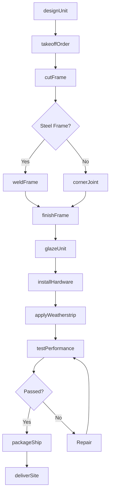
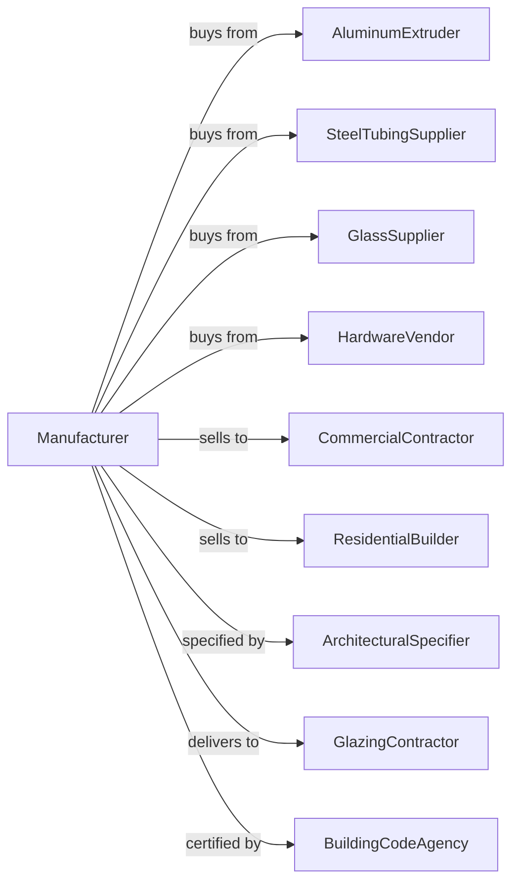

# Metal Window and Door Manufacturing

> Business-as-Code definition for metal window and door manufacturing. Models the fabrication of aluminum and steel frames, doors, and architectural openings.

## Overview

This U.S. industry comprises establishments primarily engaged in manufacturing metal framed windows (i.e., typically using purchased glass) and metal doors. Examples of products made by these establishments are metal door frames; metal framed window and door screens; and metal molding and trim (except automotive).

## Actors

| Actor | Description |
|-------|-------------|
| AluminumExtruder | Provides aluminum extrusions for frames |
| SteelTubingSupplier | Supplies hollow steel sections for doors |
| GlassSupplier | Provides flat glass, insulated units, and specialty glazing |
| HardwareVendor | Supplies hinges, locks, and operating hardware |
| CommercialContractor | Purchases windows and doors for building projects |
| ResidentialBuilder | Orders products for home construction |
| ArchitecturalSpecifier | Specifies products for commercial projects |
| GlazingContractor | Installs windows and doors at job sites |
| BuildingCodeAgency | Certifies products for energy and safety compliance |

## Roles

| Role | Description |
|------|-------------|
| PlantManager | Oversees manufacturing operations |
| ProductEngineer | Designs frame profiles and hardware integration |
| CutOperator | Cuts extrusions and tubing to length |
| WelderAssembler | Welds steel frames and assembles components |
| GlazingTechnician | Installs glass into frames |
| HardwareInstaller | Mounts hinges, locks, and operating mechanisms |
| QualityInspector | Tests units for air, water, and structural performance |
| FinishingOperator | Applies paint or anodize coatings |

## Entities

| Entity | Description |
|--------|-------------|
| AluminumExtrusion | Shaped aluminum profile for window frames |
| SteelFrame | Welded steel door or window frame |
| InsulatedGlassUnit | Double or triple pane sealed glass assembly |
| DoorSlab | Finished door panel ready for framing |
| Hardware | Hinges, locks, handles, and operators |
| WeatherStripping | Seals that prevent air and water infiltration |
| Screen | Mesh panel for insect protection |
| FrameAssembly | Completed window or door frame unit |
| ShopDrawing | Fabrication and assembly drawing |
| TestReport | Performance test results for certification |

## Actions

| Action | Description |
|--------|-------------|
| designUnit | Engineer frame profile and glass configuration |
| takeoffOrder | Extract dimensions and specifications from plans |
| cutFrame | Saw extrusions or tubing to required lengths |
| weldFrame | Join steel frame members by welding |
| cornerJoint | Mechanically fasten aluminum corner joints |
| glazeUnit | Install glass into frame assembly |
| installHardware | Mount hinges, locks, and operators |
| applyWeatherstrip | Install seals and gaskets |
| finishFrame | Paint, powder coat, or anodize frame |
| testPerformance | Conduct air, water, and structural tests |
| packageShip | Protect and load units for delivery |
| deliverSite | Transport products to construction site |

## Events

| Event | Description |
|-------|-------------|
| orderReceived | Customer purchase order has arrived |
| takeoffComplete | Dimensions extracted and materials listed |
| framesCut | All frame members cut to size |
| framesWelded | Steel frames have been welded |
| glassInstalled | Units have been glazed |
| hardwareMounted | All hardware has been installed |
| finishApplied | Coating has been applied and cured |
| testPassed | Unit has passed performance testing |
| orderShipped | Products dispatched to job site |
| installationComplete | Units have been installed in building |

## Searches

| Search | Description |
|--------|-------------|
| findOrders | List orders by project, customer, or ship date |
| getExtrusionInventory | Check stock of aluminum extrusions |
| getGlassInventory | View insulated glass unit availability |
| getProductionSchedule | See fabrication schedule by product line |
| trackTestResults | Retrieve performance test records |
| getHardwareSpecs | Look up hardware specifications by product |
| findCertifiedProducts | List products meeting specific code requirements |
| calculateGlazingArea | Sum glass area for material planning |

## Workflow

## Actor Relationships

