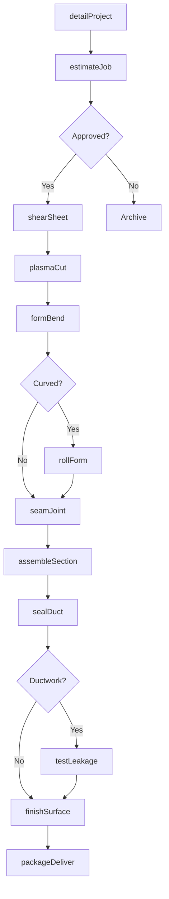
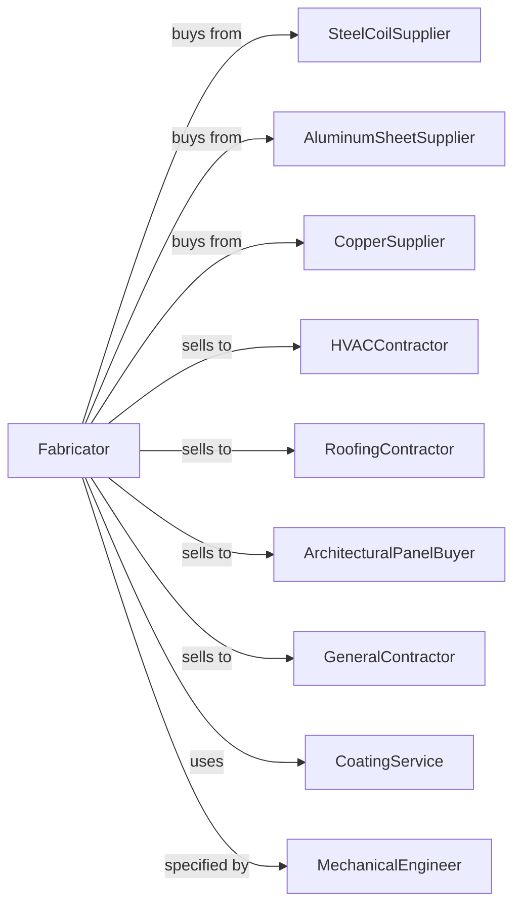

# Sheet Metal Work Manufacturing

> Business-as-Code definition for sheet metal work manufacturing. Models the fabrication of HVAC ductwork, architectural panels, and custom sheet metal products.

## Overview

This U.S. industry comprises establishments primarily engaged in manufacturing sheet metal work (except stampings). Products include HVAC ductwork, flashing, gutters, soffits, architectural panels, and custom sheet metal fabrications for commercial and residential construction.

## Actors

| Actor | Description |
|-------|-------------|
| SteelCoilSupplier | Provides galvanized and stainless steel coil |
| AluminumSheetSupplier | Supplies aluminum sheet and coil |
| CopperSupplier | Provides copper sheet for roofing and architectural work |
| HVACContractor | Purchases ductwork for heating and cooling systems |
| RoofingContractor | Orders flashing, gutters, and roofing components |
| ArchitecturalPanelBuyer | Buys custom panels for building facades |
| GeneralContractor | Purchases sheet metal for building construction |
| CoatingService | Provides paint and specialty coatings |
| MechanicalEngineer | Specifies HVAC ductwork and air handling systems |

## Roles

| Role | Description |
|------|-------------|
| ShopManager | Directs sheet metal fabrication operations |
| Detailer | Creates shop drawings from construction plans |
| CNCProgrammer | Programs plasma cutters and turret punches |
| ShearOperator | Cuts sheet metal to required sizes |
| BrakeOperator | Forms sheet metal using press brakes |
| Assembler | Joins duct sections and installs fittings |
| Seamer | Forms standing seams and joints |
| QualityInspector | Verifies dimensions and leak tests ductwork |

## Entities

| Entity | Description |
|--------|-------------|
| SheetMetal | Flat sheet or coil stock for fabrication |
| Ductwork | Enclosed passage for airflow in HVAC systems |
| Fitting | Elbows, tees, and transitions for duct runs |
| Flashing | Weatherproofing component at roof penetrations |
| Gutter | Channel for collecting and directing rainwater |
| ArchitecturalPanel | Decorative or functional building facade element |
| PressBreak | Equipment for bending sheet metal |
| PlasmaCutter | CNC machine for cutting sheet profiles |
| ShopDrawing | Fabrication drawing showing dimensions and layout |
| DuctSealant | Material used to seal duct joints |

## Actions

| Action | Description |
|--------|-------------|
| detailProject | Create fabrication drawings from plans |
| estimateJob | Calculate material and labor costs for quote |
| shearSheet | Cut sheet metal to flat pattern size |
| plasmaCut | CNC cut complex profiles and openings |
| formBend | Bend sheet using press brake to specified angle |
| rollForm | Create curved shapes using slip rolls |
| seamJoint | Join sheet edges using Pittsburgh or standing seam |
| assembleSection | Connect duct sections and attach fittings |
| sealDuct | Apply sealant to joints for air tightness |
| testLeakage | Pressure test ductwork for leaks |
| finishSurface | Apply paint or protective coating |
| packageDeliver | Protect and deliver fabricated products |

## Events

| Event | Description |
|-------|-------------|
| drawingsReceived | Construction plans have arrived for detailing |
| materialsDelivered | Sheet metal stock has been received |
| patternsComplete | Flat patterns have been cut |
| formsComplete | All bending operations are done |
| sectionsAssembled | Duct sections have been joined |
| leakTestPassed | Ductwork has passed pressure test |
| finishApplied | Coating has been applied |
| orderShipped | Products dispatched to job site |
| installationComplete | Sheet metal installed at project |

## Searches

| Search | Description |
|--------|-------------|
| findProjects | List jobs by customer, status, or delivery date |
| getSheetInventory | Check stock by gauge, material, and size |
| getPatternLibrary | Retrieve standard fitting patterns |
| getDuctSchedule | View production schedule for duct runs |
| trackLabor | Monitor labor hours by project |
| getLeakTestRecords | Retrieve test results by job |
| calculateWeight | Sum material weight for shipping and install |
| getCoatingSpec | Look up required finish by application |

## Workflow

## Actor Relationships

