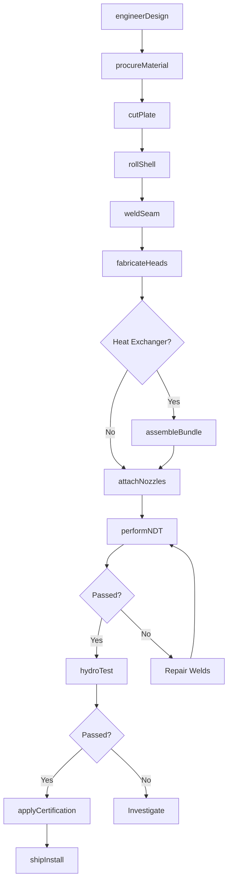
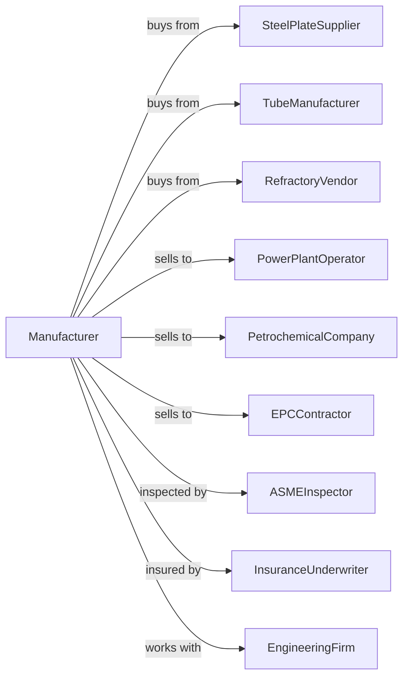

# Power Boiler and Heat Exchanger Manufacturing

> Business-as-Code definition for power boiler and heat exchanger manufacturing. Models the design and fabrication of pressure vessels for power generation and process industries.

## Overview

This industry comprises establishments primarily engaged in manufacturing power boilers and heat exchangers. Establishments in this industry may perform installation in addition to manufacturing power boilers and heat exchangers. Products include steam boilers, water tube boilers, shell and tube heat exchangers, and pressure vessels for power plants and process facilities.

## Actors

| Actor | Description |
|-------|-------------|
| SteelPlateSupplier | Provides pressure vessel grade steel plate |
| TubeManufacturer | Supplies seamless and welded tubing |
| RefractoryVendor | Provides insulation and refractory materials |
| PowerPlantOperator | Purchases boilers for power generation |
| PetrochemicalCompany | Orders heat exchangers for refining processes |
| EPCContractor | Buys equipment for industrial plant construction |
| ASMEInspector | Certifies pressure vessel code compliance |
| InsuranceUnderwriter | Provides boiler and machinery insurance |
| EngineeringFirm | Designs process systems and specifications |

## Roles

| Role | Description |
|------|-------------|
| PlantManager | Oversees boiler manufacturing operations |
| PressureVesselEngineer | Designs boilers and heat exchangers to code |
| WelderBoilermaker | Performs code-qualified welding on pressure parts |
| FitterAssembler | Fits and aligns components for welding |
| TubeBender | Bends and bundles heat exchanger tubes |
| NDTTechnician | Performs radiographic and ultrasonic testing |
| QAManager | Manages quality assurance and code compliance |
| FieldServiceTech | Supervises installation and commissioning |

## Entities

| Entity | Description |
|--------|-------------|
| PowerBoiler | Vessel that generates steam for power or process |
| HeatExchanger | Device that transfers heat between fluids |
| PressurePlate | Code-stamped steel plate for pressure components |
| TubeBundle | Assembly of tubes for heat transfer |
| DrumAssembly | Cylindrical pressure vessel header or drum |
| Baffle | Plate that directs fluid flow in exchanger |
| Nozzle | Flanged connection for piping attachment |
| NameplateCertification | ASME code stamp and data report |
| WeldMap | Record of welds and procedures used |
| HydroTest | Pressure test to verify integrity |

## Actions

| Action | Description |
|--------|-------------|
| engineerDesign | Develop pressure vessel calculations and drawings |
| procureMaterial | Order code-stamped plate and tubing |
| cutPlate | Plasma or flame cut plate to shape |
| rollShell | Form cylindrical shell sections |
| weldSeam | Join shell seams using qualified procedures |
| fabricateHeads | Form and weld dished or hemispherical heads |
| assembleBundle | Bend tubes and assemble tube bundle |
| attachNozzles | Weld nozzles and reinforcement pads |
| performNDT | Radiograph and ultrasonically test welds |
| hydroTest | Pressure test completed vessel |
| applyCertification | Affix ASME stamp and complete data report |
| shipInstall | Transport and install at customer site |

## Events

| Event | Description |
|-------|-------------|
| designApproved | Engineering calculations have been reviewed |
| materialReceived | Pressure plate and tubing have arrived |
| shellsRolled | Cylindrical sections have been formed |
| seamsWelded | Longitudinal and circumferential welds complete |
| bundleAssembled | Tube bundle has been fabricated |
| ndtComplete | Nondestructive testing has been performed |
| hydroTestPassed | Vessel has passed pressure test |
| codeStamped | ASME inspector has applied certification |
| equipmentShipped | Boiler or exchanger has left factory |
| commissioningComplete | Equipment has been started up at site |

## Searches

| Search | Description |
|--------|-------------|
| findProjects | List projects by customer, type, or delivery date |
| getMaterialCerts | Retrieve material test reports for plate and tube |
| getWeldRecords | View weld procedure and welder qualifications |
| getNDTResults | Retrieve radiograph and UT reports |
| getCodeData | Access ASME data reports and certifications |
| trackFabrication | Monitor project progress through shop |
| getHydroRecords | Retrieve pressure test documentation |
| calculateHeatDuty | Compute heat transfer requirements |

## Workflow

## Actor Relationships

