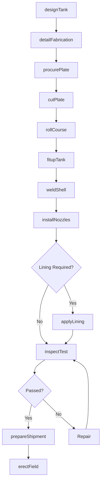
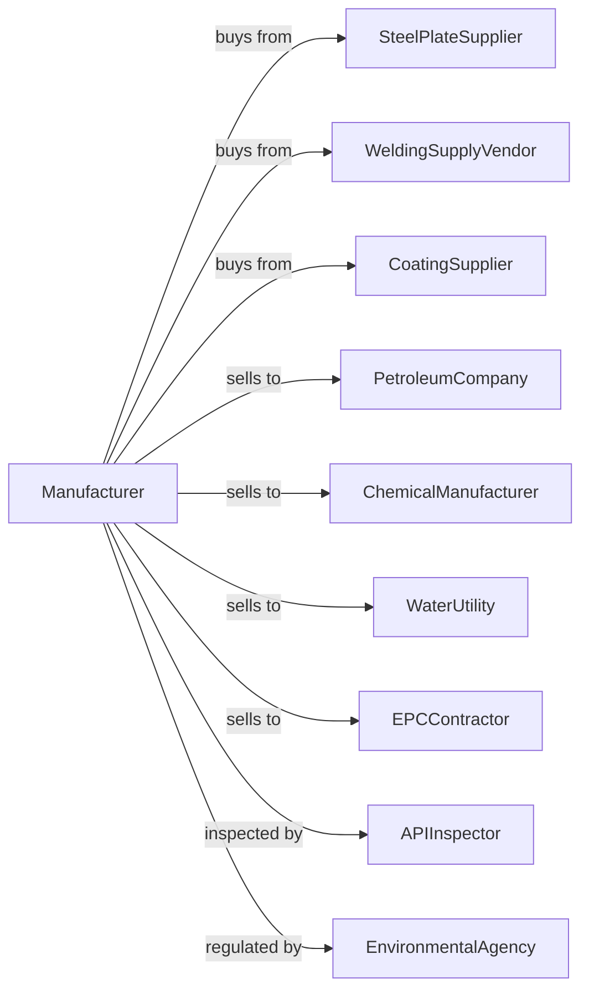

# Metal Tank (Heavy Gauge) Manufacturing

> Business-as-Code definition for heavy gauge metal tank manufacturing. Models the fabrication of large storage tanks and pressure vessels for industrial and commercial applications.

## Overview

This industry comprises establishments primarily engaged in cutting, forming, and joining heavy gauge metal to manufacture tanks, vessels, and other containers. Products include above-ground storage tanks, pressure vessels, process tanks, and water storage tanks for petroleum, chemical, water, and industrial applications.

## Actors

| Actor | Description |
|-------|-------------|
| SteelPlateSupplier | Provides carbon and stainless steel plate |
| WeldingSupplyVendor | Supplies welding consumables and gases |
| CoatingSupplier | Provides tank linings and protective coatings |
| PetroleumCompany | Purchases storage tanks for fuel and oil |
| ChemicalManufacturer | Orders process tanks for chemical production |
| WaterUtility | Buys water storage tanks for municipal systems |
| EPCContractor | Purchases tanks for plant construction projects |
| APIInspector | Certifies tanks to American Petroleum Institute standards |
| EnvironmentalAgency | Regulates tank containment and leak prevention |

## Roles

| Role | Description |
|------|-------------|
| PlantManager | Directs tank manufacturing operations |
| TankEngineer | Designs tanks per API or ASME codes |
| PlateFitter | Fits and tacks plate sections for welding |
| TankWelder | Welds tank shells, floors, and roofs |
| CoatingApplicator | Applies interior linings and exterior coatings |
| QualityInspector | Inspects welds and verifies dimensions |
| FieldErectionCrew | Assembles large tanks at customer site |
| SafetyCoordinator | Manages shop and field safety programs |

## Entities

| Entity | Description |
|--------|-------------|
| StorageTank | Large container for liquid or gas storage |
| PressureVessel | Closed container designed to hold pressure |
| ShellCourse | Cylindrical ring section of tank wall |
| TankFloor | Bottom plate assembly of storage tank |
| TankRoof | Top closure system for storage tank |
| Nozzle | Pipe connection welded to tank shell |
| Manway | Access opening for tank entry and inspection |
| TankLining | Protective coating applied to interior surfaces |
| Nameplate | Identification plate showing specifications |
| FieldWeldJoint | Weld made during site erection |

## Actions

| Action | Description |
|--------|-------------|
| designTank | Engineer tank dimensions and thickness per code |
| detailFabrication | Create shop drawings and cut lists |
| procurePlate | Order steel plate to required grades |
| cutPlate | Plasma or flame cut plate to shape |
| rollCourse | Form shell courses using plate rolls |
| fitupTank | Align and tack components for welding |
| weldShell | Complete welding of shell seams |
| installNozzles | Weld nozzles and manways to shell |
| applyLining | Apply interior coating or lining |
| inspectTest | Perform weld inspection and hydro or vacuum test |
| prepareShipment | Prepare tank sections for transport |
| erectField | Assemble and weld tank at customer site |

## Events

| Event | Description |
|-------|-------------|
| designCompleted | Engineering drawings have been approved |
| plateReceived | Steel plate has arrived in shop |
| coursesRolled | Shell courses have been formed |
| shopWeldingComplete | Tank sections have been welded in shop |
| liningApplied | Interior coating has been applied |
| shopTestPassed | Tank has passed shop tests |
| shippedToSite | Tank sections have been transported to field |
| fieldWeldingComplete | Site erection welding has finished |
| finalTestPassed | Completed tank has passed acceptance test |
| tankCommissioned | Tank has been placed in service |

## Searches

| Search | Description |
|--------|-------------|
| findProjects | List tank projects by customer or delivery date |
| getMaterialCerts | Retrieve mill test reports for plate |
| getWelderLog | Track welder qualifications and assignments |
| getInspectionRecords | View weld inspection and test results |
| calculateCapacity | Compute tank volume and dimensions |
| trackFieldProgress | Monitor site erection status |
| getCoatingBatch | Retrieve lining batch records |
| getComplianceDocs | Access API and code compliance documents |

## Workflow

## Actor Relationships

