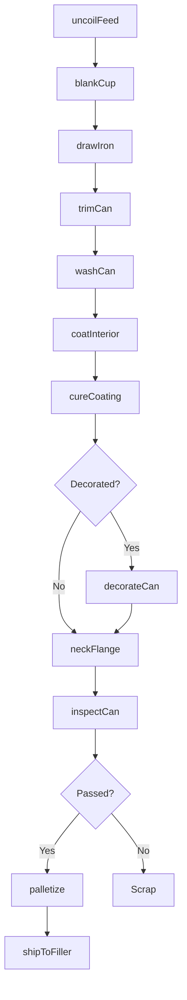
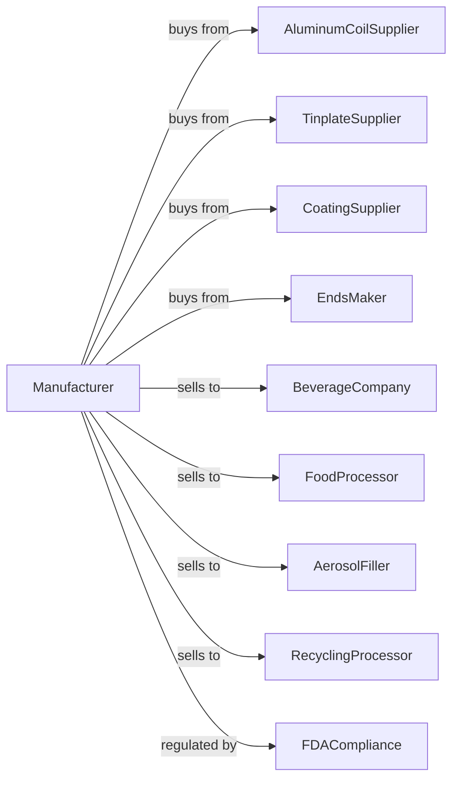

# Metal Can Manufacturing

> Business-as-Code definition for metal can manufacturing. Models the high-speed production of beverage, food, and aerosol cans from coil through finished containers.

## Overview

This U.S. industry comprises establishments primarily engaged in manufacturing metal cans, lids, and ends. Products include beverage cans, food cans, aerosol containers, and can components serving the beverage, food processing, and consumer products industries.

## Actors

| Actor | Description |
|-------|-------------|
| AluminumCoilSupplier | Provides aluminum sheet coil for beverage cans |
| TinplateSupplier | Supplies tinplate steel for food cans |
| CoatingSupplier | Provides interior lacquers and exterior inks |
| BeverageCompany | Purchases cans for soft drinks and beer |
| FoodProcessor | Orders cans for vegetables, fruits, and prepared foods |
| AerosolFiller | Buys containers for spray products |
| EndsMaker | Supplies can ends and easy-open lids |
| RecyclingProcessor | Purchases used aluminum can scrap |
| FDACompliance | Regulates food-contact materials safety |

## Roles

| Role | Description |
|------|-------------|
| PlantManager | Directs can manufacturing operations |
| ProcessEngineer | Optimizes can forming and coating processes |
| CupperOperator | Operates cupping presses for can blanks |
| BodymakerOperator | Runs bodymaker machines for can drawing |
| CoatingTechnician | Applies interior and exterior coatings |
| PrintingOperator | Operates can decorating equipment |
| NeckerFlangerOperator | Forms can neck and flange for ends |
| QualityInspector | Tests can dimensions, coatings, and seams |

## Entities

| Entity | Description |
|--------|-------------|
| AluminumCoil | Rolled aluminum sheet for can production |
| Tinplate | Tin-coated steel sheet for food cans |
| Cup | Initial drawn shape from coil blank |
| CanBody | Drawn and ironed cylindrical can shell |
| CanEnd | Lid or bottom closure for can |
| EasyOpenEnd | Pull-tab end for consumer convenience |
| InteriorLacquer | Food-safe coating for can interior |
| PrintedLabel | Decorative exterior printing on can |
| Seam | Mechanically formed joint between body and end |
| Pallet | Unit load of finished cans for shipping |

## Actions

| Action | Description |
|--------|-------------|
| uncoilFeed | Feed coil stock into cupping press |
| blankCup | Punch and draw cups from sheet |
| drawIron | Progressively draw and iron cup into can body |
| trimCan | Trim can to precise height |
| washCan | Clean cans before coating |
| coatInterior | Apply interior lacquer for food safety |
| cureCoating | Bake cans to cure coatings |
| decorateCan | Print exterior graphics and text |
| neckFlange | Form neck and flange for end seaming |
| inspectCan | Check dimensions, coating, and defects |
| palletize | Stack and wrap cans for shipment |
| shipToFiller | Deliver cans to beverage or food filler |

## Events

| Event | Description |
|-------|-------------|
| coilReceived | Aluminum or tinplate coil has arrived |
| cupsFormed | Blanks have been drawn into cups |
| bodiesDrawn | Cans have been drawn and ironed |
| coatingApplied | Interior lacquer has been applied |
| coatingCured | Cans have passed through cure oven |
| cansDecorated | Exterior printing is complete |
| neckFlangeDone | Cans are ready for ends |
| qualityApproved | Production lot has passed inspection |
| palletShipped | Cans have been dispatched to filler |
| scrapRecycled | Defective cans sent to recycling |

## Searches

| Search | Description |
|--------|-------------|
| findOrders | List orders by customer, can type, or ship date |
| getCoilInventory | Check aluminum and tinplate stock levels |
| getProductionRates | View line speeds and output by shift |
| trackQuality | Monitor defect rates and coating tests |
| getCoatingBatch | Retrieve lacquer batch records |
| calculateScrap | Compute scrap rates by line or product |
| getShipmentStatus | Track deliveries to filler locations |
| getRecyclingValue | Calculate value of aluminum scrap |

## Workflow

## Actor Relationships

