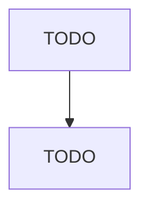

# Other Metal Container Manufacturing

> TODO: Business-as-Code definition

## Overview

This U.S. industry comprises establishments primarily engaged in manufacturing metal (light gauge) containers (except cans). Illustrative Examples: Light gauge metal bins manufacturing Light gauge metal drums manufacturing Light gauge metal garbage cans manufacturing Light gauge metal lunch boxes manufacturing Light gauge metal mailboxes manufacturing Light gauge metal tool boxes manufacturing Light gauge metal vats manufacturing Metal air cargo containers manufacturing Metal barrels manufacturi

## Actors

| Actor | Description |
|-------|-------------|
| TODO | TODO |

## Roles

| Role | Description |
|------|-------------|
| TODO | TODO |

## Entities

| Entity | Description |
|--------|-------------|
| TODO | TODO |

## Actions

| Action | Description |
|--------|-------------|
| TODO | TODO |

## Events

| Event | Description |
|-------|-------------|
| TODO | TODO |

## Searches

| Search | Description |
|--------|-------------|
| TODO | TODO |

## Workflow

## Actor Relationships

