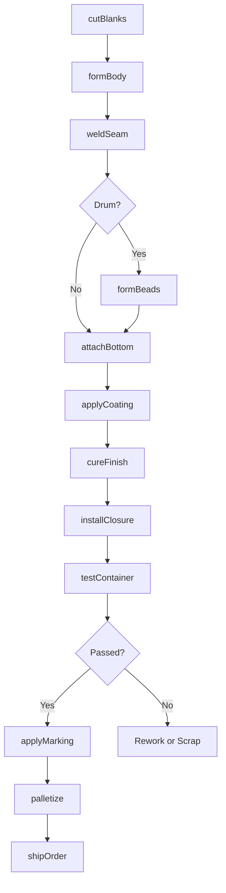
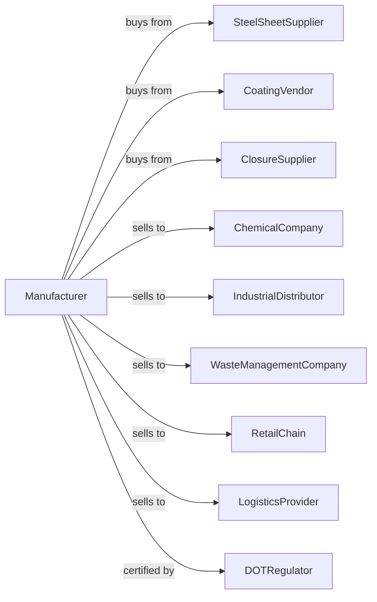

# Other Metal Container Manufacturing

> Business-as-Code definition for metal container manufacturing. Models the production of drums, pails, bins, and specialty containers for industrial and commercial applications.

## Overview

This U.S. industry comprises establishments primarily engaged in manufacturing metal (light gauge) containers (except cans). Products include steel drums, metal pails, garbage cans, tool boxes, lunch boxes, mail boxes, bins, vats, and cargo containers for industrial, commercial, and consumer markets.

## Actors

| Actor | Description |
|-------|-------------|
| SteelSheetSupplier | Provides galvanized and cold-rolled steel sheet |
| CoatingVendor | Supplies paints, lacquers, and specialty coatings |
| ClosureSupplier | Provides lids, bungs, and gaskets |
| ChemicalCompany | Purchases drums for chemical storage and shipping |
| IndustrialDistributor | Stocks containers for industrial customers |
| WasteManagementCompany | Buys garbage cans and waste containers |
| RetailChain | Orders tool boxes, mail boxes, and consumer items |
| LogisticsProvider | Purchases cargo containers and shipping supplies |
| DOTRegulator | Certifies containers for hazardous material transport |

## Roles

| Role | Description |
|------|-------------|
| PlantManager | Oversees container manufacturing operations |
| ProductEngineer | Designs containers and closure systems |
| ShearOperator | Cuts sheet metal to blank sizes |
| PressOperator | Forms container bodies using presses |
| SeamWelder | Welds or seams container joints |
| CoatingOperator | Applies interior and exterior coatings |
| AssemblyWorker | Installs closures and hardware |
| QualityTester | Tests containers for leaks and durability |

## Entities

| Entity | Description |
|--------|-------------|
| SteelDrum | 55-gallon or standard size shipping drum |
| MetalPail | Small open-top container with handle |
| GarbageCan | Waste receptacle for residential or commercial use |
| ToolBox | Portable storage container for tools |
| CargoContainer | Large metal box for freight transport |
| Closure | Lid, cover, or bung for sealing containers |
| Gasket | Sealing element for leak-proof closure |
| CoatingSystem | Interior lining or exterior finish |
| TestCertificate | Documentation of performance test results |
| UNMarking | Hazmat certification marking for drums |

## Actions

| Action | Description |
|--------|-------------|
| cutBlanks | Shear sheet metal to required blank sizes |
| formBody | Press or roll form container body |
| weldSeam | Join body seam by welding or mechanical lock |
| formBeads | Roll reinforcing beads into drum body |
| attachBottom | Weld or crimp bottom to container body |
| applyCoating | Spray or dip coat interior and exterior |
| cureFinish | Bake containers to cure coating |
| installClosure | Fit lids, bungs, and gaskets |
| testContainer | Leak test and inspect for defects |
| applyMarking | Print labels and certification marks |
| palletize | Stack and wrap containers for shipping |
| shipOrder | Dispatch containers to customers |

## Events

| Event | Description |
|-------|-------------|
| materialReceived | Steel sheet has arrived |
| blanksCut | Sheet has been cut to blanks |
| bodiesFormed | Containers have been formed |
| seamsWelded | Body seams have been joined |
| coatingApplied | Finish has been applied and cured |
| closuresInstalled | Lids and gaskets have been fitted |
| testPassed | Containers have passed leak test |
| markingsApplied | Labels and certifications are complete |
| orderShipped | Containers dispatched to customer |
| reconditioningComplete | Used drums have been reconditioned |

## Searches

| Search | Description |
|--------|-------------|
| findProducts | List containers by type, size, or application |
| getMaterialInventory | Check sheet metal and coating stock |
| getProductionSchedule | View manufacturing schedule by product |
| findOpenOrders | Retrieve orders by customer or ship date |
| trackTestResults | View leak test and inspection records |
| getCertifications | Retrieve UN and DOT certification data |
| getReconditioningStatus | Monitor drum reconditioning progress |
| calculateCapacity | Compute container volumes and dimensions |

## Workflow

## Actor Relationships

