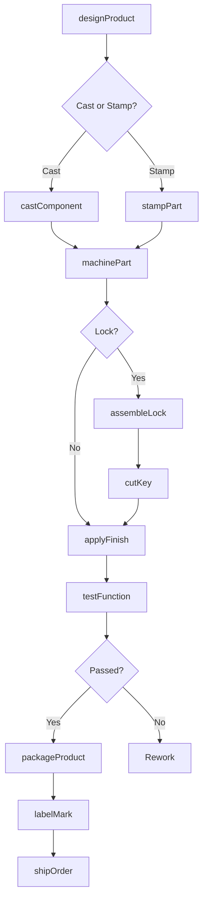
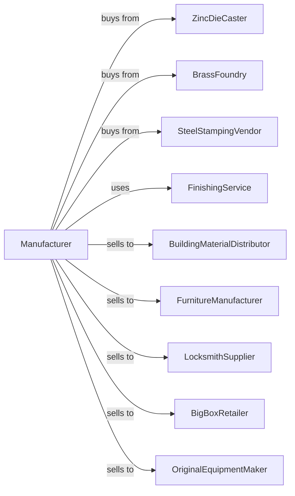

# Hardware Manufacturing

> Business-as-Code definition for hardware manufacturing. Models the production of metal hinges, handles, locks, keys, and related hardware items.

## Overview

This industry comprises establishments primarily engaged in manufacturing metal hardware, such as metal hinges, metal handles, keys, and locks (except coin- or card-operated, time locks). Products serve the construction, furniture, automotive, and consumer markets.

## Actors

| Actor | Description |
|-------|-------------|
| ZincDieCaster | Provides zinc die cast hardware components |
| BrassFoundry | Supplies brass castings for locks and handles |
| SteelStampingVendor | Provides stamped steel hardware parts |
| FinishingService | Offers plating, anodizing, and coating services |
| BuildingMaterialDistributor | Purchases hardware for construction supply |
| FurnitureManufacturer | Orders hinges and handles for furniture |
| LocksmithSupplier | Buys locks and key blanks for security trade |
| BigBoxRetailer | Stocks hardware for consumer home improvement |
| OriginalEquipmentMaker | Integrates hardware into manufactured products |

## Roles

| Role | Description |
|------|-------------|
| PlantManager | Oversees hardware manufacturing operations |
| ProductDesigner | Develops new hardware products and specifications |
| DieCastOperator | Runs die casting machines for hardware parts |
| StampingOperator | Operates presses for stamped hardware |
| AssemblyTechnician | Assembles multi-component hardware items |
| FinishingOperator | Applies plating, painting, or other finishes |
| QualityInspector | Tests hardware for function and durability |
| PackagingWorker | Packages hardware for retail or bulk shipment |

## Entities

| Entity | Description |
|--------|-------------|
| Hinge | Pivoting hardware for doors and cabinets |
| Handle | Grip component for doors, drawers, and cabinets |
| Lock | Security device with key or combination mechanism |
| Key | Metal implement for operating locks |
| Latch | Fastening device for securing doors or gates |
| Bracket | Supporting hardware for shelves and fixtures |
| DieCasting | Metal part formed by injecting molten metal into die |
| Stamping | Metal part formed by pressing sheet metal |
| PlatedFinish | Decorative or protective metal coating |
| PackagedSet | Retail-ready hardware with mounting accessories |

## Actions

| Action | Description |
|--------|-------------|
| designProduct | Create specifications and CAD models for hardware |
| castComponent | Produce parts using die casting or sand casting |
| stampPart | Form parts using progressive die stamping |
| machinePart | Machine castings or stampings to final dimensions |
| assembleLock | Combine pins, springs, and housing into lock |
| cutKey | Cut key blanks to specific bitting patterns |
| applyFinish | Plate, paint, or anodize hardware surfaces |
| testFunction | Verify operation, strength, and durability |
| packageProduct | Package hardware with screws and instructions |
| labelMark | Apply brand labels and specifications |
| inventoryStock | Manage finished goods inventory |
| shipOrder | Dispatch orders to distributors or retail |

## Events

| Event | Description |
|-------|-------------|
| designApproved | New product design has been finalized |
| castingsReceived | Die cast or sand cast parts have arrived |
| stampingsComplete | Stamped parts are ready for assembly |
| assemblyComplete | Hardware items have been assembled |
| finishApplied | Plating or coating has been completed |
| functionTestPassed | Hardware has passed performance testing |
| packagingComplete | Products are packaged and labeled |
| orderShipped | Hardware dispatched to customer |
| inventoryReplenished | Stock levels have been restocked |

## Searches

| Search | Description |
|--------|-------------|
| findProducts | List hardware by type, finish, or application |
| getComponentInventory | Check stock of castings and stampings |
| getProductionSchedule | View manufacturing schedule by product |
| findOpenOrders | Retrieve orders by customer or ship date |
| trackQuality | Monitor defect rates and test results |
| getFinishOptions | List available plating and coating choices |
| getSalesData | Analyze sales by product, customer, or region |
| checkKeyPatterns | Look up key bitting specifications |

## Workflow

## Actor Relationships

