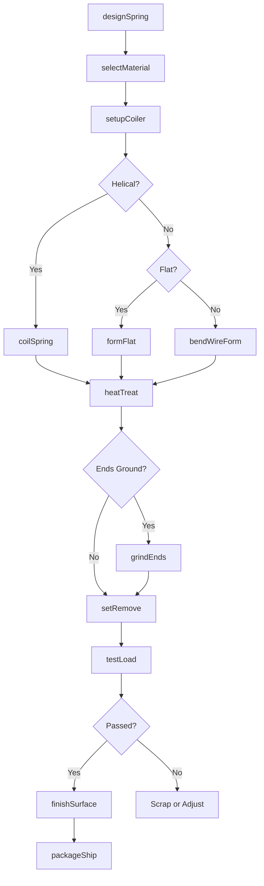
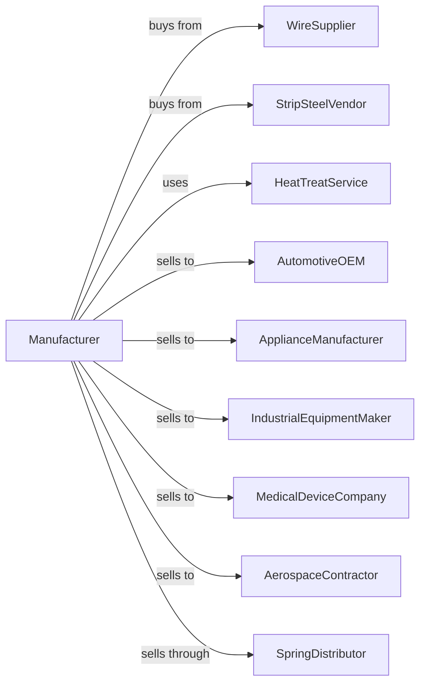

# Spring Manufacturing

> Business-as-Code definition for spring manufacturing. Models the production of coil springs, flat springs, and wire forms from purchased wire, strip, and rod stock.

## Overview

This U.S. industry comprises establishments primarily engaged in manufacturing springs from purchased wire, strip, or rod. Products include compression springs, extension springs, torsion springs, flat springs, and specialty wire forms for automotive, industrial, and consumer applications.

## Actors

| Actor | Description |
|-------|-------------|
| WireSupplier | Provides music wire, stainless, and specialty wire |
| StripSteelVendor | Supplies spring steel strip and flat stock |
| HeatTreatService | Provides stress relief and hardening services |
| AutomotiveOEM | Purchases springs for vehicle components |
| ApplianceManufacturer | Orders springs for consumer appliances |
| IndustrialEquipmentMaker | Buys springs for machinery and equipment |
| MedicalDeviceCompany | Sources precision springs for medical devices |
| AerospaceContractor | Procures high-spec springs for aircraft |
| SpringDistributor | Stocks standard springs for industrial supply |

## Roles

| Role | Description |
|------|-------------|
| PlantManager | Directs spring manufacturing operations |
| SpringEngineer | Designs springs and calculates load specifications |
| CoilerOperator | Operates CNC coiling machines |
| FlatSpringOperator | Runs stamping and forming equipment for flat springs |
| HeatTreatOperator | Performs stress relief and tempering |
| GrinderOperator | Grinds spring ends to specification |
| QualityTechnician | Tests springs for load, rate, and dimensions |
| SetupTechnician | Programs and sets up coiling machines |

## Entities

| Entity | Description |
|--------|-------------|
| MusicWire | High-carbon steel wire for precision springs |
| StainlessWire | Corrosion-resistant wire for springs |
| CompressionSpring | Helical spring that resists compressive force |
| ExtensionSpring | Helical spring that resists pulling force |
| TorsionSpring | Spring that exerts rotational force |
| FlatSpring | Spring made from flat strip stock |
| WireForm | Custom bent wire shape for specific function |
| CoilingMachine | CNC equipment for forming helical springs |
| LoadTester | Equipment to measure spring force and rate |
| SpringDrawing | Engineering specification for spring design |

## Actions

| Action | Description |
|--------|-------------|
| designSpring | Engineer spring geometry and load characteristics |
| selectMaterial | Choose wire or strip grade for application |
| setupCoiler | Program and tool coiling machine for spring |
| coilSpring | Form helical springs on coiling machine |
| formFlat | Stamp or form flat springs from strip |
| bendWireForm | Create custom wire shapes on bending equipment |
| heatTreat | Stress relieve or temper springs |
| grindEnds | Grind spring ends flat and square |
| setRemove | Compress springs to remove initial set |
| testLoad | Measure spring force at specified deflection |
| finishSurface | Apply coating, plating, or shot peening |
| packageShip | Package and dispatch springs to customer |

## Events

| Event | Description |
|-------|-------------|
| designComplete | Spring specification has been finalized |
| materialReceived | Wire or strip stock has arrived |
| machineSetup | Coiler is programmed and ready |
| springsCoiled | Production run has been completed |
| heatTreatDone | Stress relief or tempering is complete |
| endsGround | Spring ends have been processed |
| loadTestPassed | Springs meet force specifications |
| orderShipped | Springs dispatched to customer |
| toolingWorn | Coiling tooling requires replacement |

## Searches

| Search | Description |
|--------|-------------|
| findProducts | List springs by type, size, or application |
| getWireInventory | Check wire and strip stock levels |
| getSpringSpecs | Retrieve engineering specifications by part number |
| findOpenOrders | List orders by customer or due date |
| getTestData | View load test results by lot |
| getToolingStatus | Check coiling tool condition and inventory |
| calculateSpringRate | Compute spring rate from dimensions |
| trackProduction | Monitor output by machine or shift |

## Workflow

## Actor Relationships

