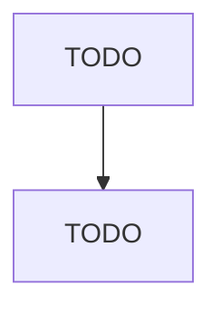

# Other Fabricated Wire Product Manufacturing

> TODO: Business-as-Code definition

## Overview

This U.S. industry comprises establishments primarily engaged in manufacturing fabricated wire products (except springs) made from purchased wire. Illustrative Examples: Barbed wire made from purchased wire Chain link fencing and fence gates made from purchased wire Metal baskets made from purchased wire Paper clips made from purchased wire Nails, brads, and staples made from purchased wire Noninsulated wire cable made from purchased wire Woven wire cloth made from purchased wire Cross-Reference

## Actors

| Actor | Description |
|-------|-------------|
| TODO | TODO |

## Roles

| Role | Description |
|------|-------------|
| TODO | TODO |

## Entities

| Entity | Description |
|--------|-------------|
| TODO | TODO |

## Actions

| Action | Description |
|--------|-------------|
| TODO | TODO |

## Events

| Event | Description |
|-------|-------------|
| TODO | TODO |

## Searches

| Search | Description |
|--------|-------------|
| TODO | TODO |

## Workflow

## Actor Relationships

