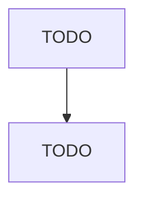

# Machine Shops

> TODO: Business-as-Code definition

## Overview

This industry comprises establishments known as machine shops primarily engaged in machining metal and plastic parts and parts of other composite materials on a job or order basis. Generally machine shop jobs are low volume using machine tools, such as lathes (including computer numerically controlled); automatic screw machines; and machines for boring, grinding, milling, and additive manufacturing. Cross-References. Establishments primarily engaged in--

## Actors

| Actor | Description |
|-------|-------------|
| TODO | TODO |

## Roles

| Role | Description |
|------|-------------|
| TODO | TODO |

## Entities

| Entity | Description |
|--------|-------------|
| TODO | TODO |

## Actions

| Action | Description |
|--------|-------------|
| TODO | TODO |

## Events

| Event | Description |
|-------|-------------|
| TODO | TODO |

## Searches

| Search | Description |
|--------|-------------|
| TODO | TODO |

## Workflow

## Actor Relationships

