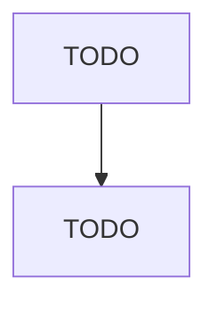

# Precision Turned Product Manufacturing

> TODO: Business-as-Code definition

## Overview

This U.S. industry comprises establishments known as precision turned manufacturers primarily engaged in machining precision products of all materials on a job or order basis. Generally precision turned product jobs are large volume using machines, such as automatic screw machines, rotary transfer machines, computer numerically controlled (CNC) lathes, or turning centers. Cross-References. Establishments primarily engaged in--

## Actors

| Actor | Description |
|-------|-------------|
| TODO | TODO |

## Roles

| Role | Description |
|------|-------------|
| TODO | TODO |

## Entities

| Entity | Description |
|--------|-------------|
| TODO | TODO |

## Actions

| Action | Description |
|--------|-------------|
| TODO | TODO |

## Events

| Event | Description |
|-------|-------------|
| TODO | TODO |

## Searches

| Search | Description |
|--------|-------------|
| TODO | TODO |

## Workflow

## Actor Relationships

