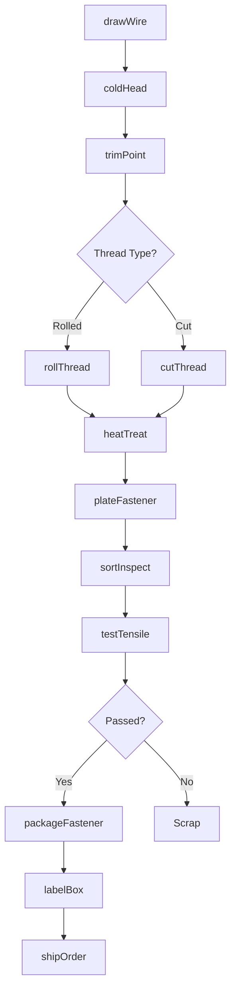
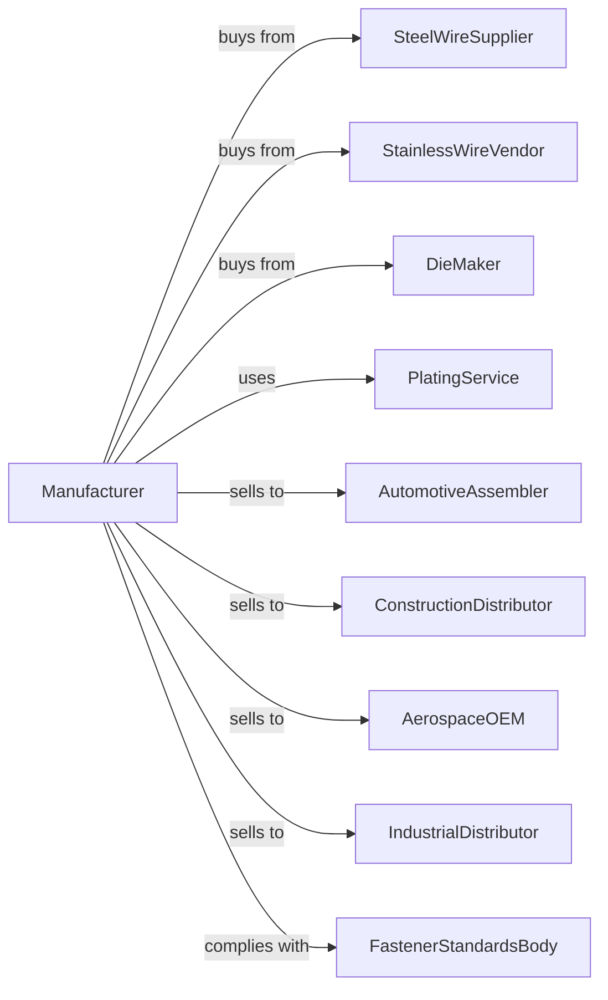

# Bolt, Nut, Screw, Rivet, and Washer Manufacturing

> Business-as-Code definition for industrial fastener manufacturing. Models the production of bolts, nuts, screws, rivets, and washers using headers, threaders, and forming equipment.

## Overview

This U.S. industry comprises establishments primarily engaged in manufacturing metal bolts, nuts, screws, rivets, washers, and other industrial fasteners using machines, such as headers, threaders, and nut forming machines. Products serve automotive, construction, aerospace, and industrial assembly applications.

## Actors

| Actor | Description |
|-------|-------------|
| SteelWireSupplier | Provides carbon and alloy steel wire for cold heading |
| StainlessWireVendor | Supplies stainless steel wire for corrosion-resistant fasteners |
| DieMaker | Manufactures heading dies and tooling |
| AutomotiveAssembler | Purchases fasteners for vehicle assembly |
| ConstructionDistributor | Stocks fasteners for building supply |
| AerospaceOEM | Orders high-specification aerospace fasteners |
| IndustrialDistributor | Supplies fasteners for manufacturing |
| PlatingService | Provides zinc, cadmium, and specialty plating |
| FastenerStandardsBody | Sets dimensional and performance standards |

## Roles

| Role | Description |
|------|-------------|
| PlantManager | Oversees fastener manufacturing operations |
| ProcessEngineer | Designs heading and threading processes |
| HeaderOperator | Runs cold heading machines to form blanks |
| ThreaderOperator | Operates thread rolling and cutting machines |
| HeatTreatOperator | Controls hardening and tempering furnaces |
| SortingOperator | Inspects and sorts fasteners |
| QualityEngineer | Manages testing and quality systems |
| PackagingWorker | Weighs, counts, and packages fasteners |

## Entities

| Entity | Description |
|--------|-------------|
| SteelWire | Cold heading quality wire stock |
| Bolt | Externally threaded fastener with head |
| Nut | Internally threaded fastener |
| Screw | Threaded fastener for tapping or machine use |
| Rivet | Permanent fastener installed by deformation |
| Washer | Flat disc for load distribution |
| HeaderDie | Tooling that forms fastener heads |
| ThreadRoll | Dies that form threads by displacement |
| HeatTreatBatch | Group of fasteners processed together |
| SortingMachine | Equipment for inspecting and sorting fasteners |

## Actions

| Action | Description |
|--------|-------------|
| drawWire | Reduce wire to required diameter |
| coldHead | Form fastener heads and shanks in header |
| trimPoint | Cut or form fastener points |
| rollThread | Form threads using thread rolling dies |
| cutThread | Machine threads on special fasteners |
| heatTreat | Harden and temper fasteners |
| plateFastener | Apply protective plating coating |
| sortInspect | Optically and mechanically sort fasteners |
| testTensile | Verify tensile strength on samples |
| packageFastener | Weigh, count, and package for shipment |
| labelBox | Apply lot tracking and specifications |
| shipOrder | Dispatch fasteners to customer |

## Events

| Event | Description |
|-------|-------------|
| wireReceived | Cold heading wire has arrived |
| blanksFormed | Fastener blanks have been headed |
| threadsRolled | Threads have been formed |
| heatTreatComplete | Batch has been hardened and tempered |
| platingComplete | Protective coating has been applied |
| sortingComplete | Fasteners have been inspected and sorted |
| tensileTestPassed | Sample fasteners meet strength requirements |
| orderPackaged | Fasteners are packaged and labeled |
| orderShipped | Fasteners dispatched to customer |

## Searches

| Search | Description |
|--------|-------------|
| findProducts | List fasteners by type, size, or grade |
| getWireInventory | Check steel wire stock levels |
| getDieStatus | Track heading die wear and inventory |
| getProductionSchedule | View schedule by fastener type |
| getHeatTreatRecords | Retrieve batch treatment records |
| getTestData | View tensile and hardness test results |
| trackSortingYield | Monitor sorting reject rates |
| getPlatingBatch | Retrieve plating lot records |

## Workflow

## Actor Relationships

