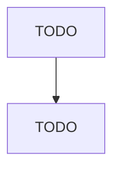

# Metal Coating, Engraving (except Jewelry and Silverware), and Allied Services to Manufacturers

> TODO: Business-as-Code definition

## Overview

This U.S. industry comprises establishments primarily engaged in one or more of the following: (1) enameling, lacquering, and varnishing metals and metal products; (2) hot dip galvanizing metals and metal products; (3) engraving, chasing, or etching metals and metal products (except jewelry; personal goods carried on or about the person, such as compacts and cigarette cases; precious metal products (except precious plated flatware and other plated ware); and printing plates); (4) powder coating 

## Actors

| Actor | Description |
|-------|-------------|
| TODO | TODO |

## Roles

| Role | Description |
|------|-------------|
| TODO | TODO |

## Entities

| Entity | Description |
|--------|-------------|
| TODO | TODO |

## Actions

| Action | Description |
|--------|-------------|
| TODO | TODO |

## Events

| Event | Description |
|-------|-------------|
| TODO | TODO |

## Searches

| Search | Description |
|--------|-------------|
| TODO | TODO |

## Workflow

## Actor Relationships

