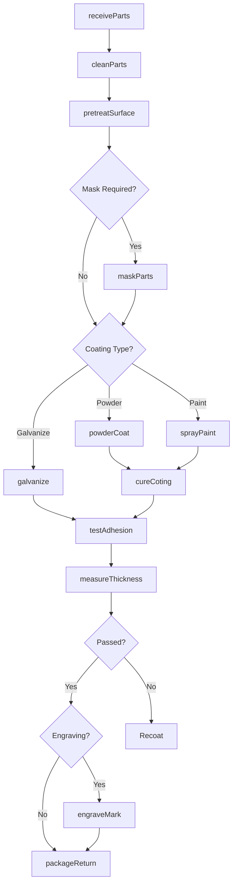
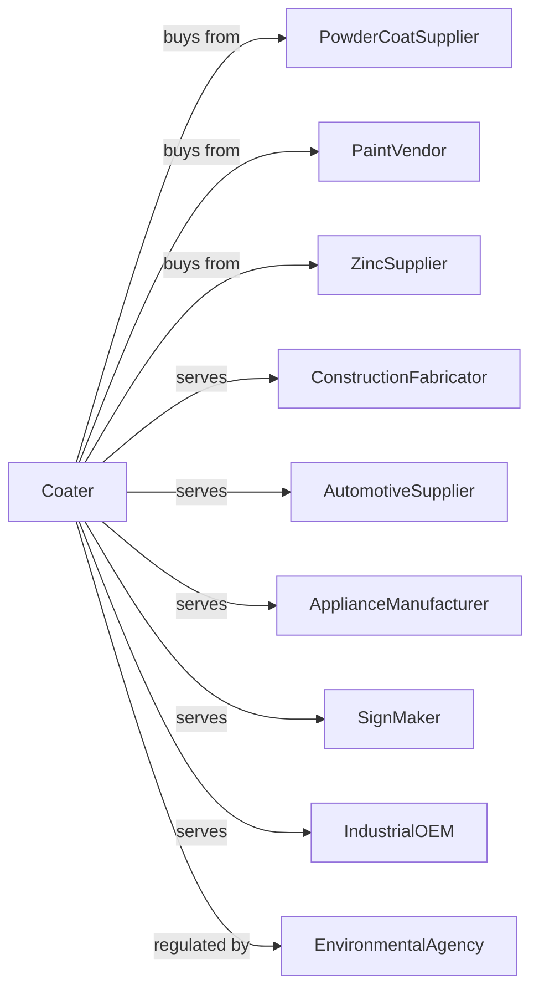

# Metal Coating, Engraving (except Jewelry and Silverware), and Allied Services to Manufacturers

> Business-as-Code definition for metal coating and engraving services. Models the application of protective and decorative coatings and precision engraving for industrial customers.

## Overview

This U.S. industry comprises establishments primarily engaged in one or more of the following: (1) enameling, lacquering, and varnishing metals and metal products; (2) hot dip galvanizing metals and metal products; (3) engraving, chasing, or etching metals and metal products; (4) powder coating metals and metal products; and (5) providing allied metal coating services to manufacturers.

## Actors

| Actor | Description |
|-------|-------------|
| PowderCoatSupplier | Provides powder coating materials |
| PaintVendor | Supplies liquid paints and lacquers |
| ZincSupplier | Provides zinc for hot dip galvanizing |
| ConstructionFabricator | Sends steel for galvanizing |
| AutomotiveSupplier | Orders powder coating for parts |
| ApplianceManufacturer | Requires decorative finishing |
| SignMaker | Orders engraved nameplates and signage |
| IndustrialOEM | Needs protective coating for equipment |
| EnvironmentalAgency | Regulates coating emissions and waste |

## Roles

| Role | Description |
|------|-------------|
| PlantManager | Directs coating and engraving operations |
| CoatingEngineer | Develops coating processes and specifications |
| GalvanizingOperator | Operates hot dip galvanizing lines |
| PowderCoatOperator | Applies powder coating and operates ovens |
| PaintSprayOperator | Applies liquid paint in spray booths |
| EngravingOperator | Operates laser and mechanical engraving equipment |
| QualityInspector | Tests coating thickness and adhesion |
| PretreatmentTech | Operates cleaning and conversion coating lines |

## Entities

| Entity | Description |
|--------|-------------|
| PowderCoat | Dry powder applied electrostatically and cured |
| LiquidPaint | Solvent or water-based coating applied by spray |
| GalvanizingBath | Molten zinc bath for hot dip coating |
| Enamel | Vitreous coating fused to metal surface |
| Engraving | Marks or designs cut into metal surface |
| PretreatmentChemical | Cleaner and conversion coating solutions |
| CuringOven | Equipment for baking coatings |
| SprayBooth | Enclosed area for paint application |
| CoatingThicknessGauge | Instrument for measuring coating depth |
| Nameplate | Engraved identification or branding plate |

## Actions

| Action | Description |
|--------|-------------|
| receiveParts | Accept incoming parts for coating |
| cleanParts | Remove oil, rust, and contaminants |
| pretreatSurface | Apply phosphate or conversion coating |
| maskParts | Protect areas from coating |
| galvanize | Immerse parts in molten zinc bath |
| powderCoat | Apply powder electrostatically |
| sprayPaint | Apply liquid coating by spray |
| cureCoting | Bake coating in curing oven |
| engraveMark | Cut or laser marks into metal surface |
| testAdhesion | Verify coating adhesion with pull test |
| measureThickness | Check coating thickness with gauge |
| packageReturn | Package and return coated parts |

## Events

| Event | Description |
|-------|-------------|
| partsReceived | Customer parts have arrived |
| cleaningComplete | Parts have been cleaned and pretreated |
| coatingApplied | Powder, paint, or zinc has been applied |
| curingComplete | Coating has been baked |
| engravingComplete | Marks or designs have been cut |
| adhesionPassed | Coating meets adhesion requirements |
| thicknessPassed | Coating thickness is within specification |
| partsShipped | Coated parts returned to customer |
| emissionAlarm | Coating booth emissions out of compliance |

## Searches

| Search | Description |
|--------|-------------|
| findJobs | List jobs by customer, coating type, or due date |
| getCoatingInventory | Check powder and paint stock levels |
| getZincLevel | Monitor galvanizing bath zinc level |
| getLineSchedule | View production schedule by line |
| getTestResults | Retrieve adhesion and thickness data |
| trackEmissions | Monitor VOC and particulate emissions |
| getColorMatch | Find color formulas by specification |
| getEquipmentStatus | Check booth and oven availability |

## Workflow

## Actor Relationships

