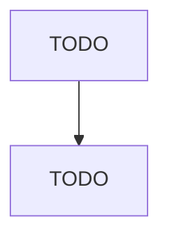

# Electroplating, Plating, Polishing, Anodizing, and Coloring

> TODO: Business-as-Code definition

## Overview

This U.S. industry comprises establishments primarily engaged in electroplating, plating, anodizing, coloring, buffing, polishing, cleaning, and sandblasting metals and metal products for the trade. Included in this industry are establishments that perform these processes on other materials, such as plastics, in addition to metals. Cross-References.

## Actors

| Actor | Description |
|-------|-------------|
| TODO | TODO |

## Roles

| Role | Description |
|------|-------------|
| TODO | TODO |

## Entities

| Entity | Description |
|--------|-------------|
| TODO | TODO |

## Actions

| Action | Description |
|--------|-------------|
| TODO | TODO |

## Events

| Event | Description |
|-------|-------------|
| TODO | TODO |

## Searches

| Search | Description |
|--------|-------------|
| TODO | TODO |

## Workflow

## Actor Relationships

