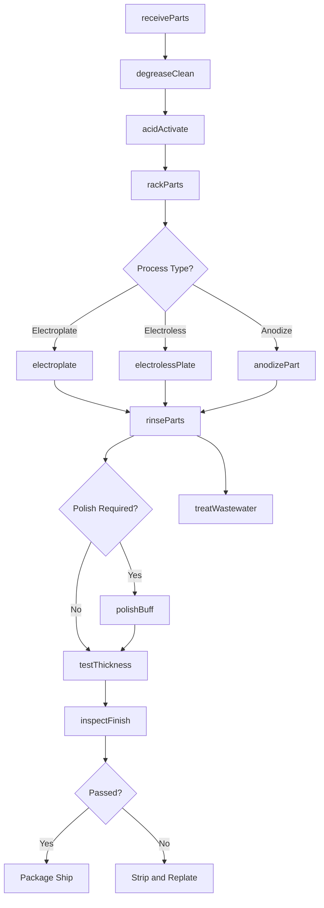
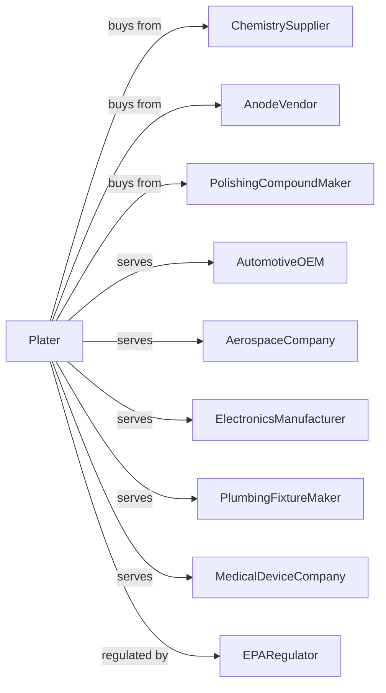

# Electroplating, Plating, Polishing, Anodizing, and Coloring

> Business-as-Code definition for electroplating and surface finishing services. Models the application of metallic coatings and surface treatments for corrosion protection and aesthetics.

## Overview

This U.S. industry comprises establishments primarily engaged in electroplating, plating, anodizing, coloring, buffing, polishing, cleaning, and sandblasting metals and metal products for the trade. Included in this industry are establishments that perform these processes on other materials, such as plastics, in addition to metals.

## Actors

| Actor | Description |
|-------|-------------|
| ChemistrySupplier | Provides plating chemicals and solutions |
| AnodeVendor | Supplies anodes for electroplating baths |
| PolishingCompoundMaker | Provides buffing compounds and abrasives |
| AutomotiveOEM | Orders chrome plating for trim and wheels |
| AerospaceCompany | Requires cadmium and specialty plating |
| ElectronicsManufacturer | Needs gold and silver plating for connectors |
| PlumbingFixtureMaker | Orders decorative chrome and nickel finishes |
| MedicalDeviceCompany | Requires biocompatible surface finishes |
| EPARegulator | Oversees hazardous waste and water discharge |

## Roles

| Role | Description |
|------|-------------|
| PlantManager | Directs plating shop operations |
| ProcessEngineer | Develops plating parameters and bath chemistry |
| PlatingOperator | Loads racks and operates plating lines |
| AnodizingOperator | Runs anodizing tanks for aluminum parts |
| PolishingOperator | Buffs and polishes parts to finish |
| LabTechnician | Tests bath chemistry and coating thickness |
| WasteTreatmentOperator | Manages wastewater treatment systems |
| QualityInspector | Verifies finish appearance and specifications |

## Entities

| Entity | Description |
|--------|-------------|
| PlatingBath | Tank containing plating solution and anodes |
| Electroplating | Coating applied using electrical current |
| ElectrolessPlating | Coating applied by chemical reduction |
| Anodizing | Electrochemical oxide layer on aluminum |
| ChromePlating | Decorative or hard chrome coating |
| NickelPlating | Corrosion-resistant nickel layer |
| ZincPlating | Sacrificial zinc coating for steel |
| PolishingWheel | Buffing wheel for surface finishing |
| RinseTank | Water tank for cleaning between steps |
| WasteTreatmentSystem | Equipment for treating plating effluent |

## Actions

| Action | Description |
|--------|-------------|
| receiveParts | Accept incoming parts for finishing |
| degreaseClean | Remove oil and contaminants from parts |
| acidActivate | Prepare surface with acid treatment |
| rackParts | Mount parts on plating racks or barrels |
| electroplate | Apply metal coating using electrical current |
| electrolessPlate | Deposit coating by chemical reduction |
| anodizePart | Create oxide layer on aluminum |
| rinseParts | Remove chemicals between process steps |
| polishBuff | Achieve desired surface finish |
| testThickness | Measure coating thickness |
| inspectFinish | Check appearance and adhesion |
| treatWastewater | Process effluent for discharge or recycling |

## Events

| Event | Description |
|-------|-------------|
| partsReceived | Customer parts have arrived |
| cleaningComplete | Parts have been degreased and activated |
| platingComplete | Electroplating cycle has finished |
| anodizingComplete | Aluminum parts have been anodized |
| polishingComplete | Parts have been buffed to finish |
| thicknessPassed | Coating meets specification |
| finishApproved | Visual inspection has passed |
| partsShipped | Finished parts returned to customer |
| bathMaintenanceDue | Plating solution requires adjustment |
| complianceAudit | Environmental inspection conducted |

## Searches

| Search | Description |
|--------|-------------|
| findJobs | List jobs by customer, finish type, or due date |
| getBathChemistry | Retrieve plating bath analysis results |
| getLineSchedule | View production schedule by line |
| getThicknessData | Retrieve coating thickness measurements |
| trackChemicalUsage | Monitor plating chemical consumption |
| getWasteRecords | View wastewater treatment logs |
| getSpecificationLibrary | Look up finish specifications by code |
| getComplianceStatus | Check permit and regulatory status |

## Workflow

## Actor Relationships

