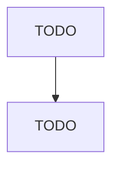

# Other Metal Valve and Pipe Fitting Manufacturing

> TODO: Business-as-Code definition

## Overview

This U.S. industry comprises establishments primarily engaged in manufacturing metal valves (except industrial valves, fluid power valves, fluid power hose fittings, and plumbing fixture fittings and trim). Illustrative Examples: Aerosol valves manufacturing Firefighting nozzles manufacturing Lawn hose nozzles manufacturing Lawn sprinklers manufacturing Water traps manufacturing Metal hose couplings (except fluid power) manufacturing Metal pipe flanges and flange unions manufacturing Plumbing an

## Actors

| Actor | Description |
|-------|-------------|
| TODO | TODO |

## Roles

| Role | Description |
|------|-------------|
| TODO | TODO |

## Entities

| Entity | Description |
|--------|-------------|
| TODO | TODO |

## Actions

| Action | Description |
|--------|-------------|
| TODO | TODO |

## Events

| Event | Description |
|-------|-------------|
| TODO | TODO |

## Searches

| Search | Description |
|--------|-------------|
| TODO | TODO |

## Workflow

## Actor Relationships

