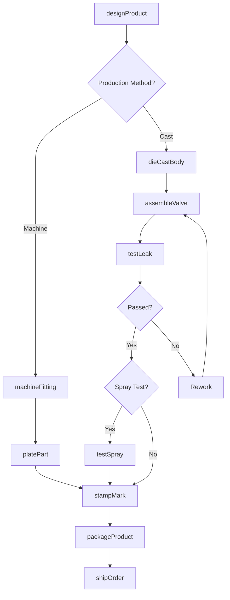
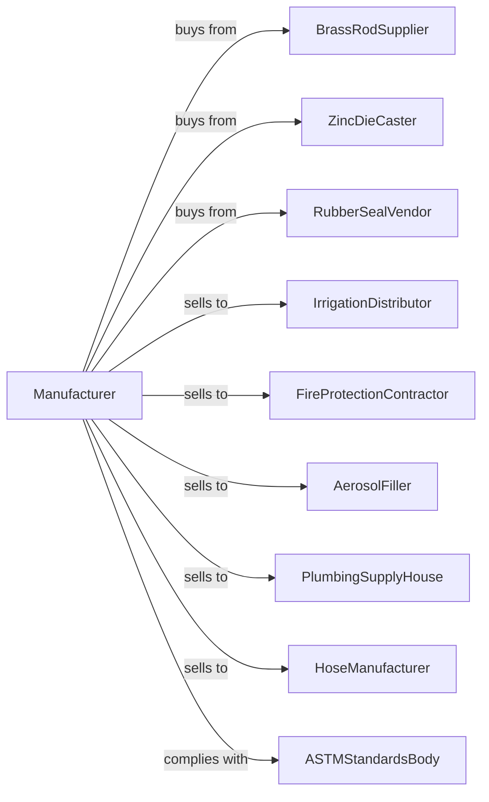

# Other Metal Valve and Pipe Fitting Manufacturing

> Business-as-Code definition for other metal valve and pipe fitting manufacturing. Models the production of specialty valves, nozzles, sprinklers, and pipe fittings.

## Overview

This U.S. industry comprises establishments primarily engaged in manufacturing metal valves (except industrial valves, fluid power valves, fluid power hose fittings, and plumbing fixture fittings and trim). Products include aerosol valves, firefighting nozzles, lawn sprinklers, hose couplings, pipe flanges, and plumbing fittings.

## Actors

| Actor | Description |
|-------|-------------|
| BrassRodSupplier | Provides brass bar stock for machining |
| ZincDieCaster | Supplies die castings for valve bodies |
| RubberSealVendor | Provides gaskets and sealing elements |
| IrrigationDistributor | Purchases sprinklers and irrigation fittings |
| FireProtectionContractor | Orders firefighting nozzles and fittings |
| AerosolFiller | Buys aerosol valves and actuators |
| PlumbingSupplyHouse | Stocks pipe fittings for contractors |
| HoseManufacturer | Purchases couplings for hose assemblies |
| ASTMStandardsBody | Sets material and testing standards |

## Roles

| Role | Description |
|------|-------------|
| PlantManager | Oversees valve and fitting manufacturing |
| ProductEngineer | Designs valves and fittings for applications |
| ScrewMachineOperator | Produces fittings on automatic screw machines |
| DieCastOperator | Runs die casting equipment |
| AssemblyWorker | Assembles valves and attaches components |
| TestTechnician | Conducts leak and performance tests |
| QualityInspector | Verifies dimensions and specifications |
| PackagingWorker | Prepares products for shipment |

## Entities

| Entity | Description |
|--------|-------------|
| AerosolValve | Dispensing valve for aerosol containers |
| FireNozzle | Adjustable nozzle for firefighting |
| LawnSprinkler | Water distribution head for irrigation |
| HoseCoupling | Quick-connect fitting for hoses |
| PipeFlange | Bolted connection for pipes |
| PipeFitting | Elbow, tee, or coupling for plumbing |
| WaterTrap | Plumbing device preventing sewer gas |
| Gasket | Sealing element between flanges |
| Actuator | Button or trigger operating aerosol valve |
| SprayPattern | Water distribution shape from nozzle |

## Actions

| Action | Description |
|--------|-------------|
| designProduct | Engineer valve or fitting specifications |
| machineFitting | Produce fittings on screw machines |
| dieCastBody | Cast valve bodies and components |
| assembleValve | Install seals and operating mechanisms |
| testLeak | Verify seal integrity under pressure |
| testSpray | Check spray pattern and flow rate |
| platePart | Apply protective or decorative finish |
| stampMark | Mark parts with specifications |
| packageProduct | Bag, box, or bulk pack items |
| shipOrder | Dispatch products to customers |
| certifyProduct | Obtain listings and approvals |

## Events

| Event | Description |
|-------|-------------|
| designCompleted | Product specifications finalized |
| castingsReceived | Die castings have arrived |
| fittingsMachined | Screw machine production complete |
| valvesAssembled | Assembly operations finished |
| testPassed | Products passed leak and flow tests |
| platingComplete | Finish has been applied |
| certificationObtained | Product meets applicable standards |
| orderShipped | Products dispatched to customer |

## Searches

| Search | Description |
|--------|-------------|
| findProducts | List products by type, size, or material |
| getBarInventory | Check brass and steel bar stock |
| getCastingInventory | View die casting availability |
| getSealInventory | Check gasket and O-ring stock |
| getProductionSchedule | View schedule by product line |
| getTestRecords | Retrieve test documentation |
| getCertifications | Verify product listings and approvals |
| trackOrders | Monitor order status |

## Workflow

## Actor Relationships

