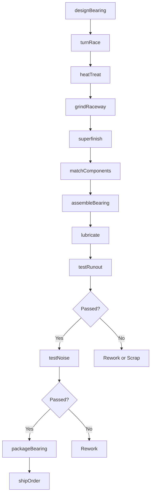
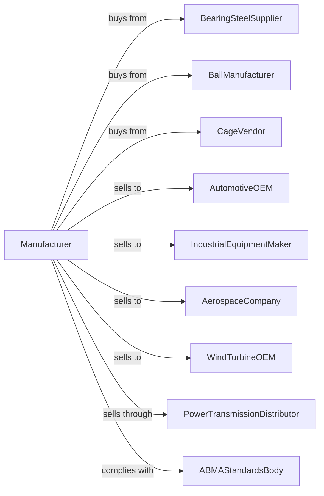

# Ball and Roller Bearing Manufacturing

> Business-as-Code definition for ball and roller bearing manufacturing. Models the precision production of anti-friction bearings for industrial, automotive, and aerospace applications.

## Overview

This U.S. industry comprises establishments primarily engaged in manufacturing ball and roller bearings of all materials. Products include radial ball bearings, angular contact bearings, tapered roller bearings, cylindrical roller bearings, and specialty bearings for automotive, industrial, and aerospace applications.

## Actors

| Actor | Description |
|-------|-------------|
| BearingSteelSupplier | Provides chrome steel bar and tube for races |
| BallManufacturer | Supplies precision steel and ceramic balls |
| CageVendor | Provides brass, steel, and polymer retainers |
| AutomotiveOEM | Purchases bearings for vehicles and transmissions |
| IndustrialEquipmentMaker | Orders bearings for machinery and equipment |
| AerospaceCompany | Requires high-specification aerospace bearings |
| PowerTransmissionDistributor | Stocks bearings for industrial supply |
| WindTurbineOEM | Purchases large-scale bearings for energy |
| ABMAStandardsBody | Sets bearing dimension and performance standards |

## Roles

| Role | Description |
|------|-------------|
| PlantManager | Oversees bearing manufacturing operations |
| BearingEngineer | Designs bearings and selects materials |
| TurningOperator | Produces inner and outer races on lathes |
| GrindingOperator | Finish grinds raceways to micron tolerances |
| HeatTreatOperator | Hardens bearing components |
| AssemblyTechnician | Assembles balls, races, and cages |
| QualityInspector | Measures dimensions and tests performance |
| CleanRoomWorker | Handles precision bearings in controlled environment |

## Entities

| Entity | Description |
|--------|-------------|
| BallBearing | Bearing using balls as rolling elements |
| RollerBearing | Bearing using cylindrical or tapered rollers |
| InnerRace | Ring contacting shaft with inner raceway |
| OuterRace | Ring fitting in housing with outer raceway |
| RollingElement | Ball or roller transferring load |
| Cage | Retainer that spaces rolling elements |
| Raceway | Precision groove guiding rolling elements |
| Preload | Assembly load affecting bearing stiffness |
| Clearance | Internal gap between components |
| ABEC | Precision grade classification |

## Actions

| Action | Description |
|--------|-------------|
| designBearing | Engineer bearing geometry and load ratings |
| turnRace | Machine rough races from bar stock |
| heatTreat | Harden races and rolling elements |
| grindRaceway | Precision grind raceways to specification |
| superfinish | Achieve mirror finish on raceways |
| matchComponents | Select matched sets for preload |
| assembleBearing | Install rolling elements and cage |
| lubricate | Apply grease or oil to bearing |
| testRunout | Measure radial and axial runout |
| testNoise | Check for vibration and acoustic quality |
| packageBearing | Wrap and protect bearings from contamination |
| shipOrder | Dispatch bearings to customer |

## Events

| Event | Description |
|-------|-------------|
| steelReceived | Bearing steel bar has arrived |
| racesFormed | Inner and outer races have been turned |
| heatTreatComplete | Components have been hardened |
| grindingComplete | Raceways are finished to specification |
| assemblyComplete | Bearings are assembled and lubricated |
| testPassed | Bearings meet runout and noise standards |
| orderShipped | Bearings dispatched to customer |
| precisionGradeAchieved | ABEC classification confirmed |

## Searches

| Search | Description |
|--------|-------------|
| findProducts | List bearings by type, size, or ABEC grade |
| getSteelInventory | Check bearing steel stock levels |
| getBallInventory | View ball availability by size and grade |
| getProductionSchedule | See grinding and assembly schedule |
| getTestData | Retrieve runout and noise measurements |
| getLoadRatings | Look up dynamic and static load capacity |
| trackOrders | Monitor order status through production |
| getInterchangeability | Find equivalent bearing part numbers |

## Workflow

## Actor Relationships

