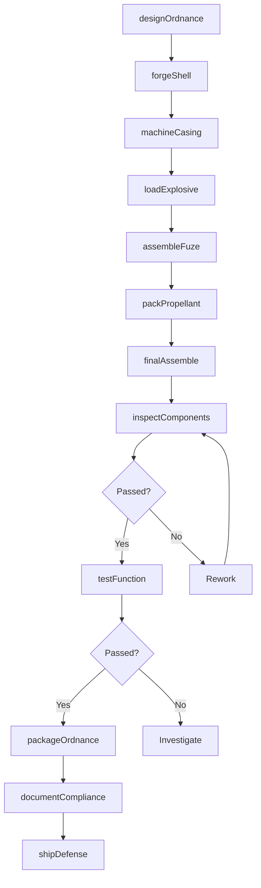
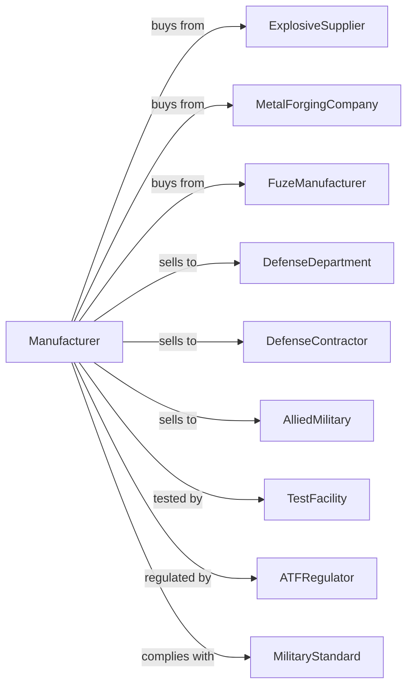

# Ammunition (except Small Arms) Manufacturing

> Business-as-Code definition for large-caliber and specialty ammunition manufacturing. Models the production of artillery rounds, naval ammunition, and aerospace ordnance.

## Overview

This U.S. industry comprises establishments primarily engaged in manufacturing ammunition (except small arms). Products include bombs, depth charges, rockets (except guided missiles), grenades, mines, and torpedoes for military and defense applications.

## Actors

| Actor | Description |
|-------|-------------|
| ExplosiveSupplier | Provides high explosives and propellants |
| MetalForgingCompany | Supplies forged shells and casings |
| FuzeManufacturer | Provides proximity and impact fuzes |
| DefenseDepartment | Procures ammunition for military services |
| DefenseContractor | Integrates ammunition into weapons systems |
| AlliedMilitary | Purchases ammunition through foreign sales |
| TestFacility | Provides ballistic testing and certification |
| ATFRegulator | Oversees explosive materials licensing |
| MilitaryStandard | Sets specifications for defense ordnance |

## Roles

| Role | Description |
|------|-------------|
| PlantManager | Directs ammunition manufacturing operations |
| OrdnanceEngineer | Designs ammunition systems |
| ExplosiveHandler | Works with high explosives following safety protocols |
| MachineOperator | Machines shell casings and components |
| AssemblyTechnician | Assembles ammunition components |
| FuzeInstaller | Integrates fuzing systems |
| QualityEngineer | Ensures compliance with military specifications |
| SafetyOfficer | Manages explosive safety programs |

## Entities

| Entity | Description |
|--------|-------------|
| ArtilleryShell | Large-caliber projectile for cannons |
| NavalRound | Ammunition for ship-mounted weapons |
| AerialBomb | Air-dropped explosive device |
| Rocket | Unguided self-propelled projectile |
| Grenade | Hand-thrown or launched explosive |
| Mine | Stationary explosive device |
| Torpedo | Self-propelled underwater weapon |
| Fuze | Device initiating ammunition function |
| Propellant | Material providing projectile velocity |
| Warhead | Explosive payload of ammunition |

## Actions

| Action | Description |
|--------|-------------|
| designOrdnance | Engineer ammunition specifications |
| forgeShell | Produce shell body forgings |
| machineCasing | Finish machine casings and components |
| loadExplosive | Fill warheads with explosive material |
| assembleFuze | Integrate fuzing system |
| packPropellant | Load propellant charges |
| finalAssemble | Complete ammunition assembly |
| inspectComponents | Verify compliance with specifications |
| testFunction | Conduct live-fire or function tests |
| packageOrdnance | Prepare for safe storage and transport |
| documentCompliance | Complete acceptance documentation |
| shipDefense | Transport to military depots |

## Events

| Event | Description |
|-------|-------------|
| contractAwarded | Defense contract has been received |
| materialsCleared | Explosive materials have passed inspection |
| forgingsReceived | Shell bodies have arrived |
| explosivesLoaded | Warheads have been filled |
| assemblyComplete | Ammunition is fully assembled |
| testFired | Function test has been conducted |
| acceptanceComplete | Government inspection has passed |
| shipmentAuthorized | Transport has been approved |

## Searches

| Search | Description |
|--------|-------------|
| findContracts | List active defense contracts |
| getExplosiveInventory | Track explosive materials by lot |
| getComponentStatus | View forging and component availability |
| getProductionSchedule | See assembly schedule by lot |
| getTestResults | Retrieve function test data |
| getComplianceStatus | Check specification compliance |
| trackShipments | Monitor transport to military sites |
| getSecurityClearance | Verify personnel authorizations |

## Workflow

## Actor Relationships

