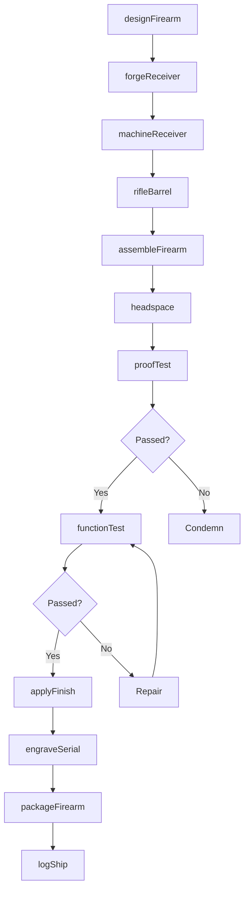
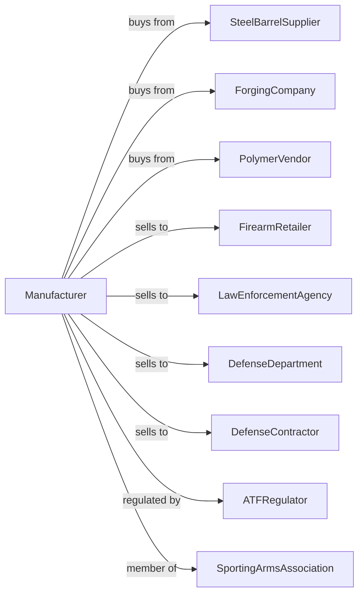

# Small Arms, Ordnance, and Ordnance Accessories Manufacturing

> Business-as-Code definition for small arms and ordnance manufacturing. Models the production of firearms, artillery, and ordnance accessories.

## Overview

This U.S. industry comprises establishments primarily engaged in manufacturing small arms, other ordnance, and/or ordnance accessories. Products include handguns, rifles, shotguns, machine guns, artillery, mortars, and ordnance accessories for commercial, law enforcement, and military markets.

## Actors

| Actor | Description |
|-------|-------------|
| SteelBarrelSupplier | Provides chrome-moly barrel steel |
| ForgingCompany | Supplies forged receivers and components |
| PolymerVendor | Provides injection-molded polymer frames |
| FirearmRetailer | Purchases firearms for consumer sales |
| LawEnforcementAgency | Orders duty weapons and accessories |
| DefenseDepartment | Procures military weapons systems |
| DefenseContractor | Integrates weapons into military platforms |
| ATFRegulator | Oversees firearm manufacturing licensing |
| SportingArmsAssociation | Promotes shooting sports industry |

## Roles

| Role | Description |
|------|-------------|
| PlantManager | Directs firearms manufacturing operations |
| FirearmEngineer | Designs weapons and mechanisms |
| BarrelMaker | Produces and rifles barrels |
| ReceiverMachinist | Machines receivers and actions |
| AssemblyTechnician | Assembles firearms |
| TestFirer | Proof tests and function tests firearms |
| QualityInspector | Verifies specifications and safety |
| ComplianceOfficer | Manages ATF regulatory requirements |

## Entities

| Entity | Description |
|--------|-------------|
| Handgun | Pistol or revolver firearm |
| Rifle | Long gun with rifled barrel |
| Shotgun | Smooth-bore long gun for shot shells |
| MachineGun | Automatic fire weapon |
| Artillery | Large-caliber military weapon |
| Barrel | Tube directing projectile |
| Receiver | Housing containing firing mechanism |
| Trigger | User-operated firing control |
| Magazine | Ammunition feeding device |
| SightsOptics | Aiming devices for firearms |

## Actions

| Action | Description |
|--------|-------------|
| designFirearm | Engineer weapon specifications |
| forgeReceiver | Produce receiver forgings |
| machineReceiver | Finish machine receivers and frames |
| rifleBarrel | Cut rifling grooves in barrel |
| assemble Firearm | Install barrel, trigger, and components |
| headspace | Verify chamber and bolt fit |
| proofTest | Fire proof load to verify safety |
| functionTest | Verify reliable operation |
| applyFinish | Blue, parkerize, or coat surfaces |
| engraveSerial | Apply unique serial number |
| packageFirearm | Prepare with manual and accessories |
| logShip | Record transaction and ship |

## Events

| Event | Description |
|-------|-------------|
| designApproved | Firearm design has been certified |
| receiversMachined | Receivers are complete |
| barrelsRifled | Barrels have been finished |
| assemblyComplete | Firearms are assembled |
| proofPassed | Proof testing is successful |
| functionPassed | Reliability testing is complete |
| serialApplied | Serial numbers have been engraved |
| atfLogged | Transaction recorded in bound book |
| orderShipped | Firearms dispatched to dealer |

## Searches

| Search | Description |
|--------|-------------|
| findProducts | List firearms by type, caliber, or model |
| getComponentInventory | Check receivers and barrel stock |
| getProductionSchedule | View assembly schedule by model |
| getTestRecords | Retrieve proof and function test data |
| getSerialLog | Track serial numbers by date |
| getATFRecords | Access bound book entries |
| trackOrders | Monitor order status |
| getComplianceStatus | Verify licensing and regulatory standing |

## Workflow

## Actor Relationships

