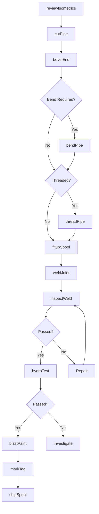
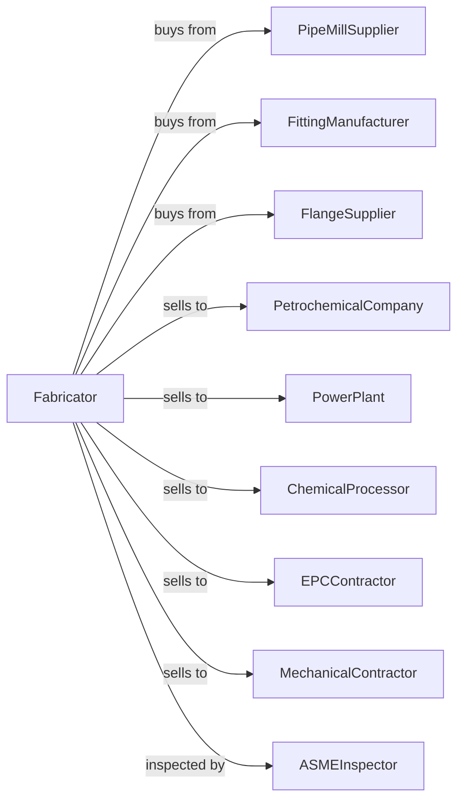

# Fabricated Pipe and Pipe Fitting Manufacturing

> Business-as-Code definition for fabricated pipe and pipe fitting manufacturing. Models the production of custom pipe spools, fittings, and piping assemblies.

## Overview

This U.S. industry comprises establishments primarily engaged in fabricating, such as cutting, threading, and bending, metal pipes and pipe fittings made from purchased metal pipe. Products include pipe spools, custom fittings, and prefabricated piping systems for process, power, and construction industries.

## Actors

| Actor | Description |
|-------|-------------|
| PipeMillSupplier | Provides carbon and alloy steel pipe |
| FittingManufacturer | Supplies elbows, tees, and reducers |
| FlangeSupplier | Provides pipe flanges in various ratings |
| PetrochemicalCompany | Orders pipe spools for refineries |
| PowerPlant | Purchases piping for steam and water systems |
| ChemicalProcessor | Orders corrosion-resistant piping |
| EPCContractor | Buys prefabricated piping for projects |
| MechanicalContractor | Purchases pipe spools for installation |
| ASMEInspector | Certifies pressure piping fabrication |

## Roles

| Role | Description |
|------|-------------|
| ShopManager | Directs pipe fabrication operations |
| PipingEngineer | Designs piping layouts and specifications |
| PipeFitter | Fits and aligns pipe and fittings |
| PipeWelder | Joins pipe using qualified welding procedures |
| CNCBendingOperator | Operates CNC pipe bending equipment |
| ThreadingOperator | Cuts threads on pipe ends |
| NDTTechnician | Performs radiographic and PT inspection |
| QualityInspector | Verifies dimensions and weld quality |

## Entities

| Entity | Description |
|--------|-------------|
| CarbonPipe | Steel pipe for general service |
| AlloyPipe | Chrome-moly pipe for high-temperature service |
| StainlessPipe | Corrosion-resistant pipe |
| PipeSpool | Prefabricated piping assembly |
| Elbow | Fitting changing pipe direction |
| Tee | Fitting creating branch connection |
| Flange | Bolted connection for pipe joints |
| WeldJoint | Welded connection between pipe or fittings |
| Isometric | 3D piping drawing |
| HydroTest | Pressure test for piping integrity |

## Actions

| Action | Description |
|--------|-------------|
| reviewIsometrics | Analyze piping drawings for fabrication |
| cutPipe | Saw or flame cut pipe to length |
| bevelEnd | Prepare pipe ends for welding |
| bendPipe | Form bends using CNC bender |
| threadPipe | Cut threads on pipe ends |
| fitupSpool | Align and tack components |
| weldJoint | Complete weld per qualified procedure |
| inspectWeld | Visual and NDT examination of welds |
| hydroTest | Pressure test completed spool |
| blastPaint | Clean and apply protective coating |
| markTag | Identify spool with number and destination |
| shipSpool | Transport spools to job site |

## Events

| Event | Description |
|-------|-------------|
| isometricsReceived | Piping drawings have arrived |
| materialReceived | Pipe and fittings have been delivered |
| pipeCut | Pipe has been cut to length |
| spoolFittedUp | Components are aligned for welding |
| weldingComplete | All welds have been completed |
| ndtPassed | Welds have passed inspection |
| hydroTestPassed | Spool has passed pressure test |
| coatingApplied | Protective finish has been applied |
| spoolShipped | Piping dispatched to site |

## Searches

| Search | Description |
|--------|-------------|
| findProjects | List projects by customer or ship date |
| getPipeInventory | Check pipe stock by size and schedule |
| getFittingInventory | View fitting availability |
| getWelderQualifications | Track welder certifications |
| getWeldMap | Retrieve weld joint tracking |
| getNDTResults | View radiograph and PT reports |
| trackSpools | Monitor spool status through fabrication |
| calculateWeight | Compute spool weights for shipping |

## Workflow

## Actor Relationships

