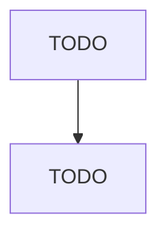

# All Other Miscellaneous Fabricated Metal Product Manufacturing

> TODO: Business-as-Code definition

## Overview

This U.S. industry comprises establishments primarily engaged in manufacturing fabricated metal products (except forgings and stampings, cutlery and handtools, architectural and structural metals, boilers, tanks, shipping containers, hardware, spring and wire products, machine shop products, turned products, screws, nuts and bolts, metal valves, ball and roller bearings, ammunition, small arms and other ordnances and accessories, and fabricated pipes and pipe fittings). Illustrative Examples: Fo

## Actors

| Actor | Description |
|-------|-------------|
| TODO | TODO |

## Roles

| Role | Description |
|------|-------------|
| TODO | TODO |

## Entities

| Entity | Description |
|--------|-------------|
| TODO | TODO |

## Actions

| Action | Description |
|--------|-------------|
| TODO | TODO |

## Events

| Event | Description |
|-------|-------------|
| TODO | TODO |

## Searches

| Search | Description |
|--------|-------------|
| TODO | TODO |

## Workflow

## Actor Relationships

