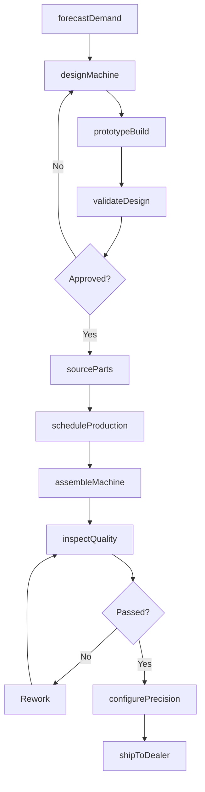
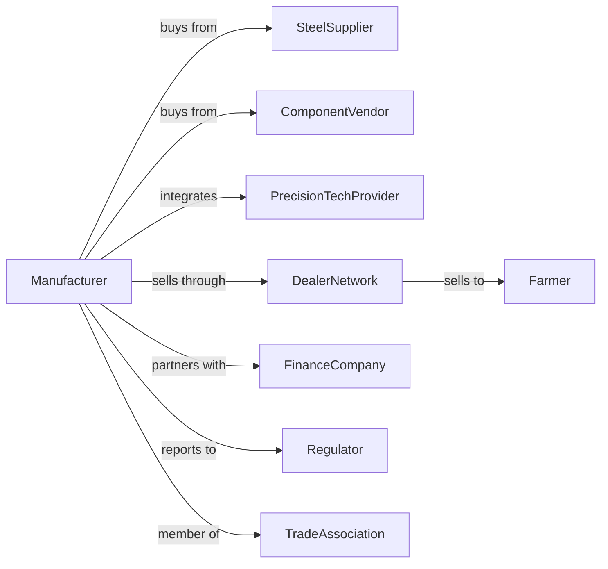

# Farm Machinery and Equipment Manufacturing

> Business-as-Code definition for farm machinery and equipment manufacturing operations. Models the complete production lifecycle from design engineering through dealer distribution including precision agriculture technology integration.

## Overview

Farm machinery and equipment manufacturing involves producing agricultural equipment including tractors, combines, planters, tillage implements, and harvesting machinery. Operations coordinate with steel suppliers, component manufacturers, and dealer networks to meet seasonal demand cycles. This definition exposes actions for product development, production scheduling, and quality management with events for automation and searches for supply chain analytics.

## Actors

| Actor | Description |
|-------|-------------|
| SteelSupplier | Provides sheet metal, structural steel, and specialty alloys |
| ComponentVendor | Supplies hydraulics, engines, electronics, and drivetrain parts |
| DealerNetwork | Distributes equipment and provides service to farmers |
| Farmer | End customer purchasing and operating equipment |
| PrecisionTechProvider | Supplies GPS, sensors, and agricultural software |
| FinanceCompany | Provides equipment financing and leasing programs |
| Regulator | Oversees safety standards and emissions compliance |
| TradeAssociation | Represents industry interests and sets standards |

## Roles

| Role | Description |
|------|-------------|
| ProductEngineer | Designs machinery and develops specifications |
| ManufacturingEngineer | Optimizes production processes and assembly lines |
| ProductionManager | Oversees daily manufacturing operations |
| QualityInspector | Ensures products meet specifications and standards |
| SupplyChainManager | Coordinates procurement and vendor relationships |
| DealerRelationsManager | Manages dealer network and support programs |

## Entities

| Entity | Description |
|--------|-------------|
| Machine | Completed agricultural equipment unit |
| Assembly | Major component subassembly like cab or axle |
| BillOfMaterials | List of parts and quantities for production |
| ProductionOrder | Work order for manufacturing specific units |
| DealerOrder | Purchase order from dealer network |
| Warranty | Coverage terms for defects and repairs |
| ServiceBulletin | Technical update or recall notice |
| TestProtocol | Quality verification procedure |
| DesignSpec | Engineering specification document |
| InventoryItem | Raw material or component in stock |

## Actions

| Action | Description |
|--------|-------------|
| designMachine | Engineer new equipment or model updates |
| prototypeBuild | Construct and test pre-production units |
| validateDesign | Verify performance against specifications |
| sourceParts | Procure components from approved vendors |
| scheduleProduction | Plan manufacturing runs based on orders |
| assembleMachine | Build equipment on production line |
| inspectQuality | Verify completed units meet standards |
| configurePrecision | Install GPS and precision agriculture systems |
| shipToDealer | Transport finished equipment to distribution |
| processWarranty | Handle warranty claims and repairs |
| issueBulletin | Release technical service updates |
| forecastDemand | Project seasonal equipment needs |

## Events

| Event | Description |
|-------|-------------|
| designApproved | New machine design cleared for production |
| prototypeValidated | Test unit meets performance targets |
| productionScheduled | Manufacturing run planned and resourced |
| machineAssembled | Unit completed on production line |
| qualityPassed | Equipment cleared quality inspection |
| machineShipped | Unit dispatched to dealer |
| warrantyClaimFiled | Customer reported defect or failure |
| bulletinIssued | Service update released to dealers |
| demandForecastUpdated | Seasonal projections revised |
| partShortageDetected | Component inventory below threshold |

## Searches

| Search | Description |
|--------|-------------|
| getProductionStatus | Retrieve manufacturing progress by order |
| findInventoryLevels | Query component and material stock |
| getDealerOrders | List pending orders by dealer |
| getWarrantyClaims | Retrieve claims by model and issue type |
| trackShipments | Monitor equipment in transit |
| getQualityMetrics | Retrieve defect rates and inspection data |
| findVendorPerformance | Evaluate supplier delivery and quality |
| getSeasonalDemand | Retrieve historical and projected demand |

## Workflow



## Actor Relationships



## Usage

### Calling Actions

```typescript
import { manufactureFarmMachinery } from '@headlessly/manufacture-farm-machinery'

const factory = manufactureFarmMachinery()

// Schedule production run for planting season
const productionRun = await factory.scheduleProduction({
  model: 'precision-planter-4800',
  quantity: 250,
  dealerOrders: ['dealer-ord-2024-0456', 'dealer-ord-2024-0457'],
  targetCompletion: new Date('2024-02-15')
})

// Assemble machine with precision agriculture package
await factory.assembleMachine({
  productionOrderId: productionRun.id,
  serialNumber: 'PP4800-2024-00156',
  options: {
    precisionPackage: 'premium',
    rowUnits: 24,
    seedMonitoring: true
  }
})

// Ship to dealer
await factory.shipToDealer({
  serialNumber: 'PP4800-2024-00156',
  dealerId: 'midwest-ag-equipment',
  carrier: 'flatbed-logistics',
  deliveryWindow: '3-days'
})
```

### Event-Driven Automation

```typescript
// Auto-reorder when parts run low
factory.partShortageDetected(async ({ partNumber, currentStock, reorderPoint }) => {
  const vendor = await factory.findVendorPerformance({ partNumber })

  await factory.sourceParts({
    partNumber,
    quantity: reorderPoint * 2,
    vendorId: vendor.preferredSupplier,
    priority: currentStock < reorderPoint * 0.5 ? 'rush' : 'standard'
  })
})

// Process warranty claims automatically
factory.warrantyClaimFiled(async ({ serialNumber, issueType, dealerId }) => {
  const machine = await factory.getProductionStatus({ serialNumber })

  if (machine.warrantyExpiration > new Date()) {
    await factory.processWarranty({
      serialNumber,
      issueType,
      resolution: 'parts-replacement',
      dealerId
    })
  }
})
```

## Related

- [Lawn and Garden Equipment Manufacturing](./333112-LawnAndGardenTractorAndHomeLawnAndGardenEquipmentManufacturing.mdx)
- [Construction Machinery Manufacturing](./333120-ConstructionMachineryManufacturing.mdx)
- [Agricultural Implement Merchant Wholesalers](../../423-MerchantWholesalersDurableGoods/4238-MachineryEquipmentAndSuppliesMerchantWholesalers/423820-FarmAndGardenMachineryAndEquipmentMerchantWholesalers.mdx)
