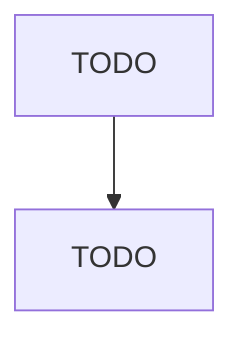

# Farm Machinery and Equipment Manufacturing

> TODO: Business-as-Code definition

## Overview

This U.S. industry comprises establishments primarily engaged in manufacturing agricultural and farm machinery and equipment, and other turf and grounds care equipment, including planting, harvesting, and grass mowing equipment (except lawn and garden-type). Illustrative Examples: Combines (i.e., harvester-threshers) manufacturing Cotton ginning machinery manufacturing Feed processing equipment, farm-type, manufacturing Fertilizing machinery, farm-type, manufacturing Grass mowing equipment (exce

## Actors

| Actor | Description |
|-------|-------------|
| TODO | TODO |

## Roles

| Role | Description |
|------|-------------|
| TODO | TODO |

## Entities

| Entity | Description |
|--------|-------------|
| TODO | TODO |

## Actions

| Action | Description |
|--------|-------------|
| TODO | TODO |

## Events

| Event | Description |
|-------|-------------|
| TODO | TODO |

## Searches

| Search | Description |
|--------|-------------|
| TODO | TODO |

## Workflow

## Actor Relationships

