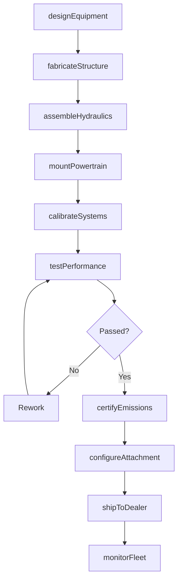
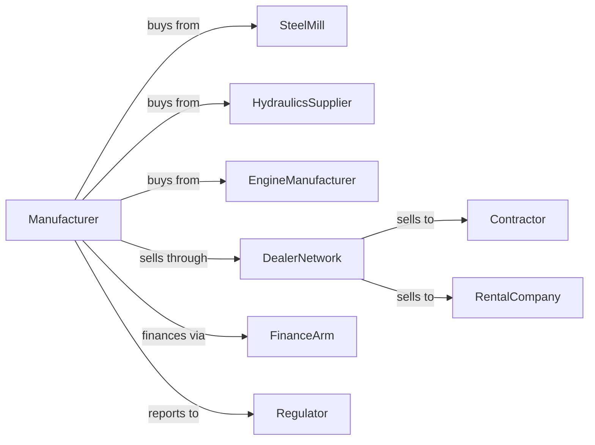

# Construction Machinery Manufacturing

> Business-as-Code definition for construction machinery manufacturing operations. Models the complete production lifecycle from heavy equipment design through dealer distribution including telematics and fleet management integration.

## Overview

Construction machinery manufacturing involves producing heavy equipment including excavators, bulldozers, loaders, backhoes, and cranes for earthmoving and construction applications. Operations coordinate with steel mills, hydraulics suppliers, and global dealer networks serving contractors and rental fleets. This definition exposes actions for product engineering, heavy fabrication, and aftermarket parts with events for automation and searches for fleet analytics.

## Actors

| Actor | Description |
|-------|-------------|
| SteelMill | Provides heavy plate, structural sections, and castings |
| HydraulicsSupplier | Supplies pumps, cylinders, valves, and hoses |
| EngineManufacturer | Provides diesel powertrains and emissions systems |
| DealerNetwork | Distributes equipment and provides parts and service |
| Contractor | Construction company purchasing equipment |
| RentalCompany | Fleet operator renting equipment to end users |
| FinanceArm | Captive finance company for equipment purchases |
| Regulator | Oversees emissions, safety, and trade compliance |

## Roles

| Role | Description |
|------|-------------|
| DesignEngineer | Creates equipment designs and specifications |
| WeldingEngineer | Develops fabrication processes for structures |
| AssemblyTechnician | Builds equipment on production line |
| TestOperator | Validates machine performance and safety |
| PartsManager | Manages aftermarket parts inventory |
| TelematicsEngineer | Develops fleet monitoring systems |

## Entities

| Entity | Description |
|--------|-------------|
| Machine | Completed construction equipment unit |
| Chassis | Main structural frame and undercarriage |
| Attachment | Bucket, blade, or other work tool |
| Telematics | Remote monitoring and diagnostic system |
| DealerOrder | Equipment purchase order from dealer |
| PartsOrder | Aftermarket parts requisition |
| ServiceContract | Extended warranty and maintenance agreement |
| FleetRecord | Equipment operating history and location |
| EmissionsCert | Regulatory compliance certificate |
| TradeIn | Used equipment taken in exchange |

## Actions

| Action | Description |
|--------|-------------|
| designEquipment | Engineer new machine models and updates |
| fabricateStructure | Cut, weld, and finish heavy steel components |
| assembleHydraulics | Install pumps, cylinders, and control systems |
| mountPowertrain | Install engine and drivetrain |
| calibrateSystems | Configure controls and telematics |
| testPerformance | Validate operation under load |
| certifyEmissions | Verify regulatory compliance |
| configureAttachment | Install work tools per customer spec |
| shipToDealer | Transport equipment to distribution |
| supplyParts | Fulfill aftermarket parts orders |
| processTradeIn | Evaluate and refurbish used equipment |
| monitorFleet | Track equipment location and health |

## Events

| Event | Description |
|-------|-------------|
| designReleased | New model cleared for production |
| structureFabricated | Chassis welding completed |
| machineAssembled | Unit completed on production line |
| performanceValidated | Machine passed operational tests |
| emissionsCertified | Regulatory compliance confirmed |
| machineShipped | Equipment dispatched to dealer |
| partOrderFulfilled | Aftermarket order completed |
| tradeInReceived | Used equipment acquired |
| telematicsAlert | Remote diagnostic issue detected |
| serviceScheduled | Preventive maintenance due |

## Searches

| Search | Description |
|--------|-------------|
| getProductionStatus | Retrieve manufacturing progress |
| findDealerInventory | Query equipment at dealers |
| getPartsAvailability | Check aftermarket stock levels |
| trackFleetLocation | Monitor equipment positions |
| getMachineHealth | Retrieve telematics diagnostics |
| findServiceHistory | Get maintenance records |
| getTradeInValues | Retrieve used equipment valuations |
| getUtilizationRates | Track machine operating hours |

## Workflow



## Actor Relationships



## Usage

### Calling Actions

```typescript
import { manufactureConstructionMachinery } from '@headlessly/manufacture-construction-machinery'

const factory = manufactureConstructionMachinery()

// Configure excavator for dealer order
const machine = await factory.designEquipment({
  model: 'excavator-350x',
  class: '35-ton',
  configuration: {
    arm: 'long-reach',
    counterweight: 'heavy',
    tracks: 'wide-pad'
  }
})

// Assemble with customer specifications
await factory.assembleHydraulics({
  machineId: machine.id,
  mainPump: 'variable-displacement',
  auxiliaryCircuit: true,
  quickCoupler: 'pin-grabber'
})

// Ship to dealer with telematics active
await factory.shipToDealer({
  serialNumber: 'EX350X-2024-00892',
  dealerId: 'rocky-mountain-equipment',
  telematics: {
    enabled: true,
    subscription: '5-year',
    fleetIntegration: 'dealer-portal'
  }
})
```

### Event-Driven Automation

```typescript
// Remote diagnostics response
factory.telematicsAlert(async ({ serialNumber, alertType, severity }) => {
  if (severity === 'critical') {
    const dealer = await factory.findDealerInventory({
      serialNumber,
      includeServiceHistory: true
    })

    await factory.supplyParts({
      dealerId: dealer.assignedDealer,
      parts: getRequiredParts(alertType),
      priority: 'emergency',
      machineDown: true
    })
  }
})

// Proactive service scheduling
factory.serviceScheduled(async ({ serialNumber, serviceType, dueHours }) => {
  const parts = await factory.getPartsAvailability({
    serviceKit: serviceType
  })

  await notifyDealer({
    serialNumber,
    serviceType,
    partsStatus: parts.inStock ? 'ready' : 'backordered',
    estimatedHours: dueHours
  })
})
```

## Related

- [Mining Machinery Manufacturing](./333131-MiningMachineryAndEquipmentManufacturing.mdx)
- [Industrial Truck Manufacturing](../3339-OtherGeneralPurposeMachineryManufacturing/333924-IndustrialTruckTractorTrailerAndStackerMachineryManufacturing.mdx)
- [Crane and Hoist Manufacturing](../3339-OtherGeneralPurposeMachineryManufacturing/333923-OverheadTravelingCraneHoistAndMonorailSystemManufacturing.mdx)
